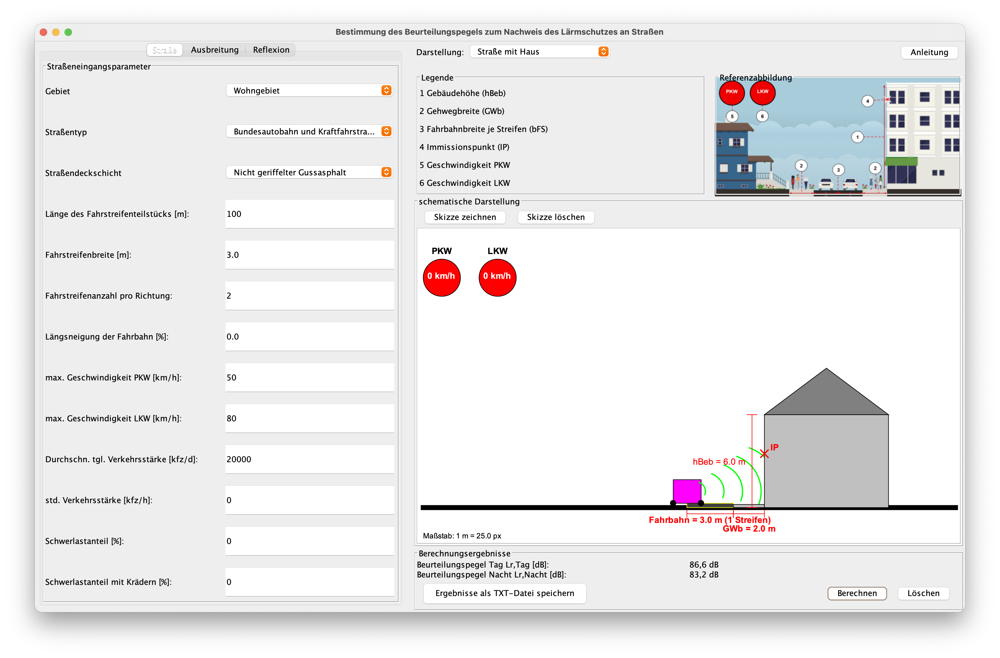
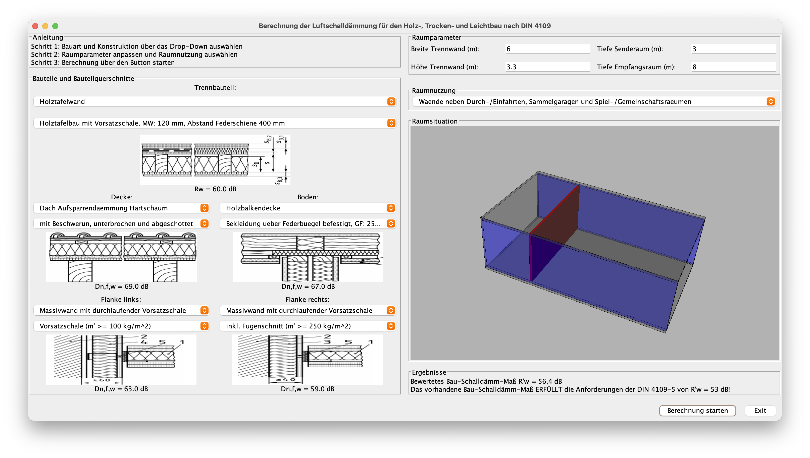
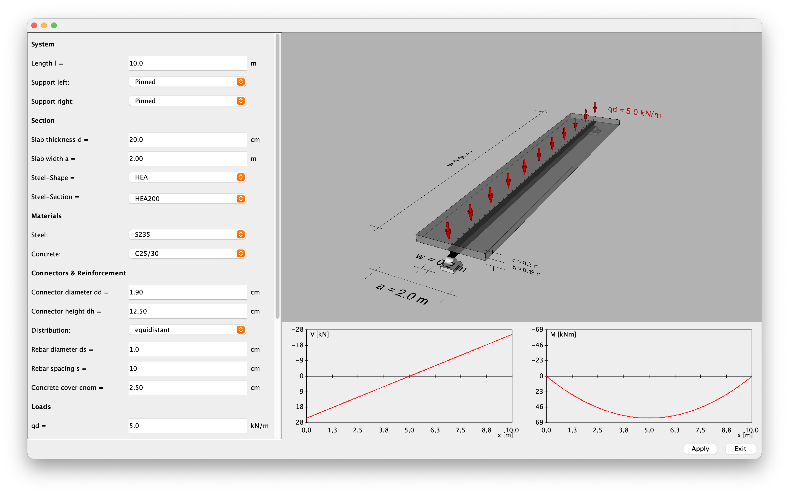

# Über das Modul Bauinformatik

## Was Sie lernen sollen

TODO Grafik zur illustration

- Entwicklung von Applikationen mit C#
- Objektorientierte Softwareentwicklung
  - Modellierung, Design und Implementation
- Gestaltung ansprechender grafischer Oberflächen

## Warum Sie das lernen sollen

[]{.down30}

### Einfache Antwort

[]{.down80}

Weil es im Modulhandbuch steht

## Warum Sie das lernen sollen

[]{.down30}

### Ausführlichere Antwort

Kompetenzen

- Komplexe Aufgaben in Teilprobleme zerlegen und nacheinander lösen
- Strukturiert vorgehen und sorgfältig nachdenken
- Mit Support und Softwareentwicklern kommunizieren

Anwendungsmöglichkeiten

- Existierende Programme erweitern
- Abschlussarbeiten mit Programmieranteil bearbeiten

$\rightarrow$ In vielen Bereichen nützlich, auch wenn Sie nicht selber programmieren

# Kontext

## Programmierung

[]{.down40}

### Einige wichtige Programmiersprachen

- Maschinencode, Assembler (seit es Computer gibt)
- Prozedural: Fortran (1957), BASIC (1964), Pascal (1970), C (1972)
- Objektorientiert: Smalltalk (1972), C++ (1980), Objective-C (1986), Python (1991), Java (1995), C# (2001), Swift (2010)
- Spezielle Sprachen z.B. für Datenbanken

### Heute

- Fortran, C: Numerische Simulationen (FEM, Wetter, \dots)
- Objektorientierung in fast allen Bereichen

## Warum objektorientiertes Programmieren?

[]{.down30}

### Einfache Antwort

[]{.down80}

Weil es gut funktioniert

## Warum objektorientiertes Programmieren?

[]{.down30}

### Ausführlichere Antwort

Weil objektorientierte Programmierung (OOP) viele Vorteile hat. OOP

- unterstützt die Entwicklung verständlicher, erweiterbarer und wartbarer Softwaresysteme
- erleichtert es ein Softwaresystem in einzelne, wiederverwendbare Bausteine aufzuteilen
- vereinfacht es zuverlässige Softwaresysteme zu entwickeln
- erleichtert es Softwaresysteme im Team zu entwickeln

$\rightarrow$ OOP hilft, komplexe Softwaresysteme handhabbar zu halten

## Programmiersprache für das Modul

[]{.down30}

### Prinzipiell in Frage kommen

- Python: Toll für kleine Programme, für größere Softwareprojekte wegen dynamischer Typisierung schwierig
- Java: Gute Sprache für den Einstieg in OOP, so gut wie keine Anwendungen im Bauingenieurwesen
- Swift: Moderne und klar strukturierte Sprache, aber vor allem für Apple
- C#: Weit verbreitet in Microsoft Welt und Anbindung an Programme wie Revit (BIM), Rhino (3D-Modellierung) und Unity (Virtual Reality), etwas komplexer

Anwendungsmöglichkeiten im Bauingenieurwesen sprechen für C#. Kenntnisse sind auf andere Programmiersprachen übertragbar.

# Studienleistung

## Hausarbeit mit mündlicher Prüfung

- Projektarbeit in Gruppen von zwei Studierenden
- Praktische Aufgabenstellungen in Abstimmung mit anderen Fachgebieten
- Aufgabenstellungen werden rechtzeitig vorgestellt
- Abgabetermin nach den Klausuren
- Mündliche Prüfung einzeln

##

##

##

# Organisatorisches

## Inverted Classroom

TODO: Grafik

- In den online-Vorlesungen werden Sie vor allem selber programmieren
- Erläuterung zur Theorie in Videos
- Exploratorischer Ansatz:
  1. Neue Konzepte anhand von Schritt-für-Schritt Anleitungen kennenlernen
  1. Ausführliche Erklärung im Video anschauen
  1. Fragen diskutieren und eigenständig auf eine Aufgabe anwenden

## Inhalte

- Anweisungen, Elementare Datentypen und Ausgabe
- Objekte: Existierende Klassen verwenden
- Klassen: Neue Klassen selber entwickeln
  - Attribute, Konstruktor und Methoden
  - UML-Klassendiagramme
  - Namenskonventionen
- Kontrollstrukturen
- Vererbung und Polymorphismus
- Datenstrukturen
- Grafische Oberflächen mit Avalonia

