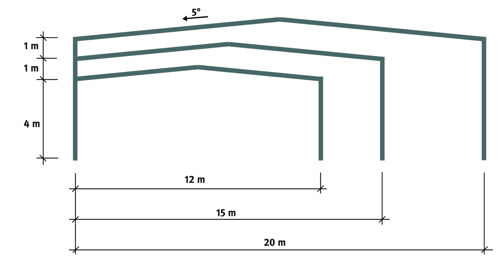

::: {#exr-hallenrechner}

## Rechner für Hallen in Stahlbauweise

Für einfache Hallen aus Stahl stellt das Bauforum Stahl mit @bauforumstahl2016 eine Typenstatik zur Verfügung. Im Rahmen der Aufgabe soll auf dieser Grundlage für eine Stahlhalle mit vorgegebenen Kenngrößen und Querschnitten die Grundfläche und den Materialbedarf berechnet werden. Typische Hallenquerschnitte zeigt @fig-hallen.

{#fig-hallen width="70%"}

Gehen Sie in den folgenden Schritten vor, in jedem Zwischenschritt sollen die jeweiligen Werte ausgegeben werden.

1. Start: Öffnen Sie die Datei `04-hallenrechner/Hallenrechner.cs` im Projekt. Sie sehen dort, wie mithilfe der [ISections-Bibliothek](https://www.nuget.org/packages/ISections#readme-body-tab) Querschnittswerte von I-Profilen verwendet werden können.

1. Eingabewerte: Die Berechnung soll auf folgenden Eingabewerten basieren.

    | Variable        | Wert            | Bedeutung                        |
    |-----------------|-----------------|----------------------------------|
    | `project`       | `"Halle S2-12-075"` | Projektbezeichnung           |
    | `numberOfFrames`| `11`            | Anzahl der Rahmen                |
    | `span`          | `15.0`          | Stützweite in m                  |
    | `height`        | `4.0`           | Stützenhöhe in m                 |
    | `frameSpacing`  | `6.0`           | Achsabstand der Rahmen in m      |
    | `roofPitch`     | `5.0`           | Dachneigung in °                 |
    | `profileColumns`| `HE-A 200`      | Profil der Stützen               |
    | `profileBeams`  | `IPE 550`       | Profil der Riegel                |

    Belegen Sie die entsprechenden Variablen mit den gegebenen Werten.

1. Grundfläche: Berechnen Sie die Länge der Halle sowie die Grundfläche.

1. Materialbedarf: Ermitteln Sie die Gesamtlänge der jeweils benötigten Profile und damit den Materialbedarf. Gehen Sie vereinfachend davon aus, dass auch an den Stirnseiten der Regelquerschnitt zum Einsatz kommt.

1. Formatierte Ausgabe: Richten Sie Beschriftungen und Zahlenwerte in einer übersichtlichen Tabelle aus, zum Beispiel

    ```
        ───────────────────────────────────────
        Hallenrechner – Halle S2-12-075
        ───────────────────────────────────────
        Eingabewerte
            Anzahl Rahmen             11
            Stützenhöhe             4,00 m
            Stützweite             15,00 m
            Achsabstand             6,00 m
            Dachneigung             5,00 °
            Profil Stützen      HE 200 A
            Profil Riegel        IPE 550
        ───────────────────────────────────────
        Ergebnisse
            Länge der Halle        60,00 m
            Grundfläche           900,00 m²
            Länge Stützen          88,00 m
            Länge Riegel          165,63 m
            Gesamtgewicht          21,28 to
        ───────────────────────────────────────    
    ```
:::
