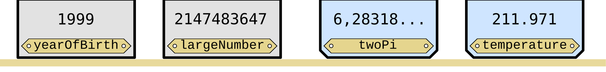

# Einführung

[🎥](https://youtu.be/bPBGY6GrSKc){target="_blank"} Erklärvideo auf YouTube

## Arten von Programmiersprachen

:::: columns
::: column
### Dynamisch typisiert – Python

```python
# Kein Typ nötig
length = 5.0
width = 3
area = length * width
print(area)               # 15.0

# Typ kann sich ändern
length = "Fünf Meter"     # Erlaubt!
```
:::
::: column
### Statisch typisiert – C\#

```csharp
// Typ muss angegeben werden
double length = 5.0;
int width = 3;
double area = length * width;
Console.WriteLine(area);  // 15

// Typ ist festgelegt
length = "Fünf Meter";    // Fehler!
```
:::
::::

### Vorteile statisch typisierter Sprachen

- Viele Fehler können vor dem Programmstart erkannt werden
- Bessere Unterstützung beim Programmieren in Entwicklungsumgebung
  - Auto-Vervollständigung
  - Umbenennen von Variablen und Methoden

::: {.fragment}
→ Wichtig vor allem bei größeren Projekten (nicht für 50 Zeilen Python)
:::

## Beispielprogramm

```csharp
int count;
double baseLength = 1.5;
string greetingToTheWorld = "Hallo Welt!";

count = 2;
count = 3;
baseLength = 0.33;

baseLength = count;           // OK     - double = int geht
💥 baseLength = "0.66cm";     // Fehler - Zeichenkette ist keine Zahl
count = 177;
💥 count = 0.33;              // Fehler - int = double geht nicht (Nachkommastellen)
💥 greetingToTheWorld = 1999; // Fehler - Zahl ist keine Zeichenkette

Console.WriteLine(greetingToTheWorld);
Console.WriteLine($"count: {count}");
Console.WriteLine($"baseLength: {baseLength}");
```

### Grundsätzlich

- Anweisungen mit Semikolon abschließen
- Ausführung Anweisung für Anweisung von oben nach unten

# Variablen und Datentypen

[🎥](https://youtu.be/TijkVI7W7GE){target="_blank"} Erklärvideo auf YouTube

## Variablen 1/2

[]{.down20}

### Anschauliche Sicht



- Variable: Schachtel für Wert mit Beschriftung (Name der Variablen)
- Art der Schachtel je nach Inhalt (Datentyp)
- Inhalt kann man beliebig ändern

### Technische Sicht


- Variable ist Name für einen Bereich im Speicher

## Variablen 2/2

Deklaration Variable mit Datentyp

```csharp
datentyp variablenname;
```

Zuweisung ändert Wert (Datentypen müssen passen)

```csharp
variablenname = wert1;
variablenname = wert2;
```

Deklaration und Zuweisung in einem Schritt

```csharp
datentyp variablenname = wert;
```

### Beachten Sie

- Variablen müssen vor der ersten Verwendung deklariert werden
- Deklaration darf nur einmal erfolgen

## Namen von Variablen

{width="100%"}

- Erlaubte Zeichen: 'A-Z' 'a-z' '0-9' '\_'
- Erster Buchstabe klein, Großbuchstaben bei neuem Wort (camelCase)
  - 'Date of birth' wird zu `dateOfBirth`
  - 'Page title' wird zu `pageTitle`
- Ziel: Name soll Bedeutung der Variablen deutlich machen
- Visual Studio Code: Variablen umbenennen mit `F2`

## Datentypen (Auswahl)

[]{.down20}

| Typ | Beschreibung | Größe | Wertemenge | Beispiel |
|---------------|---------------|---------------|---------------|---------------|
| `bool` | Wahrheitswert | 8 Bit | `true` oder `false` | `true` |
| `int` | Ganze Zahl | 32 Bit | $-2^{31}$ bis $2^{31}-1$ | `4711` |
| `long` | Ganze Zahl | 64 Bit | $-2^{63}$ bis $2^{63}-1$ | `2147483648` |
| `float` | Gleitkommazahl | 32 Bit | ± (\~$10^{-45}$ bis \~$10^{38}$) | `3.1415927` |
| `double` | Gleitkommazahl | 64 Bit | ± (\~$10^{-324}$ bis \~$10^{308}$) | `2.718281828459045` |
| `char` | Zeichen | 16 Bit | Unicode-Zeichen | `'A'` oder `'✌️'` |
| `string` | Zeichenkette | variabel | unbegrenzt | `"Hallo ✌️"` |

: {tbl-colwidths="[10, 20, 15, 30, 25]"}

[]{.down20}

### Der Vollständigkeit halber

- Datentyp `string` ist ein Sonderfall (später)
- Eigentlich reicht 1 Bit für `bool`, aber Byte kleinste adressierbare Einheit

# Operatoren und mathematische Funktionen

[🎥](https://youtu.be/Pz6wYnTLObU){target="_blank"} Erklärvideo auf YouTube

## Operatoren `+, -, *, /, %`

:::: columns
::: column
```csharp
double a = 0.1;
double b = 0.2;
double c = a + b;
Console.WriteLine($"c: {c}");
```
```output
c: 0,30000000000000004
```
```csharp
int a = 9;
int b = 4;
int c = a / b;
Console.WriteLine($"c: {c}");
```
```output
c: 2
```
:::
::: column
```csharp
int a = 9;
int b = 5;
int c = a % b;
Console.WriteLine($"c: {c}");
```
```output
c: 4
```
```csharp
string a = "Bochum";
string b = "ich komm' aus dir";
string c = a + ", " + b + " - " + 4630;
Console.WriteLine($"c: {c}");
```
```output
c: Bochum, ich komm' aus dir - 4630
```
:::
::::

### Wirkung von Operator abhängig von Datentyp

- Übliche Bedeutung für `double` (aber `double` ist nicht $\mathbb{R}$)
- Integer-Division für `int / int` (Nachkommastellen fallen weg)
- Rest bei ganzzahliger Division mit Modulo-Operator `%`
- Zeichenketten verbinden mit `+`

## Gleitkommazahlen (IEEE 754 - Standard) 1/2

[]{.down10}

```raw
      Dezimal: 15
        Binär: 0 10000000010 1110000000000000000000000000000000000000000000000000

      Dezimal: 3,141592653589793
        Binär: 0 10000000000 1001001000011111101101010100010001000010110100011000        

      Dezimal: 0.3
        Binär: 0 01111111101 0011001100110011001100110011001100110011001100110011
```

[]{.down10}

- Ein `double` belegt 64 Bit im Speicher, darin
  - Vorzeichen (1 Bit)
  - Die Position des Dezimalpunkts (11 Bit, Exponent)
  - Rund 15 Stellen (52 Bit, Mantisse)
- Es gibt nur $2^{64}$ verschiedene Zahlen und nicht unendlich viele
  - Reelle Zahlen wie $1 / 3$ oder $\pi$ werden nur approximiert
  - Rundungsfehler

## Gleitkommazahlen (IEEE 754 - Standard) 2/2

[]{.down10}

```raw
      Dezimal: 15
        Binär: 0 10000000010 1110000000000000000000000000000000000000000000000000

      Dezimal: 3,141592653589793
        Binär: 0 10000000000 1001001000011111101101010100010001000010110100011000        

      Dezimal: 0.3
        Binär: 0 01111111101 0011001100110011001100110011001100110011001100110011
```

[]{.down10}

- Gleitkommazahl (Floating Point Number): Dezimalpunkt wandert
- IEEE 754 ist de-Facto-Standard in (fast) allen Programmiersprachen
  - Auch in Python ergibt `0.1 + 0.2` den Wert `0,30000000000000004`
- Operationen direkt im Prozessor implementiert und sehr schnell
- Sonderfall: Systeme für symbolische Mathematik wie Mathematica

## Mathematische Funktionen

```csharp
using static System.Math;

double a = Sqrt(2.0);          // Wurzel:            1,4142135623730951
double b = Pow(2.0, 10.0);     // Potenz:            1024
double c = Abs(-3.7);          // Betrag:            3,7
double d = Sin(PI / 6);        // Sinus:             0,5
double e = Cos(0.0);           // Kosinus:           1
double f = Tan(PI / 4);        // Tangens:           1
double g = Log(E);             // Nat. Logarithmus:  1
double h = Log10(100.0);       // Log. Basis 10:     2
double i = Round(3.567, 2);    // Runden:            3,57
double j = Min(3.0, 7.0);      // Minimum:           3
double k = Max(3.0, 7.0);      // Maximum:           7
```

- Konstanten: `PI` = 3,14159…, `E` = 2,71828…
- Vollständige Liste bei [Microsoft](https://learn.microsoft.com/de-de/dotnet/api/system.math)

# Ausgabe

[🎥](https://youtu.be/03i74iXDWTQ){target="_blank"} Erklärvideo auf YouTube

## Dinge auf der Konsole ausgeben

Nur Text

```csharp
Console.WriteLine("Bochum, ich komm' aus dir");
```
```output
Bochum, ich komm' aus dir
```

Nur Variable

```csharp
double x = 1.0 / 3.0;
Console.WriteLine(x);
```
```output
0,3333333333333333
```

Mit interpolierten Zeichenketten (vorangestelltes $ und Variable in {})

```csharp
double x = 1.0 / 3.0;
Console.WriteLine($"Ein drittel ist etwa {x}");
```
```output
Ein drittel ist etwa 0,3333333333333333
```

## Interpolation von Zeichenketten

### Allgemein

:::: {.columns}
::: {.column}
| Möglichkeiten |
|-|
| `{var}` |
| `{var,breite}` |
| `{var:formatString}` |
| `{var,breite:formatString}` |

:::
::: {.column}
| Weitere Informationen |
|-|
| [Interpolation](https://learn.microsoft.com/en-us/dotnet/csharp/language-reference/tokens/interpolated) |
| [Format-Strings](https://learn.microsoft.com/en-us/dotnet/standard/base-types/custom-numeric-format-strings) |
:::
::::

### Beispiele

| Format | Bedeutung | Beispiel |
|-|-|-|
| `{var}` | Standardausgabe | `12345,6789` |
| `{var,15}` | Breite 15, rechtsbündig | `·····12345,6789` |
| `{var,-15}` | Breite 15, linksbündig | `12345,6789·····` |
| `{var:0.00}` | 2 Nachkommastellen | `12345,68` |
| `{var:+0.00;-0.00}` | Positiv/negativ mit zwei Stellen | `+12345,68` |
| `{var,15:0.0}` | Breite 15, eine Nachkommastelle | `········12345,7` |

: {tbl-colwidths="[35,45,20]"}

## Interpolation von Zeichenketten – Beispiele

```csharp
double force = 12345.6789;
Console.WriteLine($"| Kraft: {force} N        |");
Console.WriteLine($"| Kraft: {force:0.00} N          |");
Console.WriteLine($"| Kraft: {force,19:0.000} |");
Console.WriteLine($"| Kraft: {force,-19:0.0000} |");
Console.WriteLine($"| Kraft: {-force:0.000 N (Zug)  ;0.000 N (Druck)} |");
Console.WriteLine($"| Kraft: { force:0.000 N (Zug)  ;0.000 N (Druck)} |");
```

```output
| Kraft: 12345,6789 N        |
| Kraft: 12345,68 N          |
| Kraft:           12345,679 |
| Kraft: 12345,6789          |
| Kraft: 12345,679 N (Druck) |
| Kraft: 12345,679 N (Zug)   |
```