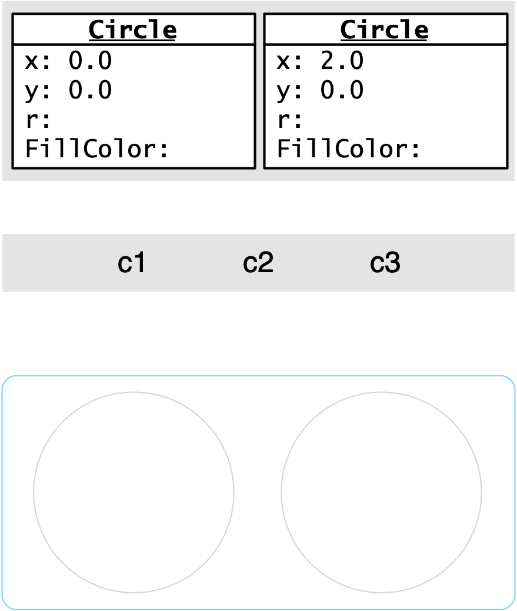

::: {#exr-referenzvariablen}

## Beispiel zu Referenzvariablen

Gegeben ist der folgende (ausdrücklich nicht zur Nachahmung empfohlene) Programmcode.

```{.csharp code-line-numbers="1-24"}
using BoDraw;

Circle c1;
Circle c2 = new Circle(0, 0, 1);
Circle c3 = new Circle(2, 0, 1);
BoDrawApp app = new BoDrawApp();

app.Add(c2, c3);

c1 = c3;
c1.FillColor = Colors.HotPink;
c3 = c2;
c3.FillColor = Colors.SkyBlue;
c1 = c3;
c1.Scale(0.5);

app.Show();
```

Schritt 1: Was werden Sie sehen, wenn Sie das Programm ausführen? Das sollen Sie sich zunächst selber überlegen. Fertigen Sie hierfür von den nachstehenden Grafiken einen Screenshot an und skizzieren Sie auf dem Tablet den Zustand des Programms und der Zeichnung in den angegebenen Schritten.

::: {layout-ncol=4}



:::

::: {.content-visible when-format="html"}
Schritt 2: Haben Sie gut nachgedacht? Hier können Sie Ihr Ergebnis überprüfen.

```{r}
#| echo: false
library(rquiz)

singleQuestion(
x = list(
    question = "Was zeigt das Programm an?",
    options = c(
        "Links klein und rot, rechts blau und groß", 
        "Links klein und blau, rechts rot und groß", 
        "Links groß und rot, rechts blau und klein", 
        "Links groß und blau, rechts rot und klein"
    ),
    answer = c(2)
),
showSolutionButton = FALSE
)
```
:::

Schritt 3: Kopieren Sie den Programmcode in `02-referenzvariablen/Referenzvariablen.cs` und führen Sie das Programm aus. Entspricht das Ergebnis den Erwartungen?
:::