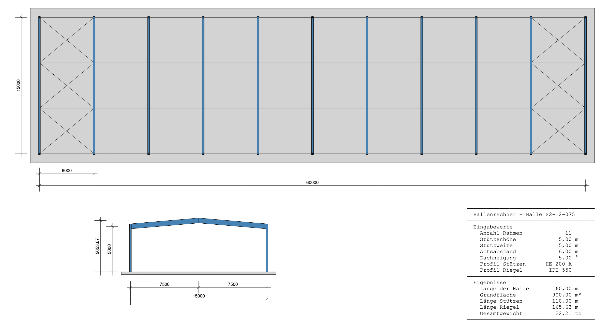

::: {#exr-hallenrechner-2}

## Hallenrechner mit Zeichnung

In dieser Aufgabe soll der Hallenrechner aus dem vorherigen Aufgabenblatt mit einer Zeichnung ergänzt werden. Wichtig dabei ist, dass die Zeichnung anhand der eingangs im Programm festgelegten Parameter erstellt wird. Wird zum Beispiel die Hallenbreite geändert, so soll die Zeichnung automatisch angepasst werden. Hier eine mögliche Darstellung.



### Vorab

Bevor Sie loslegen muss dummerweise eine Projektdatei angepasst werden. Öffnen Sie die Datei `hallenrechner-2.csproj` und ersetzen Sie den Inhalt hiermit:

   ```
    <Project Sdk="Microsoft.NET.Sdk">

    <PropertyGroup>
        <OutputType>Exe</OutputType>
        <TargetFramework>net10.0</TargetFramework>
        <ImplicitUsings>enable</ImplicitUsings>
        <Nullable>enable</Nullable>
    </PropertyGroup>

    <ItemGroup>
        <PackageReference Include="BoDraw.App" Version="1.*" />
        <PackageReference Include="ISections" Version="1.*" />
    </ItemGroup>

    </Project>
   ```

### Aufgaben

Öffnen Sie die Datei `03-hallenrechner-2/Hallenrechner.cs` im Projekt und arbeiten Sie die folgenden Schritte der Reihe nach ab.

1. Startcode vorbereiten. Kopieren Sie den vollständigen Hallenrechner-Code aus dem vorherigen Aufgabenblatt in die Datei `Hallenrechner.cs` und ergänzen sie die folgenden Zeilen (wo angegeben).

   ```csharp
   using BoDraw;                     // Steht ganz oben
   ...
   BoDrawApp app = new BoDrawApp();  // Steht unter den Variablendeklarationen
   ...
   app.Show();                       // Bleibt immer ganz am Ende der Datei
   ```

   Führen Sie das Programm aus. Es sollte ein leeres BoDraw-Fenster erscheinen.

1. Hilfsgrößen für Profilabmessungen. Die Profilabmessungen aus `ISection` sind in Millimetern angegeben, die Zeichnung arbeitet jedoch in Metern. Legen Sie nach den abgeleiteten Größen folgende Hilfsvariablen mit Breite und Höhe für Stützen und Riegel an:

   ```csharp
   double colW = profileColumns.w / 1000; 
   double colH = profileColumns.h / 1000; 
   double beamW = profileBeams.w / 1000;  
   double beamH = profileBeams.h / 1000;  
   ```

1. Querschnitt. Zeichnen Sie den Querschnitt der Halle. Beachten Sie folgende Tipps:

    - Testen Sie in jedem Schritt, ob ihr Programm funktioniert.

    - Beginnen Sie mit der Bodenplatte.

    - Zeichnen Sie die Stützen als Rechteck und den Riegel als Polygon. Dabei ist es sinnvoll, einzelne Koordinaten vorab zu berechnen und in Variablen zu speichern. Eine Skizze hilft dabei!

    - Ein Beispiel, wie Sie die Bemaßung erstellen können finden Sie [hier](https://matthiasbaitsch.github.io/BoDraw/api/BoDraw.Dimensioning.html)

    - Fügen Sie alle Zeichenelemente für den Querschnitt in einer Gruppe zusammen. Damit lässt sich der Querschnitt dann beliebig auf der Zeichnung platzieren.

        ```csharp
        Group sectionPlan = new Group(Shapes...);
        sectionPlan.Move(...);
        app.Add(sectionPlan);
        ```

1. Grundriss. Erstellen Sie den Grundriss der Halle. Tipps:

   - Die Rahmen können Sie mithilfe der `Grid`-Klasse vervielfältigen, [hier](https://matthiasbaitsch.github.io/BoDraw/api/BoDraw.Grid.html) wieder ein Beispiel, wie das geht. 

   - Die Windverbände können mit Linien gezeichnet werden. Auch hier hilft wieder die Klasse `Grid`.

   - Es ist nicht notwendig, im Grundriss die Stützen darzustellen

1. Textausgabe in die Zeichnung integrieren. Ersetzen Sie die `Console.WriteLine`-Ausgabe durch ein `Text`-Objekt. 

    - Verwenden Sie `AppendLine` statt `Console.WriteLine`.

        ```csharp
        Text text = new Text(x, y, fontsize);
        text.AppendLine("Zeile 1");
        text.AppendLine("Zeile 2");
        app.Add(text);
        ```

   - Setzen Sie für `x`, `y` und `fontsize` passende Werte ein. Die Schriftgröße wird in Zeicheneinheiten angegeben.

   - Mit `text.HJust` und `text.VJust` lässt sich die Ausrichtung anpassen.

   - Wenn die Ausrichtung des Textes wichtig ist, müssen Sie eine Schrift mit fester Buchstabenbreite verwenden, zum Beispiel so

        ```csharp
        text.FontFamilyName = "Courier New";
        ```
:::