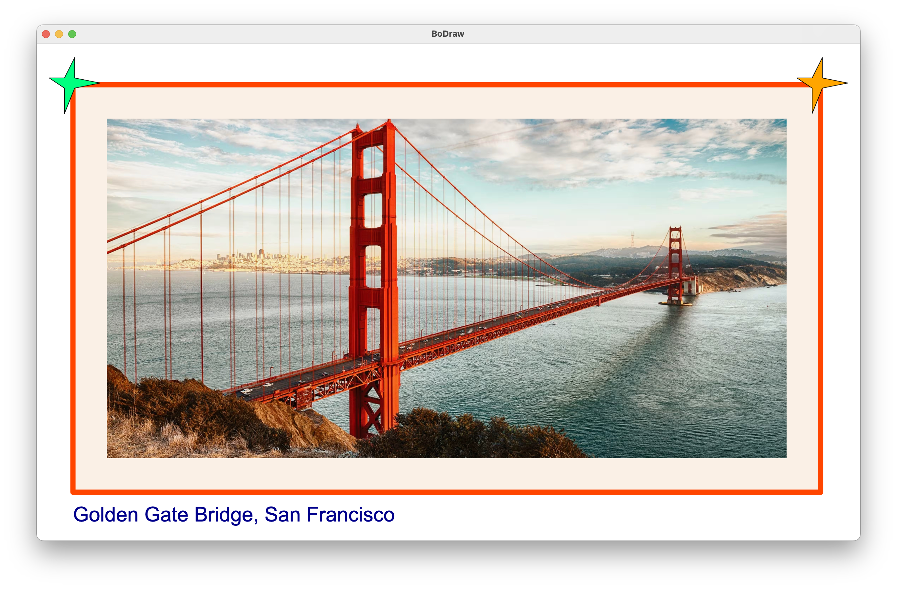
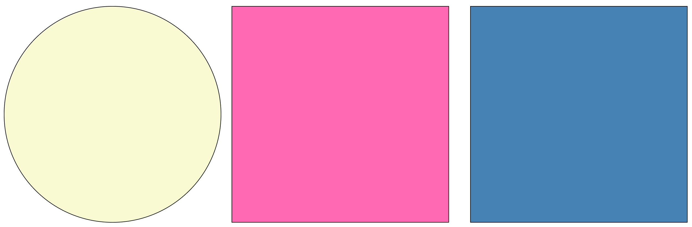
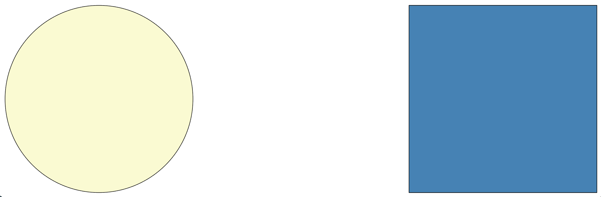
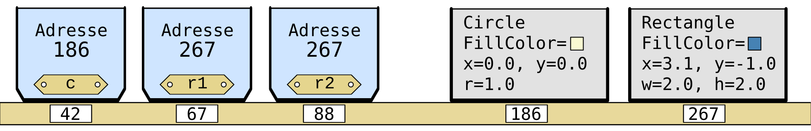

# Beispielprogramm

##



##

```{.csharp style="max-height: 400px;"}
using BoDraw;

Image image = new Image("assets/golden-gate-bridge.jpeg", 0, 0, 400);

Rectangle rectangle = new Rectangle(-20, -20, image.Width + 20, image.Height + 20);
rectangle.LineThickness = 8;
rectangle.FillColor = Colors.Linen;
rectangle.LineColor = Colors.OrangeRed;

Text text = new Text("Golden Gate Bridge, San Francisco", -20, -40);
text.Color = Colors.DarkBlue;
text.FontSize = 12;

Polygon s1 = new Polygon();
s1.AddPoint(6, 0);
s1.AddPoint(1, 1);
s1.AddPoint(1, 5);
s1.AddPoint(-1, 1);
s1.AddPoint(-4, 1);
s1.AddPoint(-1, -1);
s1.AddPoint(-1, -6);
s1.AddPoint(1, -1);
s1.Scale(3);
s1.Move(-20, image.Bounds.Height + 20);
s1.FillColor = Colors.SpringGreen;

Polygon s2 = s1.Copy(image.Bounds.Width + 40, 0);
s2.FillColor = Colors.Orange;

BoDrawApp app = new BoDrawApp();
app.Add(text, rectangle, image, s1, s2);
app.Show();
```

### Sie haben mithilfe der `BoDraw`-Bibliothek

- Dinge erzeugt und mit Variablen gespeichert
- Merkmale von Dingen benutzt und verändert
- Dinge Aktionen ausführen lassen

::: {.fragment}
→ Das gehen wir nun Schritt für Schritt durch
:::

# Objekte

## Grundbegriffe

In dem Programm kommen verschiedene Dinge vor:

- ein Bild (`image`)
- ein Rechteck (`rectangle`)
- Text (`text`)
- zwei Sterne (`s1`, `s2`)
- eine Zeichenanwendung (`app`)

::: {.fragment}
Jedes Ding hat bestimmte Merkmale (Position, Farbe, Größe) und kann Aktionen ausführen (skalieren, verschieben, anzeigen)
:::

[]{.down40}

::: {.fragment}
In der objektorientierten Programmierung heißen

- die Dinge → [Objekte]{.neuerbegriff}
- die Merkmale → [Eigenschaften]{.neuerbegriff}
- die Aktionen → [Methoden]{.neuerbegriff}
:::

## Objekte erzeugen

### Im Beispiel

```csharp
Image image = new Image("assets/golden-gate-bridge.jpeg", 0, 0, 400);
```

1. Neues Objekt vom Typ `Image` mit `new` erzeugen
1. Parameter in den runden Klammern legen Grafik, Position und Breite fest
1. Variable `image` verweist auf das Objekt
1. Datentyp ist die Klasse `Image` (aus `BoDraw`-Bibliothek)

::: {.fragment}
### Allgemeines Schema

```csharp
Klassenname variablenname = new Klassenname(Parameter...);
```
:::

## Eigenschaften

### Im Beispielprogramm

```csharp
Rectangle rectangle = new Rectangle(-20, -20, image.Width + 20, image.Height + 20);
rectangle.LineThickness = 8;
rectangle.FillColor = Colors.Linen;
rectangle.LineColor = Colors.OrangeRed;
```

- Eigenschaften `Width` und `Height` des Bildes verwenden
- Linienstärke `LineThickness` des Rechtecks anpassen
- Farbe für Füllung und Linie ändern

::: {.fragment}
### Allgemeines Schema

```csharp
... variablenname.Eigenschaftsname ...;               // Eigenschaft verwenden
variablenname.Eigenschaftsname = Wert;                // Eigenschaft verändern
```

→ Idee: Eigenschaften wie *normale* Variablen verwenden
:::

## Methoden

### Im Beispielprogramm

```csharp
s1.AddPoint(6, 0);
```

- Punkt zu Polygon hinzufügen

```csharp
Polygon s2 = s1.Copy(image.Bounds.Width + 40, 0);
```

- Polygon kopieren und in `s2` speichern

```csharp
app.Show();
```

- Applikation sichtbar machen

::: {.fragment}
### Allgemeines Schema

```csharp
variablenname.Methodenname(Parameter...);             // Methode ohne Ergebnis
Typ v2 = variablenname.Methodenname(Parameter...);    // Ergebnis in Variable v2
```

→ Unterschied zu Eigenschaften: Runde Klammern
:::

# Referenzvariablen

## Zur Erinnerung: "Normale" Variablen

::: {.columns}
::: {.column width="60%"}
```csharp
// Variablen x und y
int x = 111;
int y = x;

// Zuweisung
x = 222;

// Ausgabe
Console.WriteLine($"x = {x} und y = {y}");
```
:::
::: {.column width="5%"}
:::
::: {.column width="35%"}
[]{.down20}

Antwort A
```output
x = 222 und y = 111
```
Antwort B
```output
x = 222 und y = 222
```
:::
:::

[]{.down30}

```{r}
library(rquiz)

singleQuestion(
  x = list(
    question = "Was gibt das Programm aus?",
    options = c(
        "Die Zuweisung x = 222 ändert nur den Inhalt der Variablen x, also hat y nach wie vor den Wert 111",
        "Klar, y ist gleich x, also hat y auf jeden Fall den Wert 222"
    ),
    answer = c(1)
  ),
  showSolutionButton = FALSE
)
```

. . .

[]{.down20}

Richtig ist Antwort A: Eine Variable kann man sich als Schachtel vorstellen, die Zuweisung ändert den Inhalt der Schachtel

## Variablen für Objekte

::: {.columns}
::: {.column width="60%"}
```csharp
using BoDraw;

Circle c = new Circle(0, 0, 1);
c.FillColor = Colors.LightGoldenrodYellow;
Rectangle r1 = new Rectangle(1.1, -1, 3.1, 1);
r1.FillColor = Colors.HotPink;
Rectangle r2 = r1;
r1.Move(2.2, 0);
r2.FillColor = Colors.SteelBlue;

BoDrawApp app = new BoDrawApp();
app.Add(c, r1, r2);
app.Show();
```
:::
::: {.column width="5%"}
:::
::: {.column width="35%"}
[]{.down20}
Antwort A

Antwort B

:::
:::

[]{.down30}

```{r}
library(rquiz)

singleQuestion(
  x = list(
    question = "Was zeigt das Programm an?",
    options = c(
        "Genau wie vorher, in der Variablen r2 ist das zweite Rechteck gespeichert, klar!",
        "Variablen für Objekte funktionieren ein bisschen anders"
    ),
    answer = c(2)
  ),
  showSolutionButton = FALSE
)
```

. . .

[]{.down20}

Richtig ist Antwort B: Variablen für Objekte enthalten nicht das Objekt!


## Referenzvariablen - Inhalt ist Speicheradresse

[]{.down60}



[]{.down60}

- Im Speicher des Computers hat alles eine Hausnummer (Speicheradresse)
- `new Klassenname(...)` erzeugt ein Objekt und gibt die Hausnummer zurück
- Inhalt einer Variablen ist die Hausnummer des Objekts

[]{.down60}

→ Die Variable referenziert ein Objekt, man spricht daher von Referenzvariablen

```{r}
#| output: asis
b <- "```"
lines <- c("1", "1-4", "1-6", "1-7", "1-9")
for(i in seq(1, 5)) {
    cat(
        glue::glue(
'
## Referenzvariable - Inhalt ist Zeiger auf Objekt

::: {{.columns}}
::: {{.column width="57%"}}
### Programmcode
{b}{{.csharp code-line-numbers="{lines[i]}" style="font-size: 0.9em;"}}
using BoDraw;

Circle c = new Circle(0.0, 0.0, 1.0);
c.FillColor = Colors.LightGoldenrodYellow;
Rectangle r1 = new Rectangle(1.1,-1.0,3.1,1.0);
r1.FillColor = Colors.HotPink;
Rectangle r2 = r1;
r1.Move(2.2, 0.0);
r2.FillColor = Colors.SteelBlue;

BoDrawApp app = new BoDrawApp();
app.Add(c, r1, r2);
app.Show();
{b}
:::
::: {{.column width="2%"}}
:::
::: {{.column width="38%"}}
### Objekte und Variablen
::: {{.border}}

:::

### Grafische Darstellung
::: {{.border}}

:::
:::
:::
\n\n\n
'
        )
    )
}
```


##

[]{.down120}

Referenzvariable

::: {.r-fit-text}
Ich weiß, wo dein Objekt wohnt...
:::

# Klassen

## Klasse und Objekt

**Klasse** = Bauplan &nbsp;&nbsp;&nbsp; **Objekt** = konkretes Exemplar nach diesem Bauplan

. . .

Von einem Bauplan lassen sich viele Exemplare erstellen:

```{.csharp}
Polygon s1 = new Polygon(); // <1>
Polygon s2 = s1.Copy(...);  // <2>
```

1. Erstes Polygon-Objekt
1. Zweites Polygon-Objekt – gleicher Bauplan, eigene Daten

