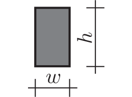
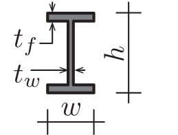

::: {#exr-querschnitte}

# Klassen für Querschnitte

Entwickeln Sie jeweils eine Klasse zur Erfassung von Rechteckquerschnitten und von I-Querschnitten. Für einen Querschnitt sollen die Fläche $A$ sowie die beiden Flächenträgheitsmomente $I_y$ und $I_z$ berechnet werden. 

::: {.columns}
::: {.column width="20%"}


[&nbsp;]{.down40}


:::
::: {.column width="5%"}
:::
::: {.column width="75%"}
Vervollständigen Sie das UML-Klassendiagramm, implementieren Sie die Klassen und testen Sie Ihren Code! Hier eine mögliche Ausgabe des Testprogramms.

```
Rectangular section 20x60
 A = 1200cm²
Iy = 360000cm⁴
Iz = 40000cm⁴

I-Section 20x60x1x2
 A = 136cm²
Iy = 81941,33333333333cm⁴
Iz = 2671,3333333333335cm⁴
```
:::
:::


:::