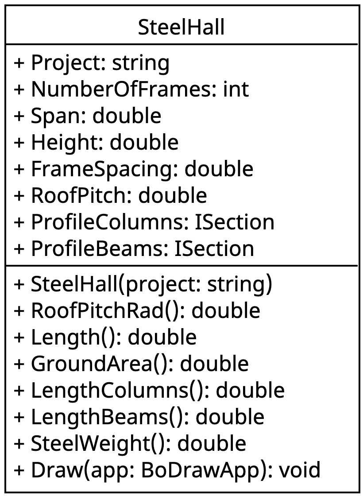

::: {#exr-stahlhalle-klasse-1}

## Klasse für Halle in Stahlbauweise

Der Programmcode zum Zeichnen der Halle aus dem vorherigen Abschnitt soll nun in eine Klasse übertragen werden, so dass im Demo-Programm sehr einfach eine Halle erzeugt und gezeichnet werden kann. Eine mögliche Anwendung ist es später, die Klasse in einem Programm mit grafischer Benutzungsoberfläche wiederzuverwenden.

Hier ein mögliches UML-Klassendiagramm und die Verwendung der Klasse in `SteelHallDemo.cs`.

::: {.columns}
::: {.column width="30%"}

:::
::: {.column width="2%"}
:::
::: {.column width="68%"}
```csharp
using BoDraw;

SteelHall hall = new SteelHall("Halle S2-12-075");
hall.RoofPitch = 3;
hall.NumberOfFrames = 8;

BoDrawApp app = new BoDrawApp();
hall.Draw(app);
app.Show();
```
:::
:::

Im Unterschied zu den Klassen, die Sie bisher implementier hatten, werden hier nicht alle Attribute im Konstruktor mit Werten belegt. Vielmehr besitzen die Attribute sinnvolle Voreinstellungen, die bei Bedarf angepasst werden können. Der folgende Code zeigt exemplarisch, wie sich das umsetzen lässt.

```csharp
using BoDraw;
using ISections;

using static System.Math;

public class SteelHall
{

    public string Project;
    ...
    public double RoofPitch = 5.0;
    public ISection ProfileColumns = ISection.Get("HE-A", 200);
    ...

    public SteelHall(string project)
    {
        this.Project = project;
    }

    public double RoofPitchRad()
    {
        return this.RoofPitch * PI / 180;
    }

    ...
}
```

Gehen Sie für die Implementation der Klasse `SteelHall` folgendermaßen vor:

1. Vervollständigen Sie die Attribute entsprechend dem UML-Klassendiagramm. Verwenden Sie als Voreinstellung die Werte aus ihrer Lösung zu Abschnitt 4.

1. Ergänzen Sie Schritt für Schritt die fehlenden Methoden. In die `Draw`-Methode kopieren Sie den Code aus Abschnitt 4. Dabei ersetzen Sie die Parameter mit Attributen und die berechneten Werte durch Methodenaufrufe. Anstatt

    ```csharp
    ...
    double length = (numberOfFrames - 1) * frameSpacing;
    ...
    Rectangle slab2 = new Rectangle(-1, -1, length + 1, span + 1);
    ...
    ```

    schreiben Sie also

    ```csharp
    ...
    Rectangle slab2 = new Rectangle(-1, -1, this.Length() + 1, span + 1);
    ...
    ```

:::