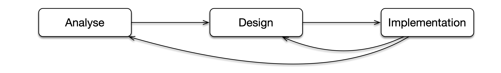
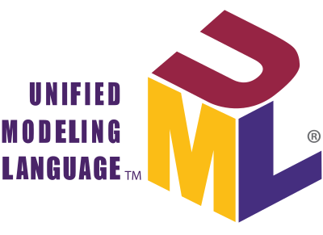
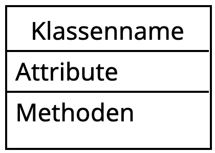
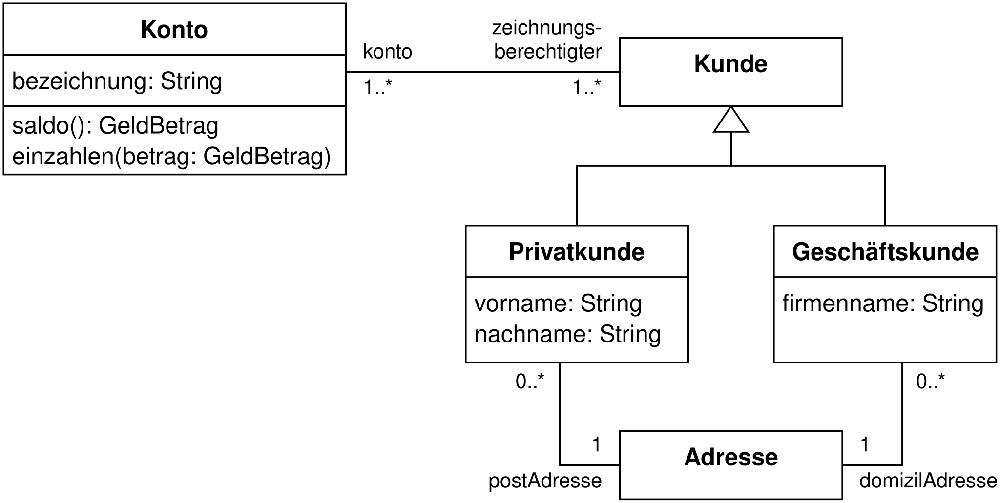
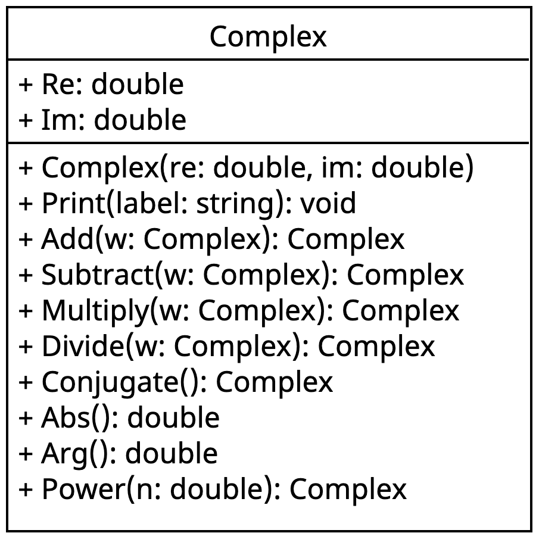

# Beispielprogramm zur Einführung

[🎥](https://youtu.be/U7M3BRRl3Fg){target="_blank"} Erklärvideo auf YouTube

##

```{.csharp filename="ComplexDemo.cs"}
Complex z1 = new Complex(3, 4);
Complex z2 = new Complex(4, 2);

Console.Clear();
Console.WriteLine("Direkter Zugriff auf Eigenschaften");
Console.WriteLine($"Re(z1) = {z1.Re}, Im(z1) = {z1.Im}");
Console.WriteLine($"Re(z2) = {z2.Re}, Im(z2) = {z2.Im}");

Console.WriteLine("\nAusgabe mit Print-Methode");
z1.Print("z1");
z2.Print("z2");

Console.WriteLine("\nAddition und Subtraktion");
Complex z3 = z1.Add(z2);
Complex z4 = z1.Subtract(z2);
z3.Print("z3");
z4.Print("z4");

Console.WriteLine("\nMultiplikation und Division");
Complex z5 = z1.Multiply(z2);
Complex z6 = z1.Divide(z2);
z5.Print("z5");
z6.Print("z6");

Console.WriteLine("\nKonjugiert-komplexe Zahl");
Complex z7 = z1.Conjugate();
Complex z8 = z1.Multiply(z7);
z7.Print("z7");
z8.Print("z8");

Console.WriteLine("\nPolarkoordinaten");
double a = z1.Abs();
double b = z1.Arg();
Console.WriteLine($"|z1| = {a}");
Console.WriteLine($"arg(z1) = {b}");

Console.WriteLine("\nPotenz");
Complex z9 = z1.Power(1.0 / 3.0);
Complex z10 = z9.Power(3);
z9.Print("z9");
z10.Print("z10");
```

##

```{.csharp filename="Complex.cs"}
using static System.Math;

public class Complex
{

    public double Re;
    public double Im;

    public Complex(double re, double im)
    {
        this.Re = re;
        this.Im = im;
    }

    public void Print(string label)
    {
        Console.WriteLine($"{label} = {this.Re:0.####} {this.Im:+ 0.####;- 0.####}i");
    }

    public Complex Add(Complex w)
    {
        double re = this.Re + w.Re;
        double im = this.Im + w.Im;

        return new Complex(re, im);
    }

    public Complex Subtract(Complex w)
    {
        double re = this.Re - w.Re;
        double im = this.Im - w.Im;

        return new Complex(re, im);
    }

    public Complex Multiply(Complex w)
    {
        double re = this.Re * w.Re - this.Im * w.Im;
        double im = this.Re * w.Im + this.Im * w.Re;

        return new Complex(re, im);
    }

    public Complex Divide(Complex w)
    {
        double denom = w.Re * w.Re + w.Im * w.Im;
        double re = (this.Re * w.Re + this.Im * w.Im) / denom;
        double im = (this.Im * w.Re - this.Re * w.Im) / denom;

        return new Complex(re, im);
    }

    public Complex Conjugate()
    {
        return new Complex(this.Re, -this.Im);
    }

    public double Abs()
    {
        Complex w = this.Multiply(this.Conjugate());

        return Sqrt(w.Re);
    }

    public double Arg()
    {
        return Atan2(this.Im, this.Re);
    }

    public Complex Power(double n)
    {
        double rn = Pow(this.Abs(), n);
        double nphi = n * this.Arg();
        double re = rn * Cos(nphi);
        double im = rn * Sin(nphi);

        return new Complex(re, im);
    }
}
```

## Aufbau

### Verwendung der Klasse für komplexe Zahlen in `ComplexDemo.cs`

1. Variablen mit Datentyp einer Klasse deklarieren
1. Objekte einer Klasse erzeugen
1. Berechnungen durchführen

::: {.fragment}
→ Das kennen Sie bereits
:::

::: {.fragment}
### Definition der Klasse für komplexe Zahlen in `Complex.cs`

1. Programmcode der
    - definiert, welche Eigenschaften ein Objekt hat,
    - festlegt, welche Operationen ein Objekt ausführen kann und
    - was genau eine Operation macht.
:::

::: {.fragment}
→ Wie das funktioniert werden Sie jetzt lernen
:::

## Schritte bei der Erstellung einer Klasse

[]{.down80}

{width=60%}

[]{.down80}

Analyse
: Klären und eingrenzen, welches Problem gelöst werden soll

Design 
: Festlegen, welche Eigenschaften und Operationen dafür notwendig sind

Implementation
: Design in Programmcode umsetzen

. . .

[]{.down40}
→ Schritt für Schritt am Beispiel der komplexen Zahlen

# Analyse

[🎥](https://youtu.be/fp1ytJukrjE){target="_blank"} Erklärvideo auf YouTube

## Ausgangspunkt: Definition

Eine komplexe Zahl $z = x + iy$ besteht aus Realteil $x$ und Imaginärteil $y$. Die folgende Tabelle fasst für $z = x + iy$ und $w = u + iv$ die wichtigsten Operationen zusammen.

[]{.down20}

| Operation | Formel |
|---|---|
| Addition | $z + w = (x+u) + (y+v)\,i$ |
| Subtraktion | $z - w = (x-u) + (y-v)\,i$ |
| Multiplikation | $z \cdot w = (xu - yv) + (xv + yu)\,i$ |
| Division | $\dfrac{z}{w} = \dfrac{xu + yv}{u^2+v^2} + \dfrac{yu - xv}{u^2+v^2}\,i$ |
| Konjugierte | $\bar{z} = x - iy$ |
| Betrag | $|z| = \sqrt{z \cdot \bar{z}} = \sqrt{x^2 + y^2}$ |
| Argument (Winkel) | $\arg(z) = \begin{cases} \phantom{-}\arccos\dfrac{x}{r} & y \geq 0 \\[1ex] -\arccos\dfrac{x}{r} & y < 0 \end{cases} \quad$ mit $r = |z|$ |
| Potenz | $z^n =  r^n \cos(n\varphi) + r^n \sin(n\varphi) \, i \quad$ mit $r = |z|$ und $n \in \mathbb{R}$ |
: {tbl-colwidths="[25,75]"}

## Ergebnis der Analyse - Im Beispiel

[]{.down40}

- Eine komplexe Zahl wird durch ein Objekt der Klasse `Complex` repräsentiert
- Eigenschaften sind Realteil `Re` und Imaginärteil `Im` (reelle Zahlen)
- Mathematische Operationen werden mithilfe von Methoden implementiert, die für eine komplexe Zahl aufgerufen werden

    []{.down40}

    | Operation | Beschreibung | Eingabe | Ergebnis |
    |-|-|-|-|
    | `Print` | Zahl mit Bezeichnung ausgeben | Bezeichnung | - |
    | `Add`, `Subtract`, `Multiply`, `Divide` | Grundrechenarten | Zweiter Operand | Komplexe Zahl |
    | `Conjugate` | Konjugiert-komplexe Zahl | - |  Komplexe Zahl  |
    | `Abs`, `Arg` | Betrag und Argument | - | reelle Zahl |
    | `Power` | Potenz | Exponent | Komplexe Zahl |
    : {tbl-colwidths="[20,30,25,25]"}

## Ergebnis der Analyse - Allgemein

[]{.down40}

::: {.objective}
Grobe Festlegung einer Klasse mit Attributen und Methoden
:::

[]{.down20}

- Name für die Klasse
    - Beginnt mit Großbuchstaben
    - CamelCase für zusammengesetzte Namen (CrossSection, WallOpening, ...)
    - Immer im Singular (`new Complex(2, 2)` erzeugt **eine** komplexe Zahl)
- Eigenschaften mit Namen und Datentyp (Schreibweise wie Klassenname)
- Methoden mit Eingabe und Ergebnis (Schreibweise wie Klassenname)

### Anmerkungen

- Statt Eigenschaften spricht man auch von [Attributen]{.neuerbegriff} oder [Feldern]{.neuerbegriff}
- Die Eingabe erfolgt mithilfe der [Parameterliste]{.neuerbegriff}
- Die Art des Ergebnisses heißt [Rückgabetyp]{.neuerbegriff}

# Design

[🎥](https://youtu.be/8_i1Y1epmx4){target="_blank"} Erklärvideo auf YouTube

## Unified Modelling Language (UML)

[]{.down40}

::: {.columns}
::: {.column width="30%"}

:::
::: {.column width="7%"}
:::
::: {.column width="22%"}

:::
::: {.column width="7%"}
:::
::: {.column width="30%"}

:::
:::

- Grafische Modellierungssprache für Softwaresysteme [(Wikipedia)](https://de.wikipedia.org/wiki/Unified_Modeling_Language)
- Idee: Diagramme dienen als Blaupausen für Programmcode
- Sehr umfangreich, wir verwenden nur Klassendiagramme
- Klassendiagramm
    - Klasse mit drei Abteilungen (Name, Attribute, Methoden)
    - Mehrere Klassen bei realen Programmen (später)
    - Attribute/Methoden in umfangreichen Diagrammen ggf. weglassen

## Ergebnis Design - Im Beispiel [🎥](https://youtu.be/JfhidC3_jgc){target="_blank"}

[]{.down60}

::: {.columns}
::: {.column width="43%"}

:::
::: {.column width="5%"}
:::
::: {.column width="52%"}
- Klassenname `Complex`
    
- Attribute `Re` und `Im` für Realteil und Imaginärteil als reelle Zahlen

- Konstruktor `Complex` erzeugt ein neues Objekt

- Methode `Print` gibt die Zahl auf der Konsole aus, gibt nichts zurück

- Methode `Add` addiert eine zweite komplexe Zahl und gibt das Ergebnis zurück
:::
:::

## UML Notation

[]{.down40}

### Attribut

`+ Name: Datentyp`

[]{.down10}

### Konstruktor (spezielle Methode)

`+ Klassenname(Parameterliste)`

[]{.down10}

### Methode

`+ Name(Parameterliste): Rückgabetyp`

[]{.down40}

### Anmerkungen

- Parameterliste: Beliebig viele Parameter der Form `name: Typ`
- Rückgabetyp `void` meint, dass Methode kein Ergebnis zurückgibt
- Das `+` am Anfang sagt, dass Attribut/Methode öffentlich ist (*public*)

## Ergebnis Design - Allgemein

[]{.down40}

::: {.objective}
Konkrete Festlegung einer Klasse mit Attributen und Methoden mit Datentypen in einem Klassendiagramm. Fokus liegt auf dem **Was** und nicht dem  **Wie**
:::

[]{.down20}

- UML-Klassendiagramm mit 
    - Klassenname
    - Eigenschaften (Attribute)
    - Konstruktor und Methoden mit Parameterliste und Rückgabetyp
- Vorteile des Klassendiagramms gegenüber Programmcode
    - Schnell erstellt und leicht zu ändern
    - Konzentration auf das Wesentliche erleichtert das Nachdenken

### Anmerkung

- Analyse und Design häufig in einem Schritt zusammengefasst

# Implementation

[🎥](https://youtu.be/mBvQ1EClqg8){target="_blank"} Erklärvideo auf YouTube

## Attribute und Konstruktor: Programmierung

[]{.down40}

```csharp
public class Complex
{

    public double Re;
    public double Im;

    public Complex(double re, double im)
    {
        this.Re = re;
        this.Im = im;
    }
}
```

[]{.down20}

- Attribute in der Form `public Datentyp Name;`
- Konstruktor: Methode mit Name der Klasse ohne Rückgabetyp
    - Ausführung, wenn Objekt mit `new` erzeugt wird
    - Zwei Parameter in der Form `Datentyp name` (erster Buchstabe klein)
    - Attribute werden mit Werten aus Parametern `re` und `im` belegt

```{r}
#| output: asis
source(here::here("bausteine/00-templates/bausteine.R"))

code_class <-
'public class Complex
{

    public double Re;
    public double Im;

    public Complex(double re, double im)
    {
        this.Re = re;
        this.Im = im;
    }
}
'

code_demo <-
'Complex z1 = new Complex(3, 4);
Complex z2 = new Complex(4, 2);

Console.WriteLine(
    $"Re(z1) = {z1.Re}, Im(z1) = {z1.Im}"
);
Console.WriteLine(
    $"Re(z2) = {z2.Re}, Im(z2) = {z2.Im}"
);
'

output <- c(
    " \n \n \n \n \n \n \n",
    " \n \n \n \n \n \n \n",
    " \n \n \n \n \n \n \n",
    " Re(z1) = 3, Im(z1) = 4 \n \n \n \n \n \n \n",
    " Re(z1) = 3, Im(z1) = 4 \n Re(z2) = 4, Im(z2) = 2\n \n \n \n \n \n"
)

lc <- function(i, ll) {
  glue::glue(
'
### Klasse

{ca_include_code(code_class)}

### Demoprogramm

{ca_include_code(code_demo, ll)}
'
  )
}

rc <- function(i, ll) {
  glue::glue(
'
### Objekte und Variablen

::: {{.border}}

:::

### Ausgabe

::: {{.border}}
{ca_include_raw(output[i])}
:::
'
  )
}

ca_make_animation(
  'Attribute und Konstruktor: Funktionsweise', 
  lc, rc, 
  c("true", "1", "1-2", "1-6", "1-9")
)

```

## Print-Methode: Programmierung [🎥](https://youtu.be/XapELKCNcYI){target="_blank"}

[]{.down40}

```csharp
public class Complex
{

    ...

    public void Print(string label)
    {
        Console.WriteLine($"{label} = {this.Re:0.##} {this.Im:+ 0.##;- 0.##}i");
    }
}
```

[]{.down20}

- Methode mit Rückgabetyp `void` liefert kein Ergebnis zurück
- Ein Parameter `label` vom Typ `string`
- Ausgabe auf Konsole innerhalb der Methode
- Zugriff auf Attribute des Objekts mit `this`

```{r}
#| output: asis
code_class <-
'public class Complex
{

    ...

    public void Print(string label)
    {
        Console.WriteLine(
            $"{label} = {this.Re:0.##} {this.Im:+ 0.##;- 0.##}i"
        );
    }
}
'

code_demo <-
'Complex z1 = new Complex(3, 4);
Complex z2 = new Complex(4, 2);


z1.Print("z1");
z2.Print("z2");
 
  
 
'

output <- c(
    " \n \n \n \n \n \n \n",
    " z1 = 3 + 4i \n \n \n \n \n \n \n",
    " z1 = 3 + 4i \n z2 = 4 + 2i\n \n \n \n \n \n"
)

lc <- function(i, ll) {
  glue::glue(
'
### Klasse

{ca_include_code(code_class)}

### Demoprogramm

{ca_include_code(code_demo, ll)}
'
  )
}

rc <- function(i, ll) {
  glue::glue(
'
### Objekte und Variablen

::: {{.border}}

:::

### Ausgabe

::: {{.border}}
{ca_include_raw(output[i])}
:::
'
  )
}

ca_make_animation(
  'Print-Methode: Funktionsweise', 
  lc, rc, 
  c("1-2", "1-5", "1-6")
)

```

## Add-Methode: Programmierung

[]{.down40}

```csharp
public class Complex
{
    ...

    public Complex Add(Complex w)
    {
        double re = this.Re + w.Re;
        double im = this.Im + w.Im;

        return new Complex(re, im);
    }
}
```

[]{.down20}

- Rückgabetyp ist `Complex`
- Ein Parameter `w` vom Typ `Complex`
- Lokale Variablen `re` und `im` vom Typ `double`
    - Summe von Real- und Imaginärteil
- Neue komplexe Zahl mit `return` zurückgeben

```{r}
#| output: asis
code_class <-
'public class Complex
{
    ...
    
    public Complex Add(Complex w)
    {
        double re = this.Re + w.Re;
        double im = this.Im + w.Im;

        return new Complex(re, im);
    }
}
'

code_demo <-
'Complex z1 = new Complex(3, 4);
Complex z2 = new Complex(4, 2);
Complex z3 = z1.Add(z2);

z1.Print("z1");
z2.Print("z2");
z3.Print("z3");
 
 
'

output <- c(
    " \n \n \n \n \n \n \n",
    " \n \n \n \n \n \n \n",
    " \n \n \n \n \n \n \n",
    " z1 = 3 + 4i\n z2 = 4 + 2i\n z3 = 7 + 6i\n \n \n \n \n"
)

lc <- function(i, ll) {
  glue::glue(
'
### Klasse

{ca_include_code(code_class)}

### Demoprogramm

{ca_include_code(code_demo, ll)}
'
  )
}

rc <- function(i, ll) {
  glue::glue(
'
### Objekte und Variablen

::: {{.border}}

:::

### Ausgabe

::: {{.border}}
{ca_include_raw(output[i])}
:::
'
  )
}

ca_make_animation(
  'Add-Methode: Funktionsweise', 
  lc, rc, 
  c("1-2", "1-3", "1-3", "true")
)

```

## Abs-Methode: Programmierung

[]{.down40}

```csharp
public class Complex
{
    ...

    public double Abs()
    {
        Complex w = this.Multiply(this.Conjugate());

        return Sqrt(w.Re);
    }
}
```

[]{.down20}

- Rückgabetyp ist `double`
- Komplexe Zahl mit konjugiert komplexer Zahl von sich selber multiplizien
- Ergebnis ist Wurzel aus dem Realteil des Produkts

##

[]{.down200}

::: {.r-fit-text}
Weitere Methoden funktionieren im Prinzip genau so
:::

## Grundlegender Aufbau einer Klasse {.smaller}

```{.csharp}
public class Klassenname
{
    // Attribute
    public Typ1 Attribut1;
    public Typ2 Attribut2;
    ...

    // Konstruktor
    public Klassenname(Typ1 attribut1, Typ2 attribut2, ...)
    {
        this.Attribut1 = attribut1;
        this.Attribut2 = attribut2;
        ...
    }

    // Methode, die keinen Wert zurückliefert
    public void Methodename1(Parameterliste)
    {
        ...
    }

    // Methode, die Wert vom Typ Rückgabetyp zurückliefert
    public Rückgabetyp Methodenname2(Parameterliste)
    {
        ...
        return Wert;
    }
}
```

- Funktioniert immer nach diesem Prinzip
- Wird später bei Bedarf noch ergänzt

## Wichtige Punkte

[]{.down40}

### Rückgabetypen und `return`

- Methoden mit Rückgabetyp `void` liefern kein Ergebnis zurück
- Alle anderen Rückgabetypen sind so etwas wie ein Versprechen
    - Die Methode liefert auf jeden Fall einen entsprechenden Wert zurück
    - In der Methode muss eine `return`-Anweisung stehen

### Struktur, Sichtbarkeit und `this`

- Die Reihenfolge im Code ist Attribute, Konstruktor, Methoden
- Parameter und lokale Variablen sind nur innerhalb der Methode sichtbar
    - Namen können in verschiedenen Methoden wiederverwendet werden
- Innerhalb einer Methode zeigt `this` auf das Objekt, für das die Methode aufgerufen wurde

# Zusammenfassung

[🎥](https://youtu.be/bJbtEVdmD1A){target="_blank"} Erklärvideo auf YouTube

## Zusammenfassung

[]{.down40}

- Schritte bei der Erstellung von Klassen: Analyse → Design → Implementation
- **Analyse**: Klären, welche Eigenschaften und Operationen benötigt werden
- **Design**: UML-Klassendiagramm erstellen (*Was*, nicht *Wie*)
- **Implementation**: Klasse in C# programmieren
- In einer Methode zeigt `this` auf das Objekt, das die Methode ausführt
- Methoden mit `void` liefern kein Ergebnis, sonst ist `return` obligatorisch

. . .

[]{.down40}

### Die wichtigsten Begriffe mit Übersetzung

[]{.down20}

::: {.columns}

::: {.column width="33%"}
Attribut und Feld
: *Attribute* und *Field*

Parameter
: *Parameter*
:::

::: {.column width="33%"}
Parameterliste
: *Parameter list*

Lokale Variable
: *Local variable*
:::

::: {.column width="33%"}
Rückgabetyp
: *Return type*

Konstruktor
: *Constructor*
:::

:::
