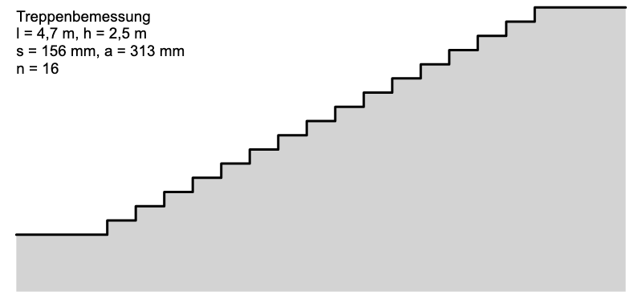

::: {#exr-treppenbemessung}
## Bemessung von Treppen

Die Auslegung von Treppen regelt die DIN 18065. In dieser Aufgabe sollen für eine vorgegebene Lauflänge $l$ und Höhe $h$ zulässige Treppenauslegungen ermittelt werden. Dabei sind folgende Regeln zu beachten:

::: {.columns}
::: {.column width="56%"}

:::
::: {.column width="1%"}
:::
::: {.column width="43%"}
- Maximal 18 Stufen ohne Podest
- Steigung <br/>
    $140\,\text{mm} \leq s \leq 210\,\text{mm}$
- Auftritt <br/>
    $230\,\text{mm} \leq s \leq 370\,\text{mm}$
- Schrittmaßregel
    $590\,\text{mm} \leq 2s + a \leq 650\,\text{mm}$
:::
:::

Öffnen Sie die Datei `Treppenbemessung.cs` und gehen Sie in folgenden Schritten vor:

1. Ausgabe: Geben Sie für $n = 2, \dots, 18$ jeweils die sich ergebende Steigung, den Auftritt sowie das Schrittmaß aus. Hier eine mögliche Ausgabe des Programms:

    ```
    Treppenbemessung: Lauflänge l = 4,7 m, Geschosshöhe h = 2,5 m

    Regelung nach DIN 18065
            Steigung: 140 mm ≤    s   ≤ 210 mm
            Auftritt: 230 mm ≤    a   ≤ 370 mm
     Schrittmaßregel: 590 mm ≤ 2s + a ≤ 650 mm

    ───────────────────────────────────────────
    n      s (mm)     a (mm)     2s+a (mm)   
    ───────────────────────────────────────────
    2      1250       4700       7200        
    3      833        2350       4017        
    4      625        1567       2817        
    5      500        1175       2175        
    6      417        940        1773        
    7      357        783        1498        
    8      312        671        1296        
    9      278        588        1143        
    10     250        522        1022        
    11     227        470        925         
    12     208        427        844         
    13     192        392        776         
    14     179        362        719         
    15     167        336        669         
    16     156        313        626         
    17     147        294        588         
    18     139        276        554         
    ───────────────────────────────────────────
    ```

    Tipp: Die horizontalen Linien können Sie mithilfe von

    ```csharp
    string line = new string('─', 43);
    ```

    erzeugen. Vorteil: In den folgenden Schritten lässt sich leicht die Breite anpassen.

1. Zulässige Steigung: Geben Sie nur Konfigurationen aus, in denen die Steigung zulässig ist.

    ```
    Treppenbemessung: Lauflänge l = 4,7 m, Geschosshöhe h = 2,5 m

    ...

    ───────────────────────────────────────────
    n      s (mm)     a (mm)     2s+a (mm)   
    ───────────────────────────────────────────
    12     208        427        844         
    13     192        392        776         
    14     179        362        719         
    15     167        336        669         
    16     156        313        626         
    17     147        294        588         
    ───────────────────────────────────────────
    ```

1. Überprüfung: Geben Sie jeweils an, ob die Treppe zulässig ist beziehungsweise welche Regel verletzt wurde.

    ```
    Treppenbemessung: Lauflänge l = 4,7 m, Geschosshöhe h = 2,5 m

    ...

    ──────────────────────────────────────────────────────────────────────────────────
    n      s (mm)     a (mm)     2s+a (mm)   Ergebnis
    ──────────────────────────────────────────────────────────────────────────────────
    12     208        427        844         Auftritt und Schrittmaß nicht eingehalten
    13     192        392        776         Auftritt und Schrittmaß nicht eingehalten
    14     179        362        719         Schrittmaß nicht eingehalten
    15     167        336        669         Schrittmaß nicht eingehalten
    16     156        313        626         Gültig
    17     147        294        588         Schrittmaß nicht eingehalten
    ──────────────────────────────────────────────────────────────────────────────────
    ```

    Tipps:
    
    - Sie benötigen das Ergebnis der Überprüfung an mehreren Stellen. Hier bieten sich boolsche Variablen an. Im Prinzip funktioniert das so:

        ```csharp
        bool testOK = x < 30 || x > 100;
        ```

    - Sie können eine Ausgabezeile in mehreren Schritten erzeugen

        ```csharp
        Console.Write("Hallo ")
        Console.Write("Bochum ")
        Console.WriteLine(" 4630 ")
        ```

1. Graphische Darstellung (Zusatzaufgabe): Zeichnen Sie die zulässigen Konfigurationen und speichern Sie die Grafik in einer Datei. Hier eine mögliche Darstellung:

    {width="60%"}
    
    Die Grafik erzeugen Sie mit

    ```csharp
    BoDrawApp app = new BoDrawApp();
    app.Add(new Rectangle(0, 0, 1, 1)); // Durch eigenen Code ersetzen
    app.SaveImage($"treppe-{n}.png");
    ```    

    Verwenden Sie zum Zeichnen `Polyline` und `Polygon`

1. Grenzfälle (Zusatzaufgabe, schwierig): Berücksichtigen Sie Grenzfälle, in denen keine Lösungen gefunden werden.

    Geschoss zu hoch:

    ```
    Treppenbemessung: Lauflänge l = 4,7 m, Geschosshöhe h = 12,5 m

    ...

    Treppe kann ohne Podest nicht gebaut werden!
    ```

    Treppe zu lang:

    ```
    Treppenbemessung: Lauflänge l = 6 m, Geschosshöhe h = 3 m

    ...

    ──────────────────────────────────────────────────────────────────────────────────
    n      s (mm)     a (mm)     2s+a (mm)   Ergebnis
    ──────────────────────────────────────────────────────────────────────────────────
    15     200        429        829         Auftritt und Schrittmaß nicht eingehalten
    16     188        400        775         Auftritt und Schrittmaß nicht eingehalten
    17     176        375        728         Auftritt und Schrittmaß nicht eingehalten
    18     167        353        686         Schrittmaß nicht eingehalten
    ──────────────────────────────────────────────────────────────────────────────────

    Keine zulässige Auslegung gefunden
    ```

:::