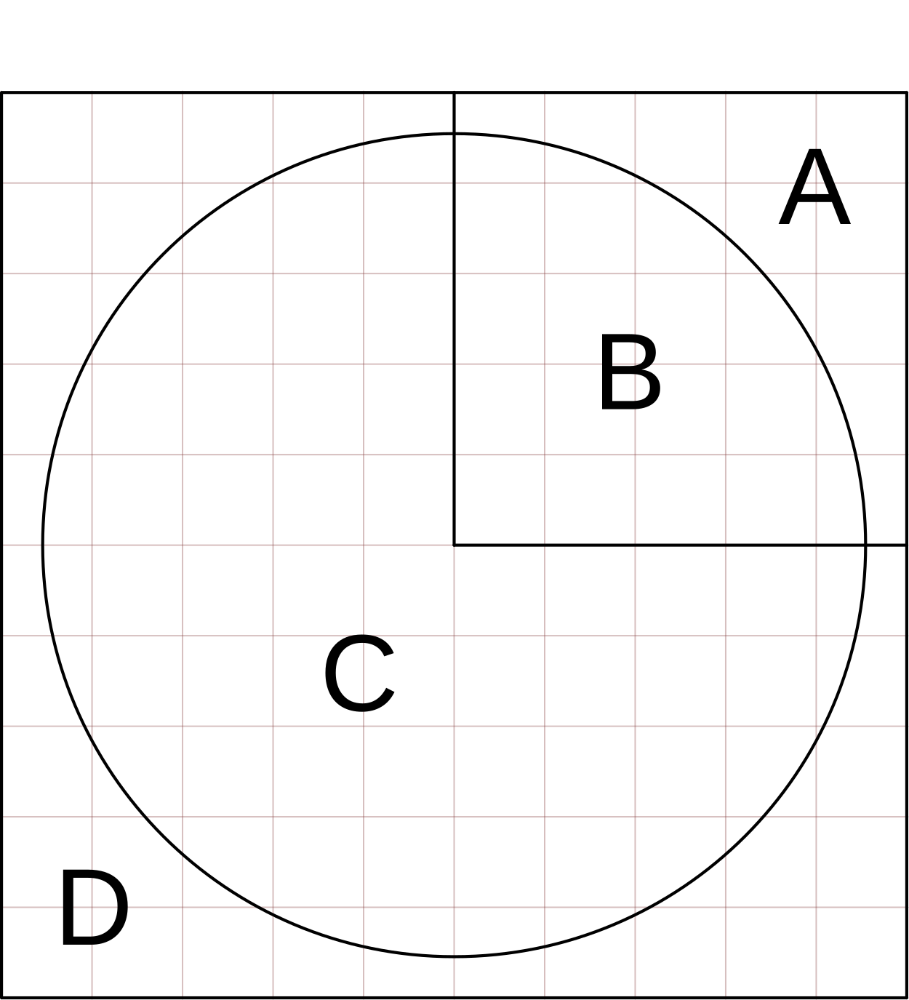

::: {#exr-malen}
## Eine Grafik Pixel für Pixel erstellen

Öffnen Sie die Datei `04-paint/Paint.cs` und führen Sie das Programm aus. Sie sehen in der Mitte des Bildes ein einzelnes grünes Pixel. Ändern Sie die Datei so, dass die dargestellte Graphik erzeugt wird.

::: {.columns}
::: {.column width="40%"}

:::
::: {.column width="5%"}
:::
::: {.column width="55%"}
### Prinzip:

- Die Bereiche werden eingefärbt
- Jeder Buchstabe steht für eine Ihrer Lieblingsfarben
- Der Kreis hat den Radius 1 und liegt im Ursprung
- Das Raster Symbolisiert die Pixel

### Tipps zur Umsetzung:

- Sie benötigen zwei geschachtelte Schleifen
- Welche Farbe ein Pixel bekommt hängt von den Pixelkoordinaten ab
- Für ein hübsches Bild müssen Sie die Auflösung erhöhen
:::
:::
:::