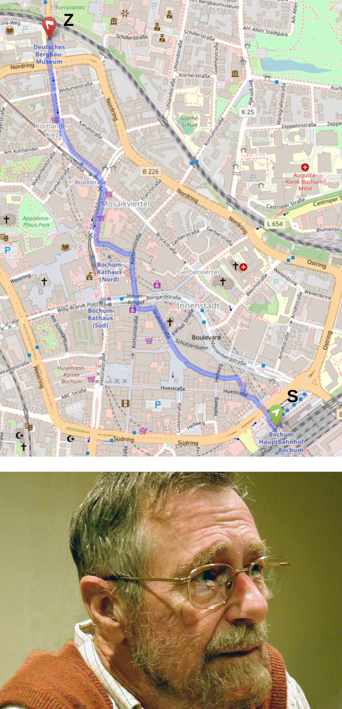
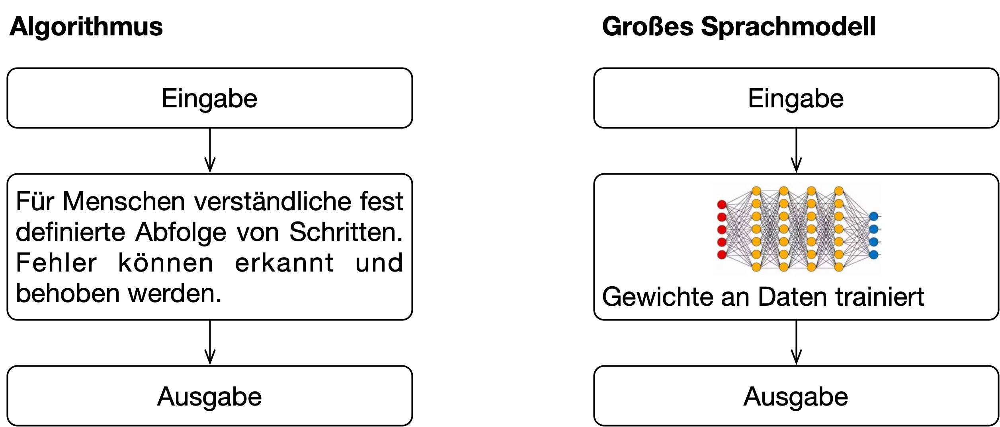
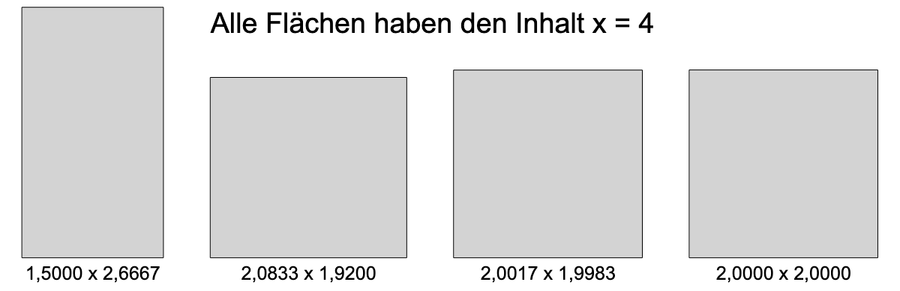
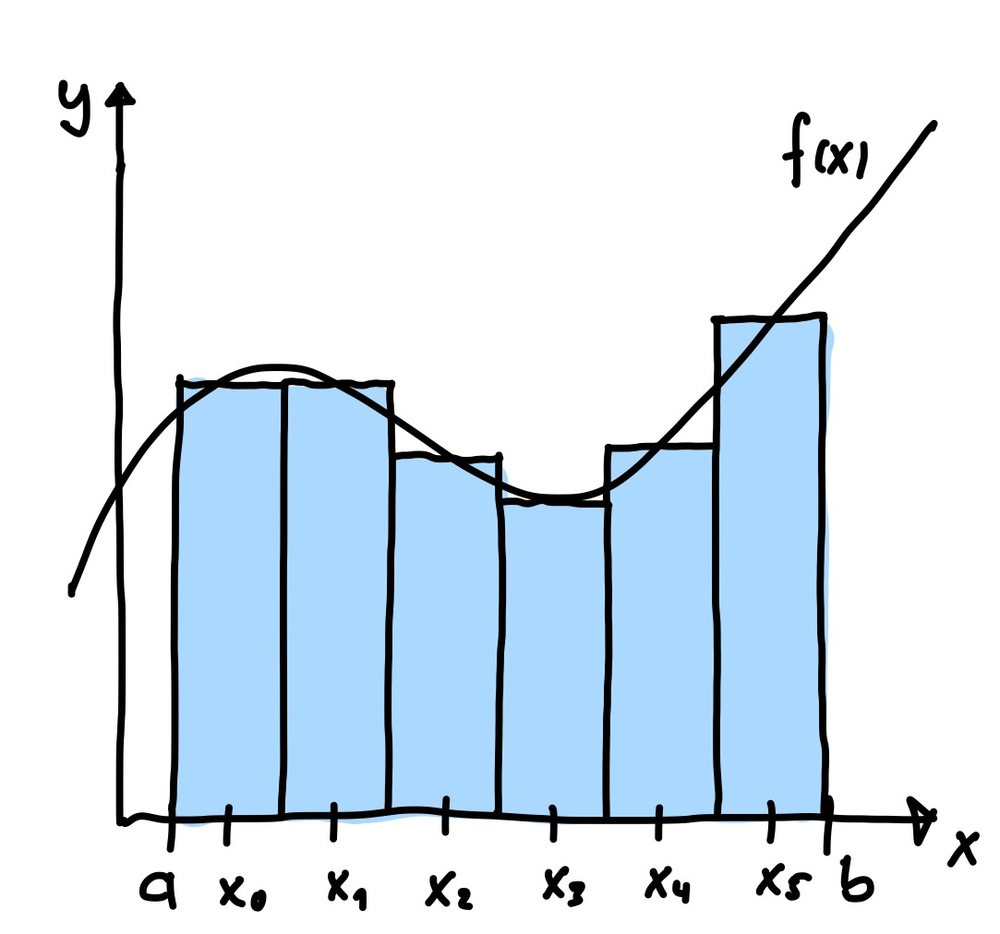
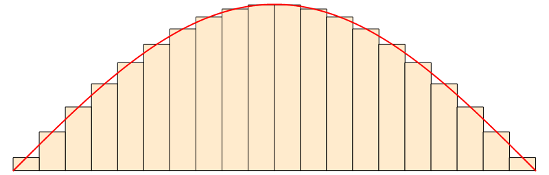

# Algorithmen

[🎥](https://youtu.be/TODO){target="_blank"} Erklärvideo auf YouTube

## Beispiel 1: Größter gemeinsamer Teiler von a und b

::: {.columns}
::: {.column width="70%"}

### Rezept zur Bestimmung

```{.pseudocode}
 Solange b ≠ 0
     h ← Rest a geteilt durch b
     a ← b
     b ← h
```
Danach
```{.pseudocode}
 a ist die gesuchte Zahl
```

### Beispiel für a = 48 und b = 18

[]{.up10}

$$
\begin{array}{rcllclll}
48 & = & 2 \cdot 18 & + & 12 & \rightarrow & \text{h} = 12 & \text{a} = 18 & \text{b} = 12 \\
18 & = & 1 \cdot 12 & + & 6  & \rightarrow & \text{h} = 6 & \text{a} = 12 & \text{b} = 6 \\
12 & = & 2 \cdot 6  & + & 0  & \rightarrow & \text{h} = 0 & \text{a} = 6 & \text{b} = 0 \\
\end{array}
$$

[]{.up30}
6 ist die gesuchte Zahl

:::
::: {.column width="30%"}
[]{.down30}

:::
:::

. . .

[]{.down20}
→ Algorithmus von Euklid

## Beispiel 2: Kürzester Weg von Ort S nach Ort Z

::: {.columns}
::: {.column width="70%"}
### Rezept zur Bestimmung
```{.pseudocode}
 strecke[S] ← 0
 strecke[o] ← ∞ für alle anderen Orte o
 Lege alle Orte in eine Schachtel
 Solange die Schachtel nicht leer ist
     Entnimm Ort o mit der kleinsten strecke[o]
     Für jeden Nachbarn n von o
         Falls strecke[o] + Entfernung(o, n) < strecke[n]
             strecke[n] ← strecke[o] + Entfernung(o, n)
             vorgänger[n] ← o
```
Danach
```{.pseudocode}
 strecke[o]: Kürzeste Strecke von S zu Ort o
 vorgänger[o]: Vorgänger von o auf der kürzesten Strecke
```
:::
::: {.column width="30%"}
[]{.down30}

:::
:::

. . .

→ Algorithmus von Edsger W. Dijkstra (1959)

## Beispiel (Entfernungen in km)

[]{.down100}

::: {.columns}
::: {.column}
```{mermaid}
graph LR
    S -->|6| A
    S -->|2| B
    B -->|3| A
    B -->|5| Z
    A -->|1| Z
```
:::
::: {.column}
| Knoten    | S | A | B | Z |
|:-|:-:|:-:|:-:|:-:|
| Strecke   | 0 | 5 | 2 | 6 |
| Vorgänger |   | B | S | A |
:::
:::

[]{.down60}

Kürzeste Strecke: S → B → A → Z  mit d = 2 + 3 + 1 = **6 km**

## Was ist ein Algorithmus

::: {.columns}
::: {.column width="70%"}
### Allgemein

- Algorithmus: Verfahren als Abfolge von Anweisungen, die eine bestimmte Aufgabe lösen
- Aufgabe: Eingabe → Ausgabe
- Namensgeber: Abu Dschaʿfar Muhammad ibn Musa al-Chwārizmī, Mathematiker und Universalgelehrter, ca. 780 bis 840 meist in Bagdad
:::
::: {.column width=30%}
.png)
:::
:::

[]{.up60}

. . .

### Formale Anforderungen

1. Das Verfahren muss in einem endlichen Text eindeutig beschreibbar sein
1. Jeder Schritt des Verfahrens muss tatsächlich ausführbar sein
1. Das Verfahren darf nur endlich viele Schritte/Speicherplatz benötigen
1. Das Verfahren muss bei gleichen Voraussetzungen dasselbe Ergebnis liefern
1. Die nächste anzuwendende Regel im Verfahren ist immer eindeutig definiert

## Bausteine von Algorithmen

### Einfache Anweisungen

- Deklaration einer Variablen
- Zuweisung `Variable = Wert`
- Aufruf einer Methode

### Verzweigungen

- Anweisungen werden ausgeführt, falls eine Bedingung erfüllt ist

### Schleifen

- Anweisungen werden immer wieder ausgeführt
    - Solange eine Bedingung erfüllt ist
    - Eine Vorgegebene Anzahl von Durchläufen

[]{.down20}

::: {.fragment}
→ Jeder Algorithmus lässt sich aus diesen drei Bausteinen zusammensetzen
:::

# Abgrenzungen

## Abgrenzung 1: Große Sprachmodelle



- Basieren auf künstlichen neuronalen Netzen, trainiert auf riesigen Textmengen
- Verfügen nicht über einen expliziten Lösungsweg, das 'Wissen' steckt in den Gewichten des künstlichen neuronalen Netzes
- Gleiche Eingabe kann unterschiedliche Ausgaben erzeugen
- Keine Garantie auf korrekte Ergebnisse

::: {.fragment}
Vereinfacht gesagt: Große Sprachmodelle haben keinen nachvollziehbaren Lösungsweg — sie raten sehr gut
:::

## Abgrenzung 2: Algorithmische Medien

„Der Algorithmus" bei TikTok, Instagram oder YouTube entscheidet, welche Inhalte Nutzer sehen

### Was ist damit gemeint?

- Kein einzelner, explizit formulierter Algorithmus
- Ein komplexes System aus vielen Algorithmen und trainierten Modellen
- Optimiert auf Engagement (Verweildauer, Klicks) — nicht auf Qualität oder Korrektheit
- Proprietär und von außen nicht einsehbar

::: {.fragment}
„Algorithmus" wird hier umgangssprachlich für ein undurchsichtiges System verwendet — nicht im Sinne eines klar definierten, nachvollziehbaren Verfahrens
:::

# Etwas tun oder nicht tun: Verzweigungen

[🎥](https://youtu.be/TODO){target="_blank"} Erklärvideo auf YouTube

## Grundprinzip 1/2

[]{.down60}

### Bedingte Anweisung

::: {.columns}
::: {.column}
```csharp
if(Bedingung)
{
    Anweisungen...
}
```
:::
::: {.column}
[]{.down10}
Anweisungen in geschweiften Klammern werden nur ausgeführt, wenn die Bedingung erfüllt ist
:::
:::

[]{.down40}

### Alternative

::: {.columns}
::: {.column}
```csharp
if(Bedingung)
{
    Anweisungen A...
} 
else
{
    Anweisungen B...
}
```
:::
::: {.column}
[]{.down10}
Wenn die Bedingung erfüllt ist wird A ausgeführt, andernfalls B
:::
:::

## Grundprinzip 2/2

[]{.down100}

### Mehrfachverzweigung

::: {.columns}
::: {.column}
```csharp
if(Bedingung A)
{
    Anweisungen A...
} 
else if(Bedingung B)
{
    Anweisungen B...
} 
else
{
    Anweisungen C...
}
```
:::
::: {.column}
[]{.down10}
Wenn Bedingung A erfüllt ist wird A ausgeführt, andernfalls, falls Bedingung B erfüllt ist wird B ausgeführt, andernfalls C
:::
:::

## Anwendungsbeispiel: Einteilung in Energieeffizienzklasse

[]{.down20}

::: {.columns}
::: {.column width="50%"}
| Energieeffizienzklasse | Heizwärmebedarf $q_h$ |
|-|-|
| A+ | < 30 |
| A | 30 – 50 |
| B oder schlechter | ≥ 50 |
:::
::: {.column width="3%"}
:::
::: {.column width="47%"}
Energiebedarf verschiedener Gebäudestandards für die energetische Bewertung mit $q_h$ in kWh/(m²·a)
:::
:::

```csharp
double qh = 49.9;

if (qh < 30)
{
    Console.WriteLine("A+");
}
else if (qh < 50)
{
    Console.WriteLine("A");
}
else
{
    Console.WriteLine("B oder schlechter");
}
```

# Etwas immer wieder tun: Schleifen

[🎥](https://youtu.be/TODO){target="_blank"} Erklärvideo auf YouTube

## Grundprinzip `while`-Schleife

[]{.down40}

```csharp
...

while(Fortsetzungsbedingung)
{
    Anweisungen...
}

...
```

[]{.down40}

### Programmablauf

1. Fortsetzungsbedingung auswerten
    - Bedingung ist wahr
        - Anweisungen ausführen
        - Weiter bei Punkt 1
    - Bedingung ist falsch
        - Weiter nach Schleife

## Heron-Verfahren zur Berechnung von Wurzeln 1/2

::: {.columns}
::: {.column width="70%"}

### Rezept zur Bestimmung

```{.pseudocode}
 a ← 1.5  // Beliebiger Startwert
 Solange |a*a - x| > 0.0000000001
     b ← x / a
     a ← 0.5 * (a + b)
```
Danach
```{.pseudocode}
 a ist eine Näherung für Wurzel x
```

### Beispiel für $x = 3$


:::

::: {.column width="30%"}

:::
:::

## Heron-Verfahren zur Berechnung von Wurzeln 2/2

[]{.down40}

```csharp
using static System.Math;

double x = 4.0;
double a = 1.5;
double b;

while (Abs(a * a - x) > 1e-10)
{
    b = x / a;
    Console.WriteLine($" a = {a,-18}  b = {b,-18}");
    a = 0.5 * (a + b);
}

Console.WriteLine($"\nDie Wurzel aus {x} beträgt in etwa {a}");
```

[]{.down40}

```{.output}
 a = 1,5                 b = 2,6666666666666665
 a = 2,083333333333333   b = 1,9200000000000004
 a = 2,001666666666667   b = 1,9983347210657783
 a = 2,0000006938662227  b = 1,999999306134018 

Die Wurzel aus 4 beträgt in etwa 2,0000000000001203
```

## Grundprinzip `for`-Schleife

```csharp
...
for (Initialisierung; Fortsetzungsbedingung; Update)
{
    Anweisungen...
}
...
```

::: {.columns}
::: {.column}

### Programmablauf

1. Initialisierung ausführen
1. Fortsetzungsbedingung auswerten
    - Bedingung ist wahr
        - Anweisungen ausführen
        - Update ausführen
        - Weiter bei Punkt 2        
    - Bedingung ist falsch
        - Weiter nach der Schleife
:::
::: {.column}

### Anmerkungen

- Fast immer mit Laufvariable

    ```csharp 
    for(int i = 0; i < 10; i++) {}
    ```

- Übliche Laufvariablen `i, j, k, l`

:::
:::

## Summierte Mittelpunktsregel 1/2

[]{.down40}

### Numerische Integration

[]{.down40}

$$
    I = \int_a^b f(x) dx \approx \sum_{i=0}^{n-1} h \cdot f(x_i) \quad \text{mit} \quad h = \frac{b - a}{n}, \qquad x_i = a + (i + 1/2) \cdot h
$$

[]{.down40}

::: {.columns}
::: {.column width="70%"}

### Rezept zur Bestimmung

```{.pseudocode}
 integral ← 0
 h ← (b - a) / n
 für alle i von 0 bis n - 1
     xi ← a + (i + 0.5) * h
     integral ← integral + h * f(xi)
```
Danach
```{.pseudocode}
 integral ist eine Näherung für das gesuchte Integral
```
:::
::: {.column width="30%"}

### &nbsp;


:::
:::

## Summierte Mittelpunktsregel 2/2

[]{.down40}

::: {.columns}
::: {.column width="70%"}

```csharp
using static System.Math;

int n = 20;
double a = 0;
double b = PI;

double h = (b - a) / n;
double integral = 0;

for (int i = 0; i < n; i++)
{
    double xi = a + (i + 0.5) * h;
    integral += h * Sin(xi);
}

Console.WriteLine($"Integral I ≈ {integral}");
```

[]{.down40}

```{.output}
Integral I ≈ 2,0020576482854167
```
:::
::: {.column width="30%"}

[]{.down20}

Approximation von

$$
    I = \int_0^\pi \sin x dx = 2
$$


[]{.down100}

:::
:::

# Logische Ausdrücke

[🎥](https://youtu.be/TODO){target="_blank"} Erklärvideo auf YouTube

## Bedingungen sind logische Ausdrücke

[]{.down40}

Die Bedingung in `if` und `while` ist ein *logischer Ausdruck* vom Typ `bool`, der `true` oder `false` ergibt

[]{.down10}

```csharp
double qh = 49.9;
bool hatGuteBewertung = qh < 30;  // false
```

[]{.down10}

::: {.columns}
::: {.column}

### Vergleiche

```csharp
qh < 30
Abs(a * a - x) > 1e-10
i < n
```

Vergleich von Werten

:::
::: {.column}

### Verknüpfungen

```csharp
qh >= 30 && qh < 50
temperatur < 5.0 || temperatur > 30.0
!fertig
```

Verknüpfung logischer Ausdrücke
:::
:::

[]{.down40}

→ *Vergleiche* und *Verknüpfungen* sind Bausteine logischer Ausdrücke

## Operatoren

[]{.down40}

### Vergleichsoperatoren

| Operator | Bezeichnung | Bedeutung |
|:-:|:-|:-|
| `==` | Gleich | `a == b` wahr, falls a gleich b |
| `!=` | Ungleich | `a != b` wahr, falls a ungleich b |
| `<` | Kleiner | `a < b` wahr, falls a kleiner b |
| `<=` | Kleiner gleich | `a <= b` wahr, falls a kleiner gleich b |
| `>` | Größer | `a > b` wahr, falls a größer b |
| `>=` | Größer gleich | `a >= b` wahr, falls a größer gleich b |

[]{.down40}

### Verknüpfungsoperatoren

| Operator | Bezeichnung | Bedeutung |
|:-:|:-|:-|
| `&&` | Und | `a && b` wahr, falls a und b wahr |
| `||` | Oder | `a || b` wahr, falls a *oder* b wahr |
| `!` | Nicht | `!a` wahr, falls a falsch und umgekehrt |

## Anwendungsbeispiel: Schaltjahre

Regeln, wann ein Jahr ein Schaltjahr ist:

1. Die Jahreszahl ist durch 4 teilbar
1. Ausnahme: Ist das Jahr durch 100 teilbar, ist es kein Schaltjahr
1. Ausnahme zur Ausnahme: Ist das Jahr durch 400 teilbar, ist es ein Schaltjahr

```csharp
for (int year = 1800; year <= 2026; year++)
{
    if ((year % 4 == 0 && year % 100 != 0) || year % 400 == 0)
    {
        Console.Write(year);
    }
}
```

```{.output}
Schaltjahre von 1800 bis 2026
1804 1808 1812 1816 1820 1824 1828 1832 1836 1840 1844 1848 1852 
1856 1860 1864 1868 1872 1876 1880 1884 1888 1892 1896 1904 1908 
1912 1916 1920 1924 1928 1932 1936 1940 1944 1948 1952 1956 1960 
1964 1968 1972 1976 1980 1984 1988 1992 1996 2000 2004 2008 2012 
2016 2020 2024 
```

# Zusammenfassung und Auslassungen

[🎥](https://youtu.be/TODO){target="_blank"} Erklärvideo auf YouTube

## Zusammenfassung

### Algorithmen

- Verfahren aus Anweisungen, das eine Aufgabe löst (Eingabe → Ausgabe)
- Bausteine: einfache Anweisungen, Verzweigungen, Schleifen

### Verzweigungen

- `if`, `if-else`, `if-else if`: Anweisungen abhängig von Bedingung ausführen

### Schleifen

- `while`: Anweisungen wiederholen, solange Bedingung wahr ist
- `for`: Anweisungen eine feste Anzahl von Malen wiederholen

### Logische Ausdrücke

- Bedingungen sind Ausdrücke vom Typ `bool` (`true` / `false`)
- Vergleichsoperatoren: `==`, `!=`, `<`, `<=`, `>`, `>=`
- Logische Operatoren: `&&` (und), `||` (oder), `!` (nicht)

## Was wir nicht behandelt haben

- Das Schlüsselwort `break` um eine Schleife zu beenden
- Mehrfachverzweigungen mit `switch`
- Do-while-Schleifen

. . .

→ Nicht zwingend notwendig, führt oft zu schlecht verständlichem Code