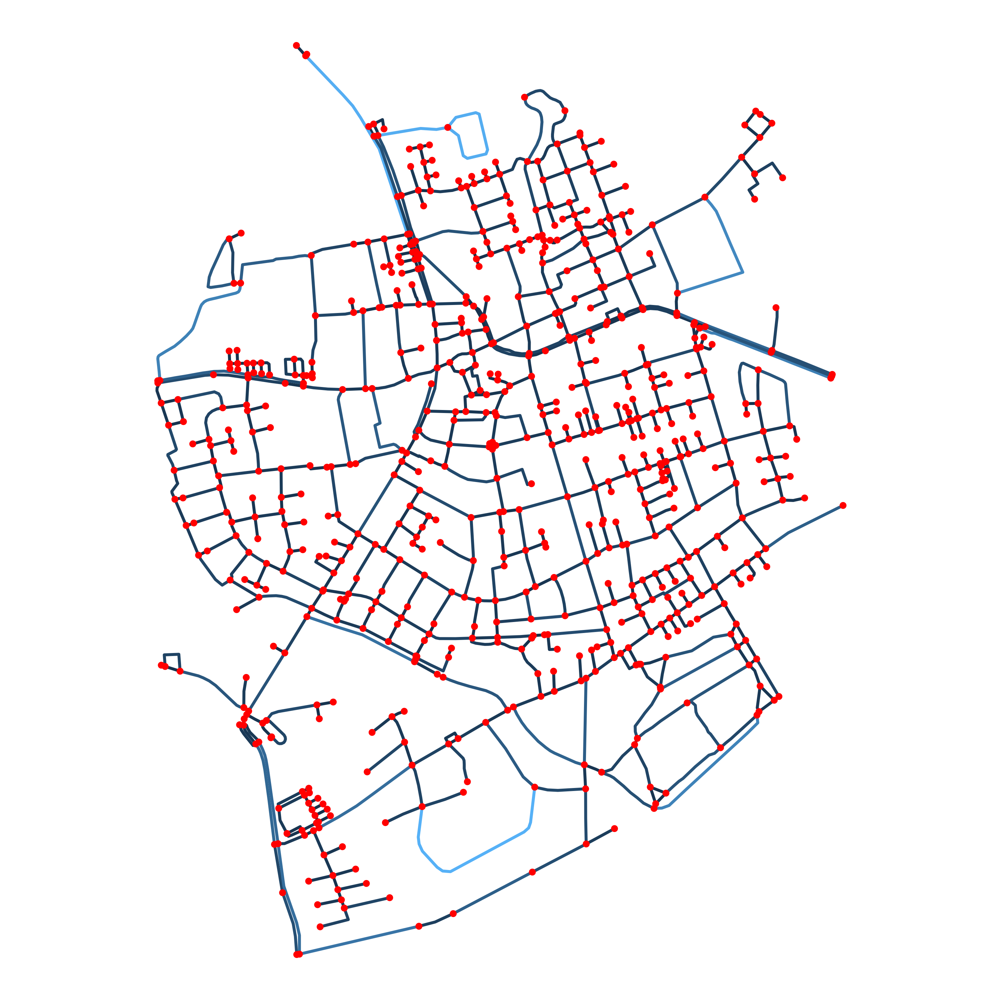
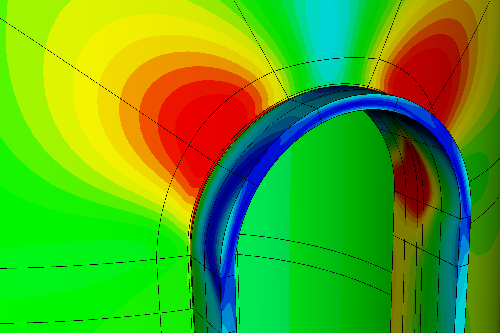
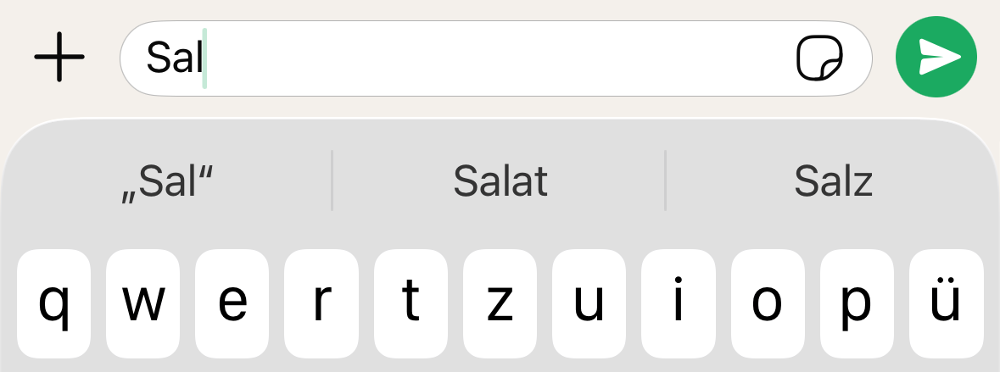
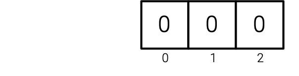
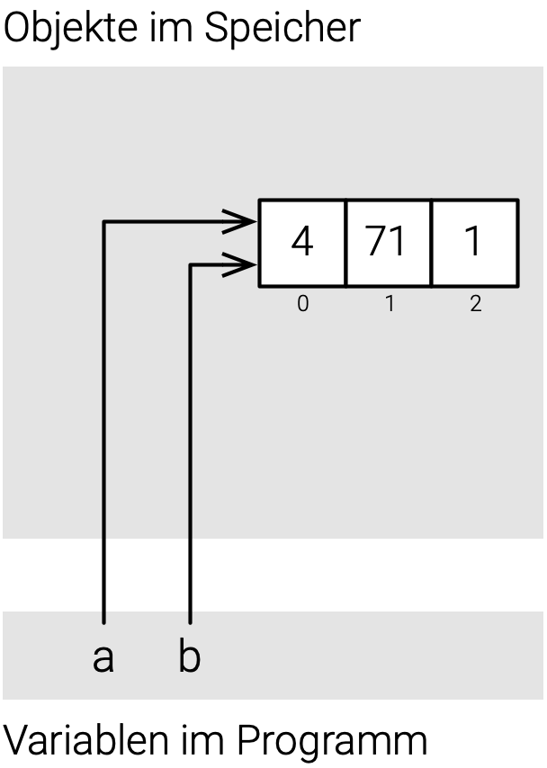
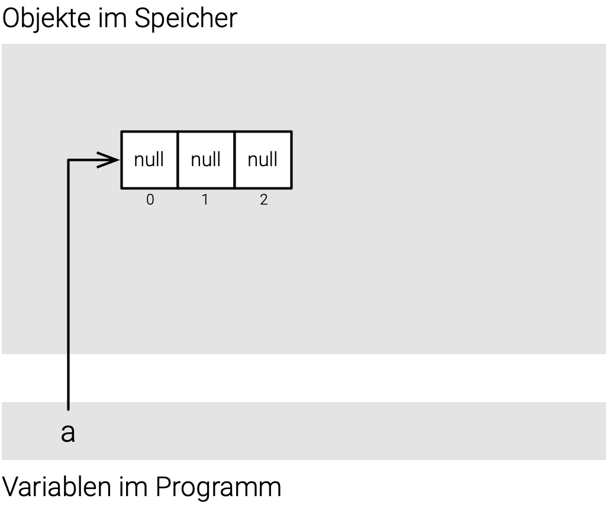
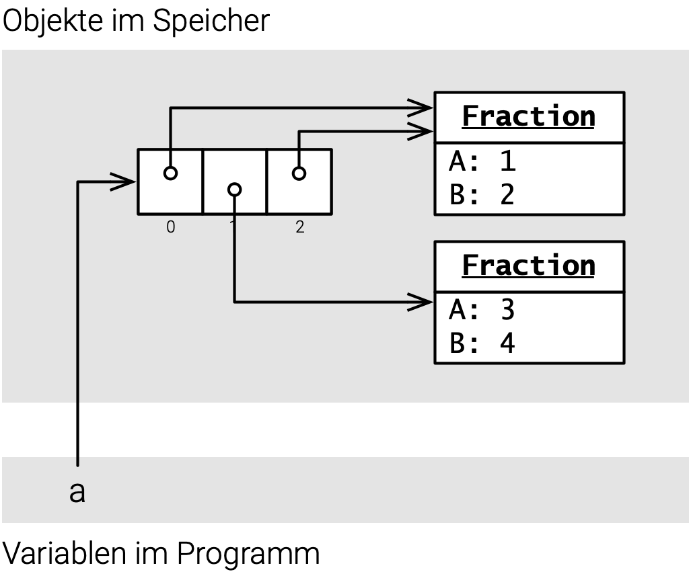

# Einführung

## Routenplanung

[]{.down80}

::: {.columns}
::: {.column width="45%"}

:::
::: {.column width="55%"}
### Vorhanden

- Orte (genauer: [Wegpunkte](https://de.wikipedia.org/wiki/Wegpunkt))
- Streckenabschnitte mit Länge

→ Gegebenenfalls sehr viele

### Notwendig für Dijkstra-Algorithmus

- Liste aller Orte
- Entfernungen zwischen Orten
- Liste aller mit Ort verbundenen Orte

→ Wie organisieren?
:::
:::

## Weitere Beispiele

[]{.down20}

::: {.columns}
::: {.column width="33%"}

:::
::: {.column width="2%"}
:::
::: {.column width="65%"}
### Finite-Elemente-Berechnung

- Liste von Knoten
- Liste von Elementen mit Knoten
- Matrizen (ggf. dünn besetzt) und Vektoren

→ Wie effizient verwalten?
:::
:::

[]{.down20}

::: {.columns}
::: {.column width="33%"}

:::
::: {.column width="2%"}
:::
::: {.column width="65%"}
### Rechtschreibprüfung

- Menge von Wörtern in der deutschen Sprache

→ Wie nachschlagen, ob es ein Wort gibt?
:::
:::

[]{.down20}

::: {.columns}
::: {.column width="33%"}

:::
::: {.column width="2%"}
:::
::: {.column width="65%"}
### Auto-Vervollständigung

- Liste mit Worten und Häufigkeiten

→ Wie wahrscheinliche Fortsetzung raussuchen?
:::
:::

## Datenstrukturen

[]{.down60}


[]{.down60}

- Zweck: Speicherung und Organisation von Daten
- Operationen: Hinzufügen, entfernen, suchen, ...
- Algorithmen: Implementieren Operationen
- Effizienz: Dauer von Operationen und Speicherbedarf

[]{.down40}

→ Fundamentales Thema in der Informatik, Regalmeter in der Bibliothek

## Elementare Datenstrukturen


Array
: Reihe von Kästchen, Zugriff auf Inhalt mit Index (bekannt)

Verkettete Liste
: Kästchen mit Inhalt und Zeiger auf nächstes Kästchen

Baum
: Kästchen mit Inhalt und Zeigern auf weitere Kästchen

Hashtabelle
: Abbildung von Schlüsselobjekt auf Index mit Hashfunktion

Graph
: Knoten verbunden mit Kanten

## Eingebaute Datenstrukturen in C\#

### Braucht man ständig

- `Array`: Viele Objekte vom selben Typ, Zugriff über Index, Größe fest
- `List`: Wie Array aber Größe variabel

### Manchmal praktisch

- `Dictionary`: Zuordnung Schlüssel zu Wert
- `Set`: Werte nur einmal speichern 

### In Sonderfällen

- `Queue`, `Stack`, `LinkedList`, `SortedMap`

### Gemeinsamer Nenner für C\# Datenstrukturen

- Schnittstelle `IEnumerable<T>`

# Arrays

## Arrays: Das Allerwichtigste

::: {.columns}
::: {.column width="70%"}
```csharp
int[] a = new int[3];
a[0] = 7;
a[1] = 54;
a[2] = 42;
int s = a[0] + a[1] + a[2];
int n = a.Length;
Console.WriteLine($"s = {s} und n = {n}");
```
``` {.output}
s = 103 und n = 3
```
:::
::: {.column width="2%"}
:::
::: {.column width="28%"}
[]{.down80}

:::
:::

[]{.down20}

- Zu jedem Datentyp `X` gibt es einen Array-Typ `X[]`
- Array für Datentyp `X` mit `n` Elementen mit `new X[n]` erzeugen
    - Länge des Arrays kann danach nicht mehr verändert werden
- Array = Reihe von Kästchen mit Index und Inhalt
    - Zugriff mit Index in eckigen Klammern
    - Erstes Kästchen hat Index 0, letztes Kästchen `n-1`
- Länge von Array `a` mit `a.Length`

## Arrays: Was man noch wissen sollte 1/2

### Arrays von Zahlen werden mit 0 vorbelegt

::: {.columns}
::: {.column width="70%"}
```csharp
int[] a = new int[3];
int s = a[0] + a[1] + a[2];
Console.WriteLine($"s = {s}");
```
``` {.output}
s = 0
```
:::
::: {.column width="2%"}
:::
::: {.column width="28%"}
[]{.down40}

:::
:::

::: {.fragment}
### Arrayvariablen sind Referenzvariablen

::: {.columns}
::: {.column width="70%"}
```csharp
int[] a = new int[3];
a[0] = 4;
a[1] = 8;
a[2] = 1;
int[] b = a;
b[1] = 71;
Console.WriteLine($"a[0] = {a[0]}");
Console.WriteLine($"a[1] = {a[1]}");
Console.WriteLine($"a[2] = {a[2]}");
```
``` {.output}
a[0] = 4
a[1] = 71
a[2] = 1
```
:::
::: {.column width="2%"}
:::
::: {.column width="28%"}
[]{.up20}

:::
:::
:::

## Arrays: Was man noch wissen sollte 2/2

### Array mit Werten initialisieren

```csharp
int[] a = [1, 98, 4];
Console.WriteLine($"a[0] = {a[0]}, a[1] = {a[1]}, a[2] = {a[2]}");
```
``` {.output}
a[0] = 1, a[1] = 98, a[2] = 4
```

::: {.fragment}
### Array ausgeben mit `String.join(...)`

```csharp
int[] a = [4, 6, 3, 0];
Console.WriteLine(String.Join(", ", a));
```
```{.output}
4, 6, 3, 0
```
:::

::: {.fragment}
### Fehler bei Zugriff außerhalb Grenzen

```csharp
int[] a = new int[3];
a[3] = 1;
```
```{.output}
Unhandled exception. System.IndexOutOfRangeException: Index was outside the bounds of the array.
   at Program.<Main>$(String[] args) in /.../Arrays.cs:line 13
```
:::

## Hilfsmethoden in der Array-Klasse 1/2

### Sortieren mit `Array.Sort`

```csharp
double[] a = [3.5, 1.2, 4.8, 2.1];
Array.Sort(a);
Console.WriteLine(String.Join("; ", a));
```
``` {.output}
1,2; 2,1; 3,5; 4,8
```

- Sortiert das Array aufsteigend, verändert das Array direkt

::: {.fragment}
### Eintrag finden mit `Array.IndexOf`

```csharp
double[] values = [3.5, 1.2, 4.8, 2.1];
int i1 = Array.IndexOf(values, 4.8);
int i2 = Array.IndexOf(values, 9.9);
Console.WriteLine($"i1 = {i1}, i2 = {i2}");
```
``` {.output}
i1 = 2, i2 = -1
```

- Gibt den ersten Index des gesuchten Werts zurück, `-1` wenn nicht enthalten
:::

## Hilfsmethoden in der Array-Klasse 2/2

### Weitere Methoden

- `Array.Copy(a, b, n)` – kopiert `n` Elemente von Array `a` nach `b`
- `Array.Fill(a, v)` – belegt alle Einträge von `a` mit dem Wert `v`
- `Array.Reverse(a)` – kehrt die Reihenfolge der Einträge um
- `Array.Resize(ref a, n)` - vermeiden, besser Liste verwenden

→ Vollständige Dokumentation [bei Microsoft](https://learn.microsoft.com/en-en/dotnet/api/system.array)

## Arrays von Objekten

::: {.columns}
::: {.column width="52%"}
```{.csharp code-line-numbers="true"}
Fraction[] a = new Fraction[3];
Console.WriteLine(a[0] == null);
a[0] = new Fraction(1, 2);
a[1] = new Fraction(3, 4);
a[2] = a[0];
a[0].Print("a[0]");
a[1].Print("a[1]");
a[2].Print("a[2]");
```
``` {.output}
True
a[0] = 1 / 2
a[1] = 3 / 4
a[2] = 1 / 2
```
:::
::: {.column width="2%"}
:::
::: {.column width="46%"}
[]{.up20}

::: {.r-stack}
::: {.fragment}

:::
::: {.fragment}

:::
:::
:::
:::

[]{.up20}

- `new Fraction[3]` erzeugt das Array – aber noch keine `Fraction`-Objekte
- Einträge sind mit `null` vorbelegt – `null` heißt kein Objekt
- Einträge zeigen erst nach Zuweisung auf Objekte

→ [Null References: The Billion Dollar Mistake - Tony Hoare](https://youtu.be/ybrQvs4x0Ps?si=bMKKhxOudVT38-yQ)

# Die `List`-Klasse

## `List`-Klasse: Das Allerwichtigste

```csharp
List<string> names = [];
names.Add("Gilmore");
names.Add("Slater");
names.Add("Machado");
names[1] = "Lopez";
Console.WriteLine($"n = {names.Count}");
Console.WriteLine(names[2]);
Console.WriteLine(String.Join(" | ", names));
```
``` {.output}
n = 3
Machado
Gilmore | Lopez | Machado
```

- Liste `List<T>` enthält Elemente vom Typ `T`
- Leere Liste mit `[]` erzeugen
- Mit `Add` Element am Ende anfügen, Länge ändert sich
- Danach wie Array verwenden (Anzahl Elemente mit `Count`, nicht `Length`)

## `List`-Klasse: Elemente suchen und entfernen

```csharp
List<int> numbers = [42, 54, 1];
Console.WriteLine(numbers.Contains(1));
Console.WriteLine(numbers.IndexOf(54));
numbers.RemoveAt(0);
numbers.Remove(1);
numbers.Remove(99);
Console.WriteLine(String.Join(", ", numbers));
```
``` {.output}
True
1
54
```

- Liste mit Anfangswerten: `[42, 54, 1]`
- `Contains(v)` – prüft ob `v` in der Liste enthalten ist
- `IndexOf(v)` – gibt Index von `v` zurück, `-1` wenn nicht enthalten
- `RemoveAt(i)` – entfernt Element an Position `i`
- `Remove(v)` – entfernt `v` falls vorhanden

# Manchmal praktisch

## Dinge mit einem Schlüssel speichern: `Dictionary`

```csharp
Dictionary<string, double> height = [];
height["Eiffel Tower"] = 330.0;
height["Burj Khalifa"] = 828.0;
height["Empire State"] = 443.0;
Console.WriteLine(height["Eiffel Tower"]);
Console.WriteLine(height.ContainsKey("Colosseum"));
height.Remove("Empire State");
Console.WriteLine(height.Count);
```
``` {.output}
330
False
2
```

- `Dictionary<TKey, TValue>` speichert Paare aus Schlüssel und Wert
- Schlüssel und Wert haben eigene Typen, z.B. `string` und `double`
- Wert für Schlüssel `k` lesen und schreiben mit `d[k]`
- `ContainsKey(k)` – prüft ob Schlüssel `k` vorhanden ist
- `Remove(k)` – entfernt Eintrag mit Schlüssel `k`

## Dinge nur einmal speichern: `HashSet`

```csharp
HashSet<string> materials = ["Concrete", "Wood"];
materials.Add("Steel");
materials.Add("Steel");
Console.WriteLine(String.Join(" • ", materials));
materials.Remove("Concrete");
materials.Add("Glass");
Console.WriteLine(String.Join(" • ", materials));
Console.WriteLine(materials.Contains("Steel"));
Console.WriteLine(materials.Contains("Concrete"));
```
``` {.output}
Concrete • Wood • Steel
Glass • Wood • Steel
True
False
```

- `HashSet<T>` speichert Werte vom Typ `T`
- Methoden `Add`, `Contains`, `Remove` wie bei `List<T>`, aber
    - Einträge werden nur einmal gespeichert (`Set` ≙ Menge in der Mathematik)
    - Für sehr große Datensätze geeignet (Hashverfahren → schnell)

# Gemeinsamer Nenner: `IEnumerable<T>`

## Übersicht

[]{.down40}

Alle besprochenen Datenstrukturen implementieren die Schnittstelle `IEnumerable<T>`

[]{.down30}

| Schnittstelle | Bedeutung | Implementiert von |
|---|---|---|
| `IEnumerable<T>` | Elemente durchlaufen | Alle Collections |
| `ICollection<T>` | `Count`, `Add`, `Remove`, `Contains` | `List<T>`, `HashSet<T>`, `Dictionary<K,V>` |
| `IList<T>` | Index-Zugriff `[i]` | `List<T>`, Arrays |

[]{.down20}

→ Methoden mit Parameter `IEnumerable<T>` funktionieren mit jeder Collection (`foreach`, `String.Join`, ...)

## Alle Elemente verarbeiten mit `foreach`

```csharp
double sum = 0;
double[] sizes = [3.5, 1.2, 4.8, 2.1];
foreach (double s in sizes)
{
    sum += s;
}
Console.WriteLine($"Summe = {sum}");
```
``` {.output}
Summe = 11.6
```

- `foreach` durchläuft alle Elemente
- Funktioniert mit Arrays, `List<T>`, `Dictionary<K,V>`, `HashSet<T>`, ...
- Schreibweise: `foreach (Typ variable in collection)`

## Beispiel: Image-Klasse aus BoDraw

## Praktische Hilfsmethoden

### Array und Liste umwandeln

```csharp
double[] a = [3.5, 1.2, 4.8];
List<double> list = new List<double>(a);
list.Add(2.1);
double[] a2 = list.ToArray();
Console.WriteLine(a2.Length);
```
``` {.output}
4
```

- `new List<T>(array)` – Array in Liste umwandeln
- `list.ToArray()` – Liste in Array umwandeln (funktioniert auch für `HashSet<T>`, `Dictionary<K,V>`, ...)

::: {.fragment}
### Collection als Text ausgeben

```csharp
List<string> names = ["Alice", "Bob", "Carol"];
Console.WriteLine(String.Join(", ", names));
```
``` {.output}
Alice, Bob, Carol
```

- `String.Join(trennzeichen, collection)` – funktioniert mit Arrays und Listen
:::

## Weitere Informationen

- https://learn.microsoft.com/en-us/dotnet/csharp/language-reference/builtin-types/collections
- https://learn.microsoft.com/en-us/dotnet/standard/collections/selecting-a-collection-class

## Was wir weggelassen haben

- Mehrdimensionale Arrays
- LINQ
- LinkedList, SortedSet
- Queues, Deques
- Bäume, Graphen
