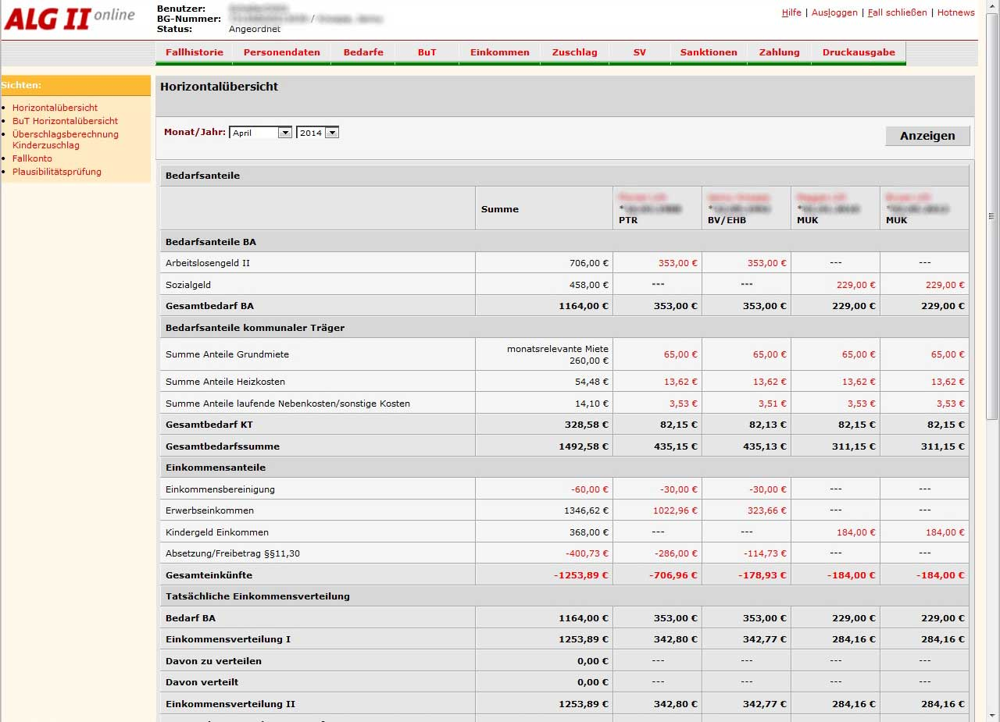
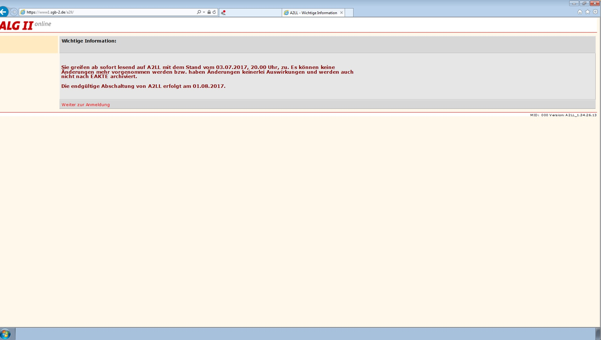
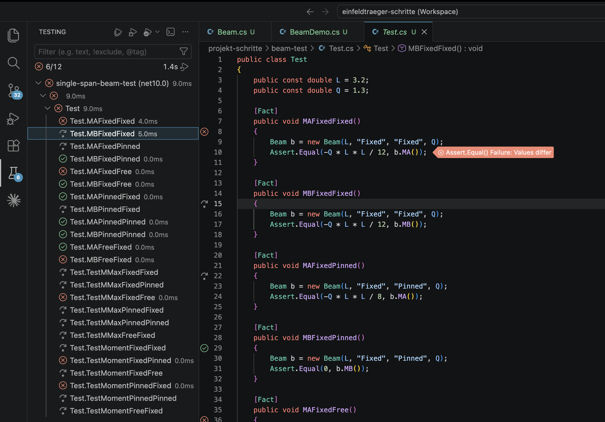
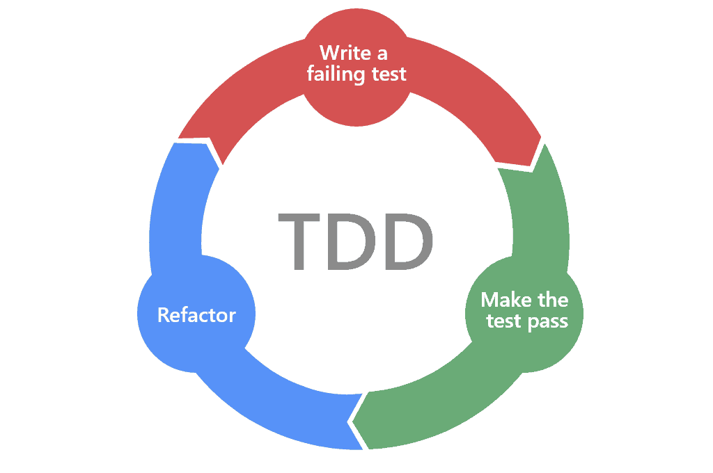
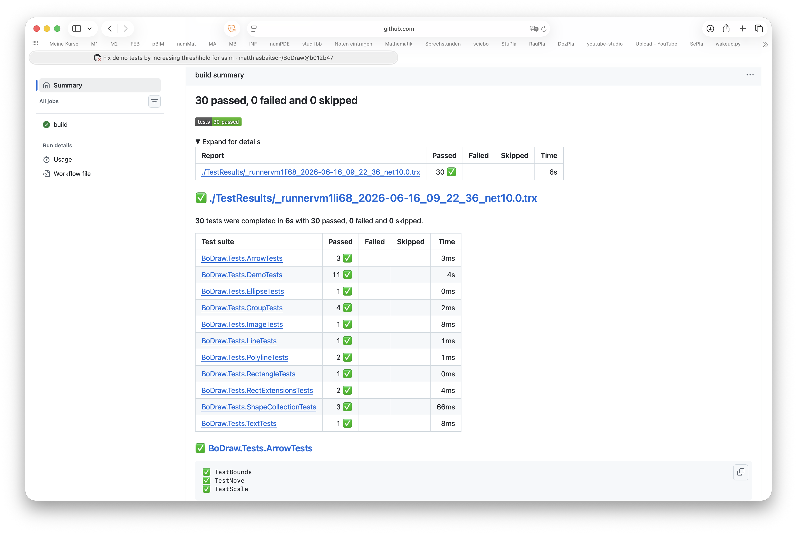

# Unit Tests

[🎥](TODO){target="_blank"} Erklärvideo auf YouTube

## Softwarefehler in [A2LL](https://de.wikipedia.org/wiki/A2LL)

::: {.columns}
::: {.column width="40%"}

:::
::: {.column width="2%"}
:::
::: {.column width="51%"}

:::
:::

- Webanwendung zur Erfassung und Verwaltung von finanziellen Leistungen für Empfänger des Arbeitslosengeldes II, Inbetriebnahme ab Oktober 2004
- Zahlreiche Fehler traten auf, die nur mit einem erheblichen Mehraufwand seitens der Jobcenter bearbeitet bzw. umgangen werden konnten
- Beispiel: Falsche Kontonummern (1234567000 anstatt 0001234567) führen zu Chaos bei Banken
- Workaround: Barschecks versenden scheitert teilweise an abgeschnittenen Straßennamen

##

[]{.down200}

::: {.r-fit-text}
Software muss getestet werden
:::

Unit Tests sind dabei ein wichtiger Baustein...

## Was sind Unit Tests?

**Unit Test**: Software, die automatisch prüft, ob eine Klasse das tut, was sie soll

::: {.fragment}
### Wie funktioniert das?

- Vergleich von Erwartung und Wirklichkeit
:::

::: {.fragment}
### Warum?

- Fehler früh erkennen
- Systematische Überprüfung von Grenzfällen
- Sicherheit, dass Klasse nach einer Änderung immer noch funktioniert
- Beispiel für Statikprogramm: Vergleich mit bekannter Lösung (Einfeldtäger)
:::

## Unit Tests in C\# mit xUnit

```{.csharp}
public class Test
{
    public const double L = 3.2;
    public const double Q = 1.3;

    [Fact]
    public void MAFixedFixed()
    {
        Beam b = new Beam(L, "Fixed", "Fixed", Q);
        Assert.Equal(-Q * L * L / 12, b.MA(), 1e-14);
    }

    [Fact]
    public void MAFixedPinned()
    {
        Beam b = new Beam(L, "Fixed", "Pinned", Q);
        Assert.Equal(-Q * L * L / 8, b.MA(), 1e-14);
    }
}
```

- Test: Methode mit Annotation `[Fact]`
- `Assert.Equal(erwarteter Wert, tatsächlicher Wert, [Toleranz])`

## Tests in VS Code

::: {.columns}
::: {.column}

:::
::: {.column}
### Tests im 'Test Explorer' ausführen

1. Links auf das Reagenzglas-Symbol klicken
1. Alle Tests mit 'Run Tests' Button ausführen
1. Bei fehlgeschlagenen Tests auf Hinweis klicken
:::
:::

::: {.fragment}
**Hinweis:** In C# müssen sich alle Tests fehlerfrei übersetzen lassen. Neue Methoden geben daher zunächst einen Platzhalterwert zurück (`return 0`), bis sie implementiert sind.
:::

## Testgetriebene Entwicklung



Idee: Man schreibt erst die Tests, dann den Code

1. **Red** – Test schreiben, der fehlschlägt
1. **Green** – minimalen Code schreiben, damit der Test besteht
1. **Refactor** – Code aufräumen, Tests müssen weiterhin grün bleiben

## Automatische Tests für BoDraw bei Github


