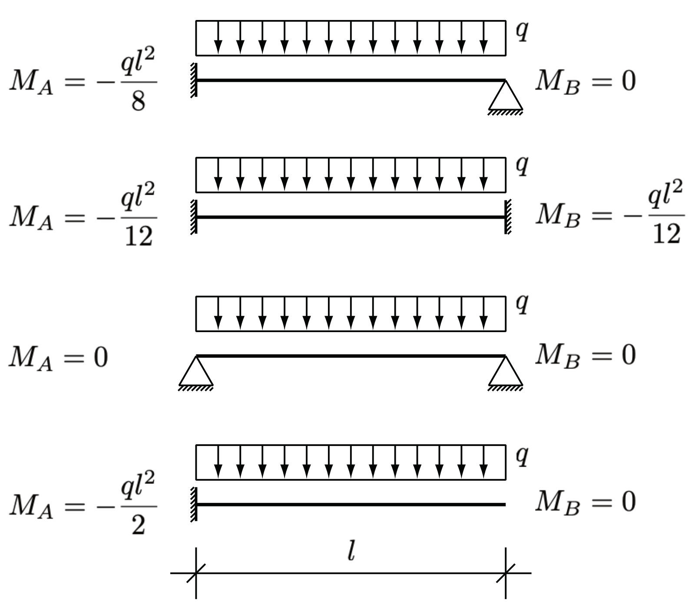
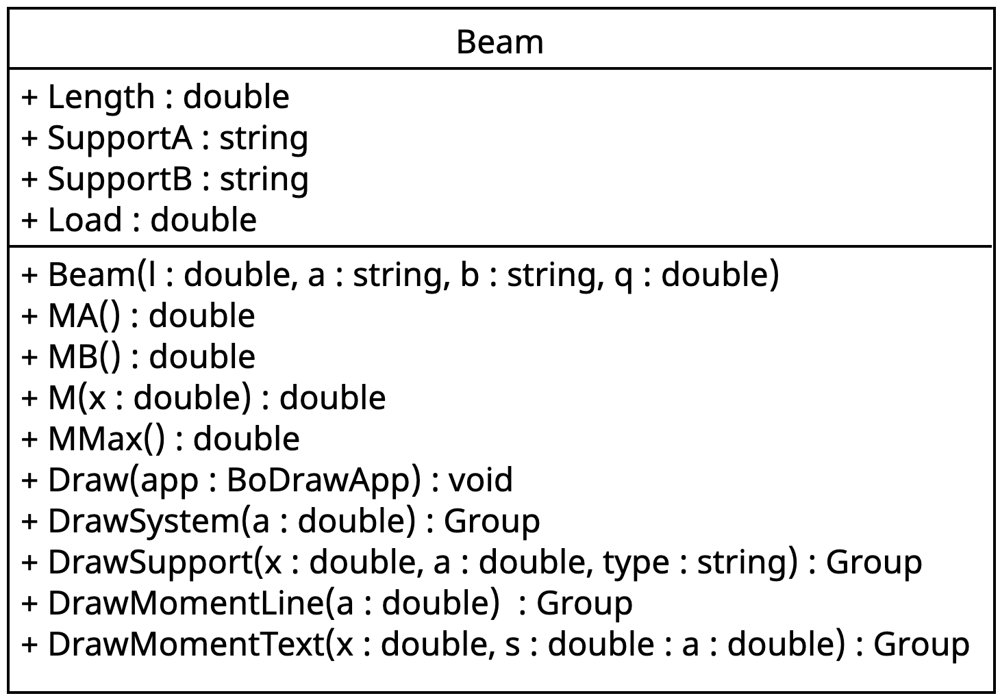
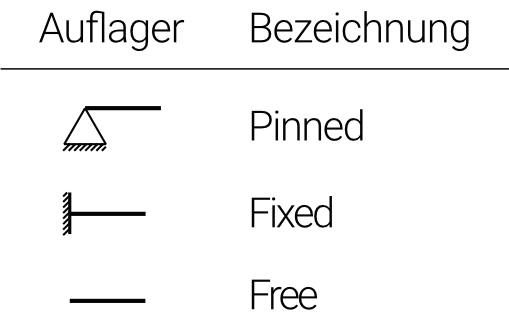
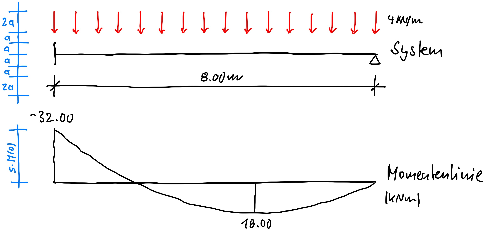

::: {#exr-einfeldtraeger}
## Einfeldträger

In dieser Aufgabe soll eine Klasse erstellt werden, die für einen Einfeldträger den Verlauf des Biegemoments berechnet und zusammen mit dem statischen System visualisiert.

### Berechnung der Momentenlinie

::: {.columns}
::: {.column width="45%"}

:::
::: {.column width="5%"}
:::
::: {.column width="50%"}
Ausgehend von den links dargestellten Auflagerreaktionen ist
$$
M(x) = M_A + \frac{M_B - M_a}{l} x - \frac{q}{2} x (x - l)
$$
die Funktionsgleichung des Verlaufs des Biegoments. Das betragsmäßig größte Biegemoment tritt entweder an den Auflagern oder in Feldmitte auf, es gilt also
$$
M_{\mathrm{max}} = \max \{-M_A, M(l/2), -M_B\}.
$$
:::
:::

### Programmierung

::: {.columns}
::: {.column width="45%"}

:::
::: {.column width="5%"}
:::
::: {.column width="50%"}
Das UML-Klassendiagramm zeigt eine mögliche Umsetzung des Einfeldträgers in eine Klasse. Für die Auflagerbedingungen sollen dabei folgende Bezeichnungen verwendet werden.

{width=50% fig-align="center"}
:::
:::

::: {.columns}
::: {.column width="43%"}

:::
::: {.column width="7%"}
:::
::: {.column width="50%"}
Die `Draw`-Methode soll das statische System und die Momentenlinie zeichnen, links ein Vorschlag, den Sie natürlich nach Ihren eigenen Vorstellungen interpretieren. Damit die Zeichnung auch dann gut aussieht, wenn der Träger 30m lang ist, bietet es sich an, eine Zeicheneinheit `a` einzuführen, und diese in Abhängigkeit der Länge des Trägers zu wählen, zum Beispiel $a = l / 30$.
:::
::: {.columns}
:::

Um das Zeichnen des Systems etwas zu organisieren werden weitere Methoden verwendet, die jeweils ein Zeichenelement erzeugen. Damit kann man dann zum Beispiel in der `Draw`-Methode einfach

```csharp
app.Add(this.DrawSystem(a));
```

schreiben. Verwenden Sie darüber hinaus einen Skalierungsfaktor `s`, den Sie in Abhängkeit von `a` und $M_\mathrm{max}$ wählen.

### Aufgaben

Gehen Sie in folgenden Schritten vor:

1. Grundgerüst: Erstellen Sie die Klasse `Beam` mit Attributen und dem Konstruktor. Implementieren Sie alle Methoden im Klassendiagramm, die mit `M` beginnen, die Methoden sollen dabei zunächst alle den Wert 0 zurückgeben. Klicken Sie links auf das Reagenzglas und führen Sie die Tests aus. Sie sollten folgende Ausgabe erhalten.

    {width=70% fig-align="center"}

1. Berechnung der Biegemomente: Implementieren Sie Schritt für Schritt die Methoden für die Biegemomente bis alle Tests grün sind.

1. Implementieren Sie Schritt für Schritt die Methoden zum Zeichnen.

:::
