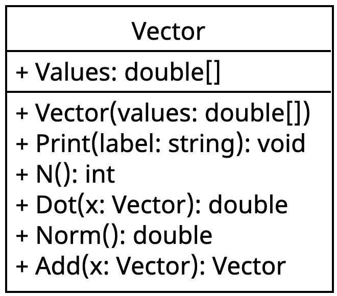

::: {#exr-vektor}
## Klasse für Vektoren

In dieser Aufgabe entwickeln Sie eine Klasse `Vector`, die einen mathematischen Vektor repräsentiert. Vektoren kommen in der Bauingenieurpraxis häufig vor – zum Beispiel als Knotenverschiebungen oder Knotenlasten in der Finite-Elemente-Methode.

### Grundlagen

Ein Vektor $\mathbf{x} \in \mathbb{R}^n$ ist eine geordnete Liste von $n$ reellen Zahlen $x_0, x_1, \ldots, x_{n-1}$. Die folgende Tabelle fasst die benötigten Operationen zusammen.

[]{.down20}

| Operation | Formel |
|---|---|
| Skalarprodukt | $\mathbf{x} \cdot \mathbf{y} = \sum_{i=0}^{n-1} x_i \cdot y_i$ |
| Norm (Länge) | $\|\mathbf{x}\| = \sqrt{\mathbf{x} \cdot \mathbf{x}}$ |
| Addition | $(\mathbf{x} + \mathbf{y})_i = x_i + y_i$ |
: {tbl-colwidths="[25,75]"}

Das folgende Klassendiagramm zeigt die zu implementierende Klasse.

{width=35% fig-align="center"}

### Aufgaben

Bearbeiten Sie nun folgende Schritte:

1. Grundgerüst. Legen Sie im Verzeichnis `01-vector` die Dateien `Vector.cs` und `VectorDemo.cs` an. Erstellen Sie in `Vector.cs` die Klasse `Vector` mit dem Attribut `public double[] Values` und einem Konstruktor, der ein `double[]`-Array entgegennimmt und in `Values` speichert. Legen Sie außerdem bereits alle fünf Methoden als leere Stubs an (`Print`, `N`, `Dot`, `Norm`, `Add`), damit der Code kompiliert und die Tests ausgeführt werden können – die Implementierung kommt in den nächsten Schritten. Für Methoden mit Rückgabewert genügt zunächst `return 0` bzw. `return new Vector([])`.

    Erstellen Sie in `VectorDemo.cs` zwei Testvektoren:

    ```csharp
    Vector x = new Vector([1.7, 2.1, 0.1, 3.7]);
    Vector y = new Vector([2.1, 1.2, 11.9, 7.3]);
    ```

    Klicken Sie links auf das Reagenzglas und führen Sie die Tests aus. Einige Tests sind bereits grün, die meisten aber noch rot – das ist in Ordnung.

1. Methode `Print`. Implementieren Sie `Print` so, dass der Aufruf `x.Print("x")` die Ausgabe

    ```
    x = [1.7, 2.1, 0.1, 3.7]
    ```

    erzeugt. Tipp: Mit `string.Join(", ", this.Values)` lassen sich alle Array-Elemente durch Komma und Leerzeichen getrennt zu einem String zusammenfügen. Geben Sie beide Vektoren in der Demo aus und überprüfen Sie das Ergebnis.

1. Methode `N`. Implementieren Sie `N`, die die Anzahl der Elemente zurückgibt. Geben Sie den Wert in der Demo aus und führen Sie die Tests aus.

1. Skalarprodukt `Dot`. Implementieren Sie `Dot` nach der Formel aus der Tabelle mit einer for-Schleife. Berechnen Sie das Skalarprodukt in der Demo mit

    ```csharp
    Console.WriteLine($"x⋅y = {x.Dot(y)}");
    ```

    und führen Sie die Tests aus – alle Tests für `Dot` sollten jetzt grün sein.

1. Norm `Norm`. Fügen Sie am Anfang von `Vector.cs` die Zeile `using static System.Math;` ein, damit `Sqrt` direkt verwendet werden kann. Implementieren Sie `Norm` nach der Formel aus der Tabelle. Zur Probe: Ein Vektor mit den Einträgen `[3.0, 4.0]` hat die Norm 5.0. Führen Sie die Tests aus.

1. Addition `Add`. Implementieren Sie `Add`, die komponentenweise addiert und einen neuen Vektor zurückgibt. Tipp: Mit `new double[this.N()]` erzeugen Sie ein leeres Array der richtigen Länge. Berechnen Sie die Summe in der Demo und geben Sie das Ergebnis aus. Führen Sie die Tests aus – alle Tests sollten jetzt grün sein.

:::
