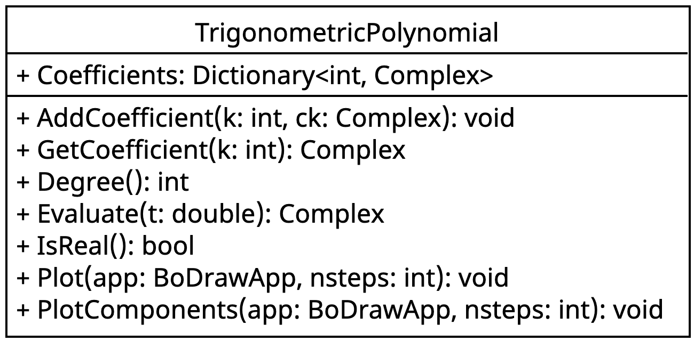

::: {#exr-trigonometric-polynomial}
## Klasse für trigonometrische Polynome

In dieser Aufgabe entwickeln Sie eine Klasse `TrigonometricPolynomial`, um trigonometrische Polynome darzustellen und auszuwerten.

### Grundlagen

Ein **trigonometrisches Polynom** ist eine endliche Summe der Form

$$
    F_n(t) = \sum_{k=-n}^n c_k \cdot e^{ikt}, \quad c_k \in \mathbb{C}
$$

Die Koeffizienten $c_k$ sind komplexe Zahlen; der Summationsindex $k$ läuft über eine endliche Menge ganzer Zahlen (positiv, negativ oder null). Mit der Eulerschen Formel $e^{ikt} = \cos(kt) + i\sin(kt)$ ergibt sich die Auswertung an einer Stelle $t \in \mathbb{R}$ als komplexer Wert.

Ein trigonometrisches Polynom heißt **reellwertig**, wenn für alle Koeffizienten gilt:

$$c_{-k} = \overline{c_k}$$

Das heißt: Koeffizient $c_{-k}$ muss das konjugiert-komplexe von $c_k$ sein.

Das folgende Klassendiagramm zeigt die zu implementierende Klasse.

{width=50% fig-align="center"}

Die Klasse `Complex` für komplexe Zahlen kopieren Sie aus dem Abschnitt zu Klassen in das Projektverzeichnis.

### Aufgaben

Bearbeiten Sie folgende Schritte:

1. Grundgerüst: Erstellen Sie die Klasse `TrigonometricPolynomial` mit dem Feld `Coefficients` vom Typ `Dictionary<int, Complex>` sowie allen Methoden aus dem Klassendiagramm, so dass der Code kompiliert – die Implementierung folgt in den nächsten Schritten.

1. `AddCoefficient` und `GetCoefficient`: Implementieren Sie die beiden Methoden.

    - `AddCoefficient(int k, Complex ck)` trägt den Koeffizienten $c_k$ in das Dictionary ein.
    - `GetCoefficient(int k)` gibt $c_k$ zurück; ist $k$ nicht im Dictionary vorhanden, wird `new Complex(0, 0)` zurückgegeben.

    Legen Sie im Demoprogramm ein trigonometrisches Polynom an, zum Beispiel dieses:

    ```csharp
    TrigonometricPolynomial p = new TrigonometricPolynomial();
    p.AddCoefficient(-5, new Complex(0.4, 0));
    p.AddCoefficient(1, new Complex(1, 0));
    p.AddCoefficient(7, new Complex(0.25, 0));
    ```

1. Polynomgrad: Implementieren Sie die Methode, die den Grad des Polynoms zurückgibt – das ist der Index $k$ mit dem größten Betrag.

    ```csharp
    Console.WriteLine($"Grad: {p.Degree()}");
    ```

1. Funktionswert berechnen: Implementieren Sie die Auswertung nach der Formel

    $$p(t) = \sum_{k} c_k \cdot e^{ikt} = \sum_{k} c_k \cdot \bigl(\cos(kt) + i\sin(kt)\bigr)$$

    Iterieren Sie dazu über alle Schlüssel im Dictionary. Geben Sie im Demoprogramm den Wert $p(0.1)$ aus:

    ```csharp
    p.Evaluate(0.1).Print("p(0.1)");
    ```

1. Eigenschaft prüfen: Implementieren Sie die Methode, die prüft ob das Polynom reellwertig ist. Iterieren Sie über alle Schlüssel $k$ im Dictionary und prüfen Sie, ob $c_{-k} = \overline{c_k}$ gilt. Geben Sie das Ergebnis im Demoprogramm aus

    ```csharp
    Console.WriteLine($"Reellwertig: {p.IsReal()}");
    ```

    und überprüfen Sie den Test.

1. Plotten: Implementieren Sie die Methode, die das Polynom als **parametrische Kurve** in der komplexen Ebene zeichnet. Der Parameter $t$ läuft von $0$ bis $2\pi$ in `nsteps` gleichmäßigen Schritten. Jeder ausgewertete Wert $p(t) = u + iv$ wird als Punkt $(u, v)$ in eine `Polyline` eingetragen.

    ```csharp
    BoDrawApp app = new BoDrawApp();
    p.Plot(app, 1000);
    app.SaveImage("plot-1.png")
    app.Show();
    ```

1. Komponenten plotten: Implementieren Sie die Methode, die Real- und Imaginärteil von $p(t)$ getrennt über $t \in [0, 2\pi]$ darstellt: $t \mapsto \operatorname{Re}(p(t))$ und $t \mapsto \operatorname{Im}(p(t))$.

    ```csharp
    BoDrawApp app = new BoDrawApp();
    p.PlotComponents(app, 1000);
    app.SaveImage("plot-2.png")
    app.Show();
    ```

:::
