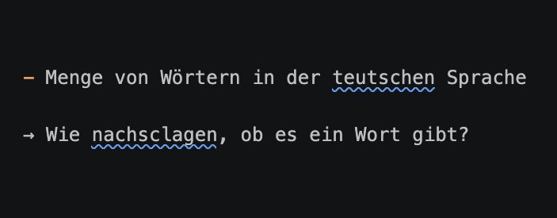
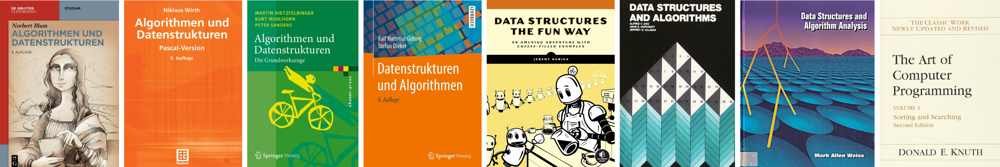
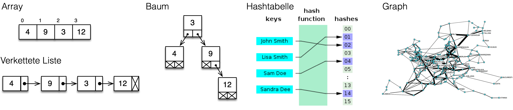
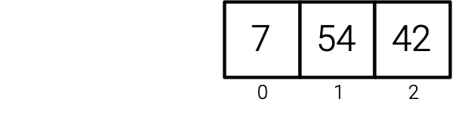
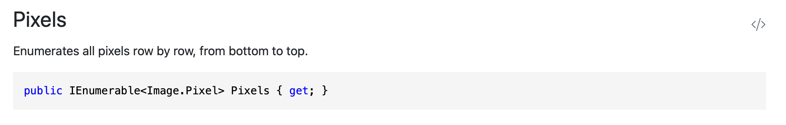
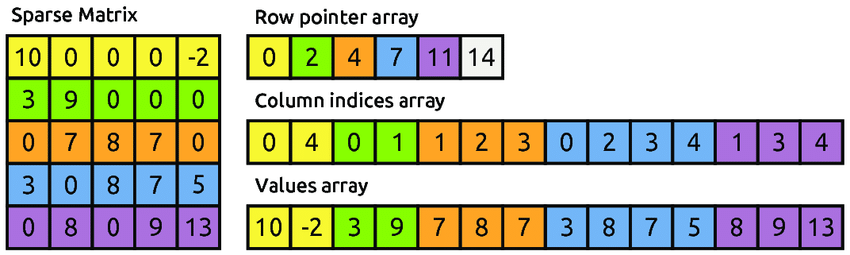
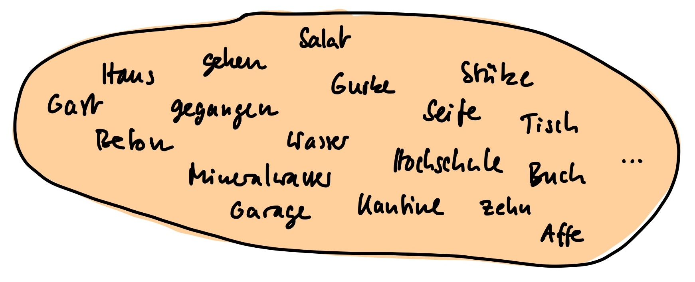
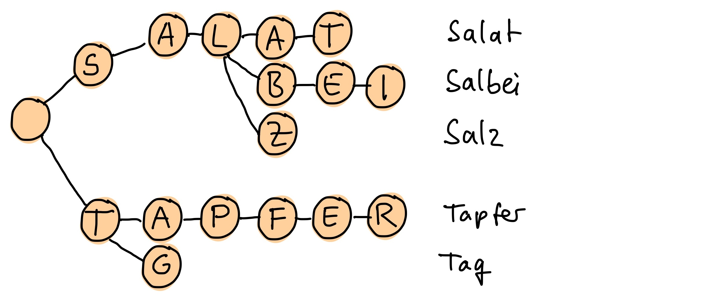

# Einführung

[🎥](https://youtu.be/-kVkkvPdtow){target="_blank"} Erklärvideo auf YouTube

## Routenplanung

[]{.down80}

::: {.columns}
::: {.column width="50%"}

:::
::: {.column width="50%"}
### Vorhanden

- Orte (genauer: [Wegpunkte](https://de.wikipedia.org/wiki/Wegpunkt))
- Streckenabschnitte mit Länge

→ Gegebenenfalls sehr viele

::: {.fragment}
[]{.down40}

### Notwendig für Dijkstra-Algorithmus

- Liste aller Orte
- Entfernungen zwischen Orten
- Liste aller mit Ort verbundenen Orte

→ Wie organisieren?
:::
:::
:::

## Weitere Beispiele

[]{.down20}

::: {.columns}
::: {.column width="33%"}

:::
::: {.column width="2%"}
:::
::: {.column width="65%"}
### Finite-Elemente-Berechnung

- Liste von Knoten
- Liste von Elementen mit Knoten
- Matrizen (ggf. dünn besetzt) und Vektoren

→ Wie effizient verwalten?
:::
:::

[]{.down20}

::: {.fragment}
::: {.columns}
::: {.column width="33%"}

:::
::: {.column width="2%"}
:::
::: {.column width="65%"}
### Rechtschreibprüfung

- Menge von Wörtern in der deutschen Sprache

→ Wie nachschlagen, ob es ein Wort gibt?
:::
:::
:::

[]{.down20}

::: {.fragment}
::: {.columns}
::: {.column width="33%"}

:::
::: {.column width="2%"}
:::
::: {.column width="65%"}
### Auto-Vervollständigung

- Liste mit Worten und Häufigkeiten

→ Wie wahrscheinliche Fortsetzung heraussuchen?
:::
:::
:::


## Datenstrukturen

[]{.down60}



[]{.down60}

- Zweck: Speicherung und Organisation von Daten
- Operationen: Hinzufügen, entfernen, suchen, ...
- Algorithmen: Implementieren Operationen
- Effizienz: Dauer von Operationen und Speicherbedarf

[]{.down40}

→ Fundamentales Thema in der Informatik, Regalmeter in der Bibliothek

## Elementare Datenstrukturen



Array
: Reihe von Kästchen, Zugriff auf Inhalt mit Index (bekannt)

Verkettete Liste
: Kästchen mit Inhalt und Zeiger auf nächstes Kästchen

Baum
: Kästchen mit Inhalt und Zeigern auf weitere Kästchen

Hashtabelle
: Abbildung von Schlüsselobjekt auf Index mit Hashfunktion

Graph
: Knoten verbunden mit Kanten

## Eingebaute Datenstrukturen in C\#

### Braucht man ständig

- `Array`: Viele Objekte vom selben Typ, Zugriff über Index, Größe fest
- `List`: Wie Array aber Größe variabel (verwendet intern ein Array)

[]{.down30}

::: {.fragment}
### Manchmal praktisch

- `Dictionary`: Zuordnung Schlüssel zu Wert
- `Set`: Werte nur einmal speichern 
:::

[]{.down30}

::: {.fragment}
### In Sonderfällen

- `Queue`, `Stack`, `LinkedList`, `SortedDictionary`
:::

[]{.down30}

::: {.fragment}
### Gemeinsamer Nenner für C\# Datenstrukturen

- Schnittstelle `IEnumerable<T>`
:::

# Arrays

[🎥](https://youtu.be/gmOEktSt6EU){target="_blank"} Erklärvideo auf YouTube

## Arrays: Das Allerwichtigste

::: {.columns}
::: {.column width="70%"}
```csharp
int[] a = new int[3];
a[0] = 7;
a[1] = 54;
a[2] = 42;
int s = a[0] + a[1] + a[2];
int n = a.Length;
Console.WriteLine($"s = {s} und n = {n}");
```
``` {.output}
s = 103 und n = 3
```
:::
::: {.column width="2%"}
:::
::: {.column width="28%"}
[]{.down80}

:::
:::

[]{.down20}

- Zu jedem Datentyp `X` gibt es einen Array-Typ `X[]`
- Array für Datentyp `X` mit `n` Elementen mit `new X[n]` erzeugen
    - Länge des Arrays kann danach nicht mehr verändert werden
- Array = Reihe von Kästchen mit Index und Inhalt
    - Zugriff mit Index in eckigen Klammern
    - Erstes Kästchen hat Index 0, letztes Kästchen `n-1`
- Länge von Array `a` mit `a.Length`

## Arrays: Was man noch wissen sollte 1/2

### Arrays von Zahlen werden mit 0 vorbelegt

::: {.columns}
::: {.column width="70%"}
```csharp
int[] a = new int[3];
int s = a[0] + a[1] + a[2];
Console.WriteLine($"s = {s}");
```
``` {.output}
s = 0
```
:::
::: {.column width="2%"}
:::
::: {.column width="28%"}
[]{.down40}

:::
:::

[]{.down30}

::: {.fragment}
### Arrayvariablen sind Referenzvariablen

::: {.columns}
::: {.column width="70%"}
```csharp
int[] a = new int[3];
a[0] = 4;
a[1] = 8;
a[2] = 1;
int[] b = a;
b[1] = 71;
Console.WriteLine($"a[0] = {a[0]}");
Console.WriteLine($"a[1] = {a[1]}");
Console.WriteLine($"a[2] = {a[2]}");
```
``` {.output}
a[0] = 4
a[1] = 71
a[2] = 1
```
:::
::: {.column width="2%"}
:::
::: {.column width="28%"}
[]{.up20}

:::
:::
:::

## Arrays: Was man noch wissen sollte 2/2

### Array mit Werten initialisieren

```csharp
int[] a = [1, 98, 4];
Console.WriteLine($"a[0] = {a[0]}, a[1] = {a[1]}, a[2] = {a[2]}");
```
``` {.output}
a[0] = 1, a[1] = 98, a[2] = 4
```

[]{.down30}

::: {.fragment}
### Array ausgeben mit `String.Join(...)`

```csharp
int[] a = [4, 6, 3, 0];
Console.WriteLine(String.Join(", ", a));
```
```{.output}
4, 6, 3, 0
```
:::

[]{.down30}

::: {.fragment}
### Fehler bei Zugriff außerhalb Grenzen

```csharp
int[] a = new int[3];
a[3] = 1;
```
```{.output}
Unhandled exception. System.IndexOutOfRangeException: Index was outside the bounds of the array.
   at Program.<Main>$(String[] args) in /.../Arrays.cs:line 13
```
:::

## Hilfsmethoden in der Array-Klasse 1/2

### Sortieren mit `Array.Sort`

```csharp
double[] a = [3.5, 1.2, 4.8, 2.1];
Array.Sort(a);
Console.WriteLine(String.Join("; ", a));
```
``` {.output}
1,2; 2,1; 3,5; 4,8
```

- Sortiert das Array aufsteigend, verändert das Array direkt

[]{.down30}

::: {.fragment}
### Eintrag finden mit `Array.IndexOf`

```csharp
double[] values = [3.5, 1.2, 4.8, 2.1];
int i1 = Array.IndexOf(values, 4.8);
int i2 = Array.IndexOf(values, 9.9);
Console.WriteLine($"i1 = {i1}, i2 = {i2}");
```
``` {.output}
i1 = 2, i2 = -1
```

- Gibt den ersten Index des gesuchten Werts zurück, `-1`, wenn nicht enthalten
:::

## Hilfsmethoden in der Array-Klasse 2/2

### Weitere Methoden

- `Array.Copy(a, b, n)` – kopiert `n` Elemente von Array `a` nach `b`
- `Array.Fill(a, v)` – belegt alle Einträge von `a` mit dem Wert `v`
- `Array.Reverse(a)` – kehrt die Reihenfolge der Einträge um
- `Array.Resize(ref a, n)` – vermeiden, besser Liste verwenden

→ Vollständige Dokumentation [bei Microsoft](https://learn.microsoft.com/en-us/dotnet/api/system.array)

## Arrays von Objekten

::: {.columns}
::: {.column width="52%"}
```{.csharp code-line-numbers="true"}
Fraction[] a = new Fraction[3];
Console.WriteLine(a[0] == null);
a[0] = new Fraction(1, 2);
a[1] = new Fraction(3, 4);
a[2] = a[0];
a[0].Print("a[0]");
a[1].Print("a[1]");
a[2].Print("a[2]");
```
``` {.output}
True
a[0] = 1 / 2
a[1] = 3 / 4
a[2] = 1 / 2
```
:::
::: {.column width="2%"}
:::
::: {.column width="46%"}
[]{.up20}

::: {.r-stack}
::: {.fragment}

:::
::: {.fragment}

:::
:::
:::
:::

[]{.up20}

- `new Fraction[3]` erzeugt das Array – aber noch keine `Fraction`-Objekte
- Einträge sind mit `null` vorbelegt – `null` heißt kein Objekt
- Einträge zeigen erst nach Zuweisung auf Objekte

[]{.down40}

::: {.fragment}
→ [Null References: The Billion Dollar Mistake - Tony Hoare](https://youtu.be/ybrQvs4x0Ps?si=bMKKhxOudVT38-yQ)
:::

# Die `List`-Klasse

[🎥](https://youtu.be/AWxJPDvQVKE){target="_blank"} Erklärvideo auf YouTube

## `List`-Klasse: Das Allerwichtigste

```csharp
List<string> names = [];
names.Add("Gilmore");
names.Add("Slater");
names.Add("Machado");
names[1] = "Lopez";
Console.WriteLine($"n = {names.Count}");
Console.WriteLine(names[2]);
Console.WriteLine(String.Join(" | ", names));
```
``` {.output}
n = 3
Machado
Gilmore | Lopez | Machado
```

- Liste `List<T>` enthält Elemente vom Typ `T`
- Leere Liste mit `[]` erzeugen
- Mit `Add` Element am Ende anfügen, Länge ändert sich
- Danach wie Array verwenden (Anzahl Elemente mit `Count`, nicht `Length`)

## `List`-Klasse: Elemente suchen und entfernen

```csharp
List<int> numbers = [42, 54, 1];
Console.WriteLine(numbers.Contains(1));
Console.WriteLine(numbers.IndexOf(54));
Console.WriteLine(numbers.IndexOf(1));
numbers.RemoveAt(0);
numbers.Remove(1);
numbers.Remove(99);
Console.WriteLine(String.Join(", ", numbers));
```
``` {.output}
True
1
2
54
```

- Liste mit Anfangswerten: `[42, 54, 1]`
- `Contains(v)` – prüft ob `v` in der Liste enthalten ist
- `IndexOf(v)` – gibt Index von `v` zurück, `-1` wenn nicht enthalten
- `RemoveAt(i)` – entfernt Element an Position `i`
- `Remove(v)` – entfernt `v`, falls vorhanden

# Manchmal praktisch

[🎥](https://youtu.be/hjfvYoG_OPM){target="_blank"} Erklärvideo auf YouTube

## Dinge mit einem Schlüssel speichern: `Dictionary`

```csharp
Dictionary<string, double> height = [];
height["Eiffel Tower"] = 330.0;
height["Burj Khalifa"] = 828.0;
height["Empire State"] = 443.0;
Console.WriteLine(height["Eiffel Tower"]);
Console.WriteLine(height.ContainsKey("Colosseum"));
height.Remove("Empire State");
Console.WriteLine(height.Count);
```
``` {.output}
330
False
2
```

- `Dictionary<TKey, TValue>` speichert Paare aus Schlüssel und Wert
- Schlüssel und Wert haben eigene Typen, z.B. `string` und `double`
- Wert für Schlüssel `k` lesen und schreiben mit `d[k]`
- `ContainsKey(k)` – prüft ob Schlüssel `k` vorhanden ist
- `Remove(k)` – entfernt Eintrag mit Schlüssel `k`

## Dinge nur einmal speichern: `HashSet`

```csharp
HashSet<string> materials = ["Concrete", "Wood"];
materials.Add("Steel");
materials.Add("Steel");
Console.WriteLine(String.Join(" • ", materials));
materials.Remove("Concrete");
materials.Add("Glass");
Console.WriteLine(String.Join(" • ", materials));
Console.WriteLine(materials.Contains("Steel"));
Console.WriteLine(materials.Contains("Concrete"));
```
``` {.output}
Concrete • Wood • Steel
Glass • Wood • Steel
True
False
```

- `HashSet<T>` speichert Werte vom Typ `T`
- Methoden `Add`, `Contains`, `Remove` wie bei `List<T>`, aber
    - Einträge werden nur einmal gespeichert (`Set` ≙ Menge in der Mathematik)
    - Für sehr große Datensätze geeignet (Hashverfahren → schnell)

# Gemeinsamer Nenner: `IEnumerable<T>`

[🎥](https://youtu.be/dBGjpUzSYJI){target="_blank"} Erklärvideo auf YouTube

## Übersicht

Alle besprochenen Datenstrukturen haben die Schnittstelle `IEnumerable`

[]{.down20}

| Methode | Bedeutung |
|---|---|
| `foreach(Datentyp e in a) {}` | Alle Elemente von `a` durchlaufen |
| `a.Sum()` | Summe |
| `a.Min()` / `a.Max()` | Minimum / Maximum der Elemente von `a`|
| `a.Average()` | Mittelwert der Elemente von `a` |
| `a.Skip(n)` / `a.Take(n)` | Erste `n` Elemente überspringen / nur erste `n` Elemente |
| `a.ToArray()` / `a.ToList()` / `a.ToHashSet()` | Kopie als Array / Liste / Menge erstellen |

[]{.down20}

- Alle Methoden funktionieren mit Arrays, `List<T>`, `HashSet<T>`, ...
- Methoden `Sum`, `Min`, `Max`, `Average` nur mit Zahlen
- Technische Anmerkung: Methoden stammen aus [LINQ](https://learn.microsoft.com/en-us/dotnet/csharp/linq/){target="_blank"}
    - Leistungsfähiges Sprachfeature von C# für Abfragen

## Beispiel 1: Mit Array

```csharp
double s2 = 0;
double[] forces = [12.5, 3.2, 8.7, 1.4, 9.1];

foreach (double f in forces)
{
    s2 += f * f;
}
Console.WriteLine($"Summe der Quadrate: {s2}");
Console.WriteLine($"Summe mit Sum: {forces.Sum()}");
Console.WriteLine($"Min und Max: {forces.Min()} - {forces.Max()}");
```

``` {.output}
Summe der Quadrate: 326,95
Summe mit Sum: 34,9
Min und Max: 1,4 - 12,5
```

- Summe der Quadrate in `foreach`-Schleife berechnen
    - Schreibweise: `foreach(Datentyp variable in collection) {}`
    - Summationsvariable `s2`
- Summe und Minimum/Maximum mit vordefinierten Methoden

## Beispiel 2: Image-Klasse aus BoDraw 1/2

### Alle Pixel von Rastergrafik mit geschachtelten Schleifen

```csharp
BoDrawApp app = new BoDrawApp();
Image image = new Image(-1.1, -1.1, 1.1, 1.1, 1500);

for (int row = 0; row < image.PixelSize.Height; row++)
{
    for (int col = 0; col < image.PixelSize.Width; col++)
    {
        Image.Pixel p = image.PixelAt(row, col);
        p.Color = ...;
    }
}
```

- Variablen `row` und `col` durchlaufen alle Zeilen und Spalten
- Damit zeigt `p` einmal auf jedes Pixel

→ Nicht gut: Intention 'alle Pixel verarbeiten' ist versteckt, viel zu tippen

## Beispiel 2: Image-Klasse aus BoDraw 2/2

### Dokumentation von [Image](https://matthiasbaitsch.github.io/BoDraw/api/BoDraw.Image.html){target="_blank"}



### Alle Pixel mit `foreach`-Schleife

```csharp
foreach (Image.Pixel p in image.Pixels)
{
    p.Color = ...;
}
```

- Variable `p` durchläuft alle Pixel
- Programmcode macht Intention 'alle Pixel bearbeiten' deutlich

## Beispiel 3: Schlüssel und Werte eines `Dictionary`

```csharp
Dictionary<string, double> height = [];
height["Eiffel Tower"] = 330.0;
height["Burj Khalifa"] = 828.0;
height["Empire State"] = 443.0;

foreach (string building in height.Keys)
{
    Console.WriteLine($"{building}: {height[building]}");
}
```
``` {.output}
Eiffel Tower: 330
Burj Khalifa: 828
Empire State: 443
```

- `height.Keys` – Sammlung aller Schlüssel, kann mit `foreach` durchlaufen werden
- Wert zu Schlüssel `building` wie gewohnt mit `height[building]`

## Praktische Hilfsmethoden für `IEnumerable`

### In Array oder Liste kopieren

```csharp
double[] array = [3.5, 1.2, 4.8];
List<double> list = array.ToList();
list.Add(2.1);
array = list.ToArray();
Console.WriteLine(array.Length);
```
``` {.output}
4
```

- `array.ToList()` – Werte in neue Liste kopieren
- `list.ToArray()` – Werte in neues Array kopieren

[]{.down30}

::: {.fragment}
### Als Text ausgeben

```csharp
List<string> names = ["Alice", "Bob", "Carol"];
Console.WriteLine(String.Join(", ", names));
```
``` {.output}
Alice, Bob, Carol
```

- `String.Join(trennzeichen, collection)`
:::

# Datenstrukturen für die Beispiele

[🎥](https://youtu.be/A6-CNLqI6tA){target="_blank"} Erklärvideo auf YouTube

## 

[]{.down20}

::: {.columns}
::: {.column width="35%"}

:::
::: {.column width="65%"}
### Routenplanung

{width=70%}

- [Graph](https://de.wikipedia.org/wiki/Graphentheorie){target="_blank"} abstrahiert Straßennetz
    - Knoten repräsentieren Orte
    - Kanten sind Verbindungen
:::
:::

[]{.down40}

::: {.fragment}
::: {.columns}
::: {.column width="33%"}

:::
::: {.column width="2%"}
:::
::: {.column width="65%"}
### Finite-Elemente-Berechnung

{width=55%}

- Listen, Datenstrukturen für Matrizen und Vektoren
:::
:::
:::

##

[]{.down20}

::: {.columns}
::: {.column width="33%"}

:::
::: {.column width="2%"}
:::
::: {.column width="65%"}
### Rechtschreibprüfung

{width=40%}

- Rund 150000 Wörter deutschen Sprache (Duden)
- Perfekt geeignet: `HashSet<string>`
:::
:::

[]{.down40}

::: {.fragment}
::: {.columns}
::: {.column width="33%"}

:::
::: {.column width="2%"}
:::
::: {.column width="65%"}
### Auto-Vervollständigung

{width=70%}

- Trie erlaubt effizientes Lookup
:::
:::
:::

# Zusammenfassung, Auslassungen und weitere Informationen

[🎥](https://youtu.be/k9QlaiWCk90){target="_blank"} Erklärvideo auf YouTube

## Zusammenfassung

### Datenstrukturen

- Speichern und organisieren Daten
- Operationen: Hinzufügen, Suchen, Entfernen etc.
- Auswahl hängt vom Anwendungsfall ab

[]{.down20}

::: {.fragment}
### Die wichtigsten C\#-Datenstrukturen

- `Array` – feste Größe, Zugriff über Index
- `List<T>` – wie Array, aber Größe variabel, häufig die erste Wahl
- `Dictionary<TKey, TValue>` – Schlüssel-Wert-Paare
- `HashSet<T>` – Menge, jeder Wert nur einmal, schnelles Nachschlagen
:::

[]{.down20}

::: {.fragment}
### Gemeinsamer Nenner: `IEnumerable<T>`

- Alle Datenstrukturen unterstützen `foreach`, `Sum`, `Min`, `Max`, `Average`
- Elemente überspringen / auswählen mit `Skip(n)`, `Take(n)`
- Konvertierung mit `ToArray()`, `ToList()`, `ToHashSet()`
:::

## Was wir hier weggelassen haben

[]{.down80}

- Mehrdimensionale Arrays
- LinkedList (verkettete Liste, schnelles Einfügen/Löschen)
- Stack (Stapel, „Last In First Out")
- SortedDictionary (Dictionary mit sortierten Schlüsseln)
- Queues (Warteschlange) und Deques (doppelseitige Warteschlange)
- Bäume
- Graphen (Übungsaufgabe)
- LINQ nur kurz erwähnt
- Und einiges mehr...

## Weitere Informationen

[]{.down80}

- [Dokumentation zu Collections](https://learn.microsoft.com/en-us/dotnet/csharp/language-reference/builtin-types/collections){target="_blank"}
- [Geeignete Collection auswählen](https://learn.microsoft.com/en-us/dotnet/standard/collections/selecting-a-collection-class){target="_blank"}
- [Array-Klassenreferenz](https://learn.microsoft.com/en-us/dotnet/api/system.array){target="_blank"}
- [LINQ-Dokumentation](https://learn.microsoft.com/en-us/dotnet/csharp/linq/){target="_blank"}

