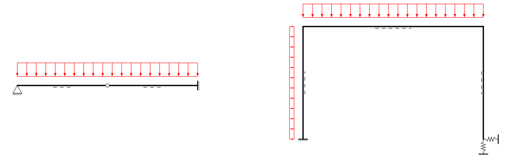

::: {#exr-vektor}
## Statische Systeme mit Momentengelenken und Federn

Ziel in dieser Aufgabe ist es, die existieren Klassen zum Zeichnen statischer Systeme um Symbole für Momentengelenke und Federn zu erweitern. Am Ende soll das dargestellte Bild gezeichnet werden.

{width=80% fig-align=center}

Aufgaben:

1. Führen Sie `SysdrawDemo.cs` im Ordner `01-sysdraw` aus. Sie sollten die Grafik aus den Folien sehen.

1. Implementieren Sie die Klasse `MomentHinge` für Momentengelenke. Ergänzen Sie das Gelenk in der Systemskizze.

1. Programmieren Sie die Klasse `Spring` für die Federn und ändern Sie die Zeichnung entsprechend.
:::