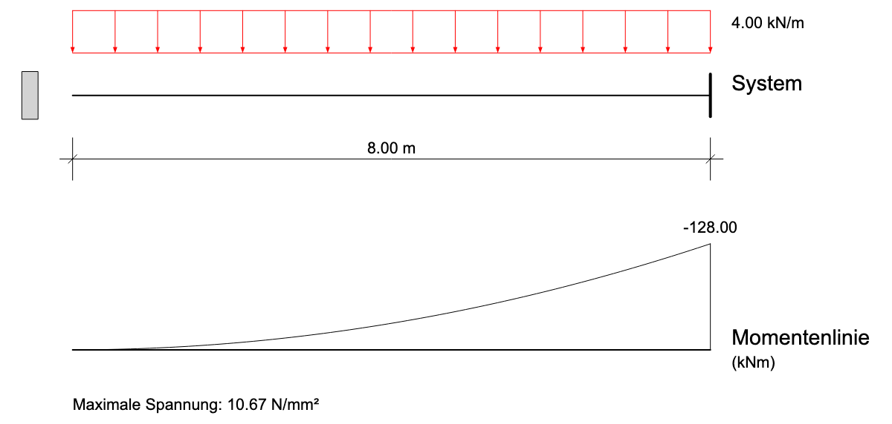
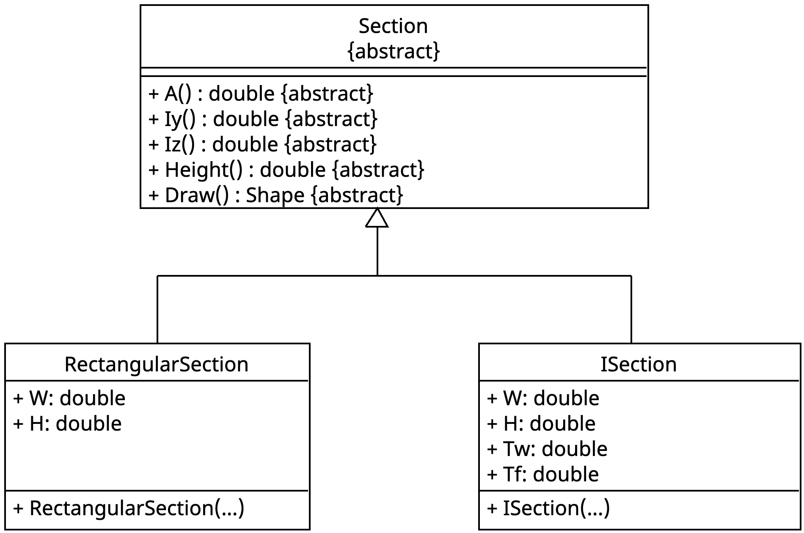

::: {#exr-einfeldtraeger}
## Einfeldträger mit Querschnitt

In dieser Aufgabe soll der Einfeldträger aus Abschnitt 7 um einen Querschnitt erweitert werden. Dabei sollen sowohl Rechteck- als auch I-Querschnitte verwendet werden können. Als Endergebnis soll der folgende Plot dargestellt werden.

{width=70% fig-align="center"}

Hinzugekommen sind die Darstellung des Querschnitts links vom System sowie die Ausgabe der maximal auftretenden Spannung unten.

### Klassen kopieren

Als Grundlage verwenden Sie die Dateien `RectangularSection.cs` und `ISection.cs` aus Abschnitt 5 sowie `Beam.cs` und `BeamDemo.cs` aus Abschnitt 7.

Schritte:

1. Kopieren Sie die genannten Dateien in den Ordner `02-beam` des Projekts zum Abschnitt Vererbung. 

1. Führen Sie die Tests in `02-beam-tests` aus, sie sollten alle grün sein.

Zur Not können Sie die Dateien auch herunterladen (Rechtsklick auf den Link → „Ziel speichern unter"): [RectangularSection.cs](https://raw.githubusercontent.com/matthiasbaitsch/informatik-master/refs/heads/main/bausteine/05-klassen/aufgaben/projekt-musterloesung/03-section/RectangularSection.cs), [ISection.cs](https://raw.githubusercontent.com/matthiasbaitsch/informatik-master/refs/heads/main/bausteine/05-klassen/aufgaben/projekt-musterloesung/03-section/ISection.cs), [Beam.cs](https://raw.githubusercontent.com/matthiasbaitsch/informatik-master/refs/heads/main/bausteine/07-einfeldtraeger-mit-tests/aufgaben/projekt-musterloesung/beam/Beam.cs), [BeamDemo.cs](https://raw.githubusercontent.com/matthiasbaitsch/informatik-master/refs/heads/main/bausteine/07-einfeldtraeger-mit-tests/aufgaben/projekt-musterloesung/beam/BeamDemo.cs).

### Querschnitte

Die Beam-Klasse soll für beliebige Querschnittstypen funktionieren. Das lässt sich mit einer abstrakten Basisklasse `CrossSection` lösen.


::: {.columns}
::: {.column width=50%}

:::
::: {.column width=5%}
:::
::: {.column width=45%}
Anmerkungen

- Die Parameterliste im Konstruktor entspricht den Attributen

- Die Methode `Height()` gibt die Querschnittshöhe $h$ zurück 
:::
:::

Schritte:

1. Fügen Sie die abstrakte Klasse `CrossSection` hinzu, so wie im Klassendiagramm dargestellt.

1. Rechteckquerschnitt: Lassen Sie die Klasse für Rechteckquerschnitte von `CrossSection` erben. Ergänzen Sie hierzu

    ```csharp
    public class RectangularSection : CrossSection {
    ```

    im Klassenkopf, markieren Sie die bestehenden Methoden mit `override` und ergänzen Sie die fehlenden Methoden 

    ```csharp
    public override double Height()
    {
        return this.H;
    }
    ```

    sowie

    ```csharp
    public override Shape Draw()
    {
        return new Rectangle(-this.W / 2, -this.H / 2, this.W / 2, this.H / 2);
    }
    ```

1. I-Querschnitt: Gehen Sie wie beim Rechteckquerschnitt vor. Zum Zeichnen bietet es sich an, die Hilfsvariablen

    ```csharp
    double z1 = this.H / 2;
    double z2 = z1 - this.Tf;
    double y1 = this.W / 2;
    double y2 = this.Tw / 2;
    ```

    zu verwenden. Eine kleine Skizze hilft.

### Querschnitt zur Klasse `Beam` hinzufügen

Die Klasse `Beam` erhält nun ein zusätzliches Attribut für den Querschnitt. Der Querschnitt soll dann grafisch dargestellt und zur Berechnung der maximalen Spannung verwendet werden.

Schritte:

1. Die `Beam`-Klasse erhält ein Attribut `Section`, das mit einem Rechteckquerschnitt vorbelegt wird.

    ```csharp
    public CrossSection Section = new RectangularSection(0.2, 0.6);
    ```

1. Zeichnen Sie den Querschnitt und überprüfen Sie das Ergebnis. Sie können den `Shape` für den Querschnitt mit `Move` verschieben.

1. Ergänzen Sie in der `Beam`-Klasse eine Methode `public double MaxSigma() {...}` in der die maximale Spannung mit der Formel
    $$
    \sigma_\mathrm{max} = \frac{|M_\mathrm{max}|}{I_y} \cdot \frac{h}{2}
    $$
    berechnet wird. Die Werte für $I_y$ und $h$ bekommen Sie von dem `Section`-Attribut.

1. Geben Sie den Wert für die maximale Spannung in der Zeichnung aus.

1. Testen Sie die Klasse für den I-Querschnitt. Sie können das im Demo-Programm mit

    ```csharp
    beam.Section = new ISection(0.2, 0.4, 0.05, 0.01);
    ```

    ändern.

