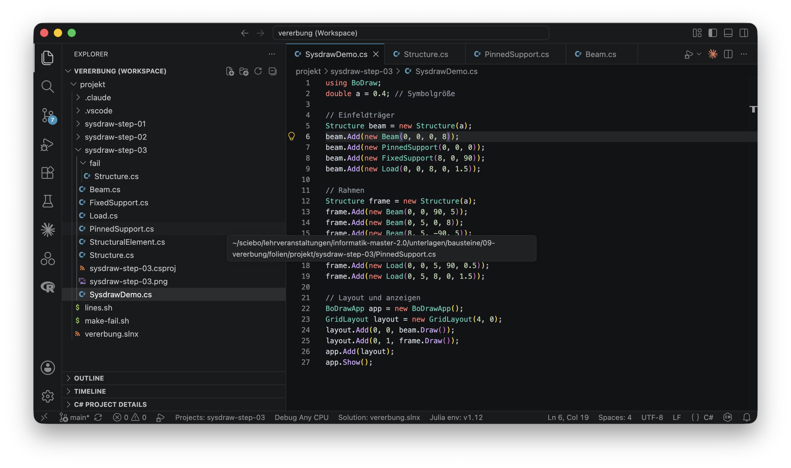
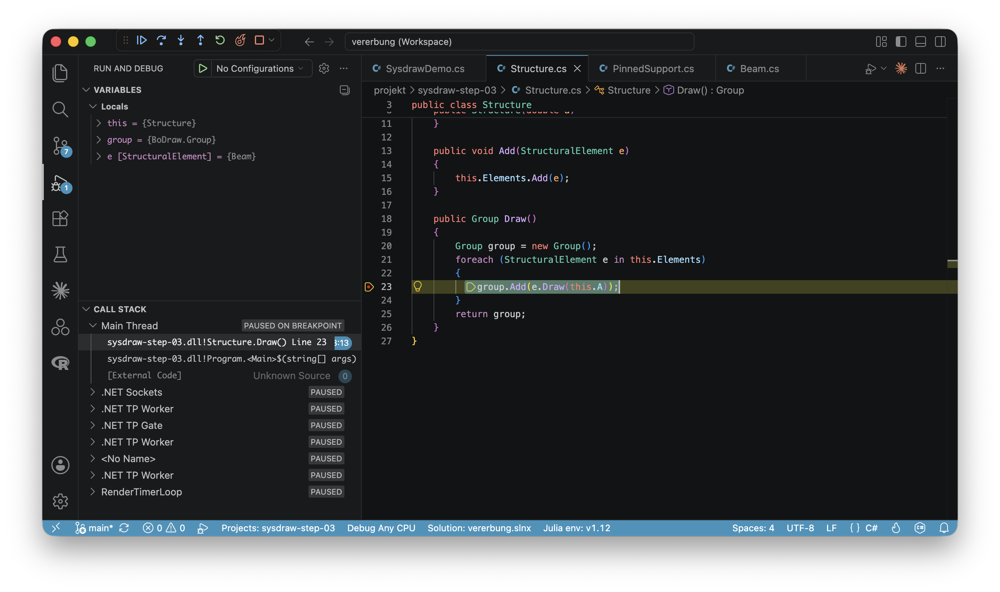
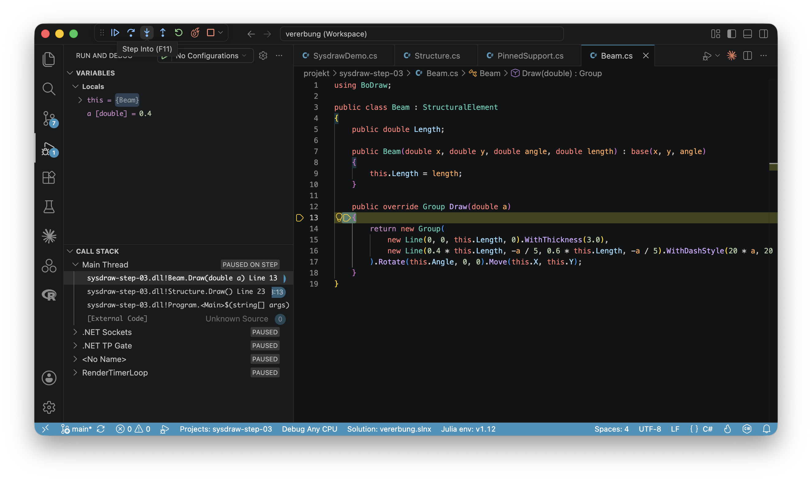
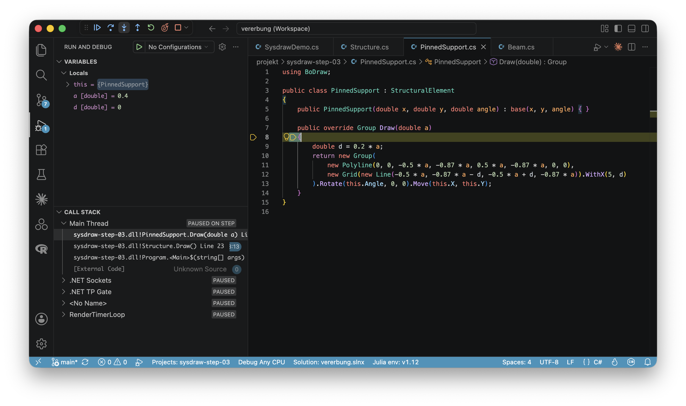
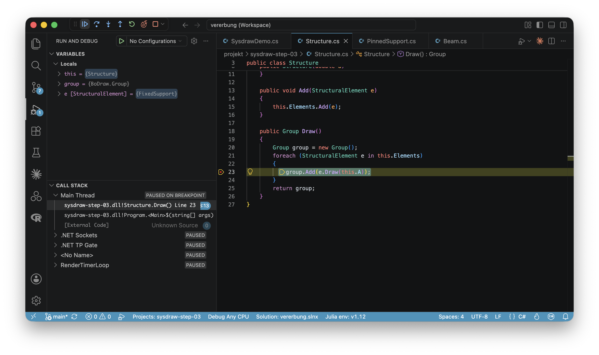
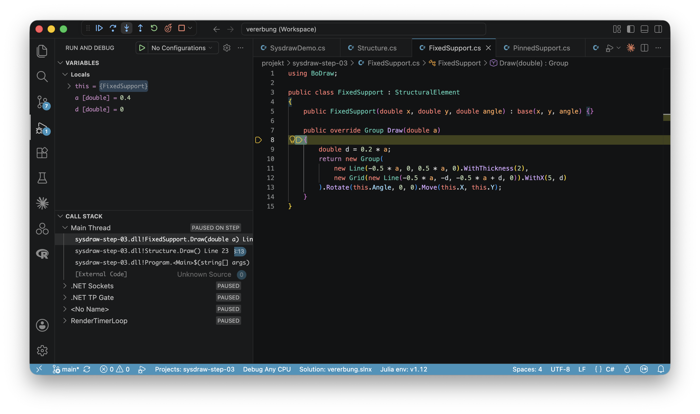
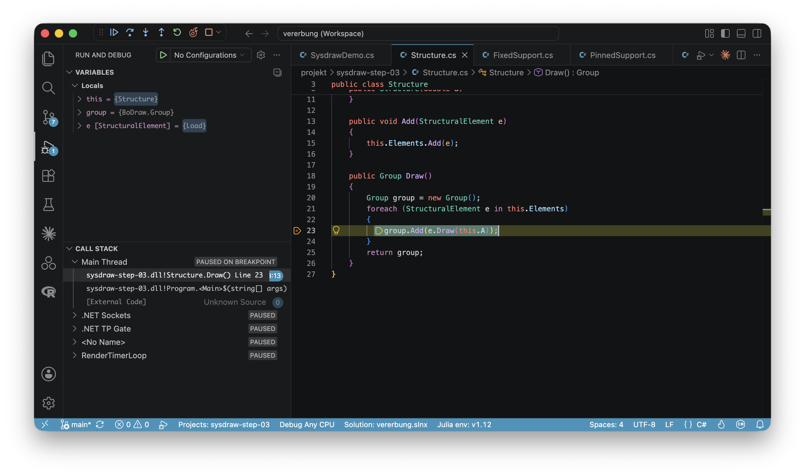

# Einführung

## Klassifikation


- Klassifikation der Art 'Tier → Wirbeltier → Säugetier → Hauskatze'

- Gruppiert nach Gemeinsamkeiten

## In der objektorientierten Programmierung

[]{.down60}

- Vererbung
    - Klassen organisieren
    - Gemeinsame Eigenschaften/Methoden nur einmal Programmieren

. . .

[]{.down60}

- Polymorphismus
    - Programme flexibel erweitern
    - Unterschiedliche Objekte einheitlich behandeln

. . .

[]{.down60}

→ Wichtige Grundprinzipien

## Beispiel: Klassen um statische Systeme zu zeichnen

[]{.down60}
{height=250}
[]{.down40}

:::: {.r-stack}
::: {.fragment .fade-in-then-out style="width:100%"}
### Wofür man das brauchen könnte

- In dem Beispiel zum Einfeldträger
- Für ein FE-Programm, das prüffähige Statiken erstellt
- Um ein Zeichenprogramm für statische Systeme zu erstellen
:::

::: {.fragment .fade-in-then-out style="width:100%"}
::: {.columns}
### Analyse: Klassen (links) Eigenschaften und Methoden (rechts)

::: {.column width=55%}
- `Beam`: Balken mit Bezugsfaser
- `PinnedSupport`: Gelenkiges Lager
- `FixedSupport`: Eingespanntes Lager
- `Load`: Streckenlast
:::
::: {.column width=45%}
- Position, Orientierung
- Länge, Wert, etc.
- Verschieben nach
- Zeichnen mit Zeicheneinheit
:::
:::
:::

::: {.fragment .fade-in-then-out style="width:100%"}
### Design: Klassendiagramm

::: {.full-width-img}

:::
:::
::::

## {.smaller}

::: {.tall-code}
```csharp

```
:::

## {.smaller}

::: {.tall-code}
```csharp

```
:::

## {.smaller}

::: {.tall-code}
```csharp

```
:::

## {.smaller}

::: {.tall-code}
```csharp

```
:::

## {.smaller}

::: {.tall-code}
```csharp

```
:::

## Ergebnis

[]{.down40}

::: {.full-width-img}

:::

[]{.down40}

. . .

- Ordentliche Grafik
- Insgesamt 125 Zeilen Programmcode
- Attribute `X`, `Y`, `Angle` und Methode `MoveTo` vier mal

. . .

→ Identischer Code an mehreren Stellen ([DRY](https://de.wikipedia.org/wiki/Don’t_repeat_yourself)-Prinzip verletzt)

# Vererbung

## Gemeinsame Basisklasse

::: {.full-width-img}

:::

- Gemeinsame Eigenschaften und Methoden in Klasse `StructuralElement`
- `Beam`, `PinnedSupport`, `FixedSupport` und `Load` sind ein `StructuralElement`
- Sprachregelung
    - `StructuralElement` ist die Basisklasse von `Beam`
    - `Beam` erbt von `StructuralElement`
    - UML: Verbindung mit Dreieck an der Basisklasse

## {.smaller}

::: {.tall-code}
```csharp

```
:::

[]{.down40}

Definition Basisklasse

- Wie gehabt

## {.smaller}

::: {.tall-code}
```{.csharp code-line-numbers="|3|7|"}

```
:::

[]{.down40}

Definition abgeleitete Klasse

- Basisklasse angeben

    `public class Klassenname : Basisklasse {}`

- Konstruktor Basisklasse

    `public Klassenname(Parameterliste 1) : base(Parameterliste 2) {}`

## {.smaller}

::: {.columns}
::: {.column width=54%}

:::
::: {.column width=46%}

:::
:::

[]{.down60}

::: {.r-stack}
::: {.fragment .fade-out fragment-index=1 style="width:100%"}
Verwendung: Eigenschaften und Methoden aus beiden Klassen
```csharp
BoDrawApp app = new BoDrawApp();
Beam beam = new Beam(3, 12, 90, 7);
beam.MoveTo(4, 2);
Console.WriteLine($"Beam x: {beam.X}, y: {beam.Y}, l: {beam.Length}");
app.Add(beam.Draw(0.3));
```
```output
Beam x: 4, y: 2, l: 7
```

- Variable `beam` ist vom Typ `Beam`
- `Beam` ist ein `StructuralElement`

→ Alles aus `StructuralElement` plus das, was in `Beam` dazukommt
:::
::: {.fragment .fade-in fragment-index=1 style="width:100%"}
Verwendung: Basisklasse als Datentyp
```csharp
BoDrawApp app = new BoDrawApp();
StructuralElement beam = new Beam(3, 12, 90, 7);
beam.MoveTo(4, 2);
Console.WriteLine($"Beam x: {beam.X}, y: {beam.Y}"); 
// Kein beam.Length und beam.Draw(0.3) da nicht in Klasse StructuralElement
```
```output
Beam x: 4, y: 2
```

- Datentyp für `beam` jetzt `StructuralElement`
    - jeder `Beam` ist ein `StructuralElement`
- Methoden und Attribute aus `Beam` nicht verfügbar
    - nicht jedes `StructuralElement` ist ein `Beam`

→ `StructuralElement` gemeinsamer Nenner
:::
:::

## {.smaller}

::: {.tall-code}
```csharp

```

```csharp

```
:::

## {.smaller}

::: {.tall-code}
```csharp

```
:::

## {.smaller}

::: {.tall-code}
```csharp

```
:::

→ Code unverändert gegenüber erster Fassung

## Ergebnis

[]{.down40}

::: {.full-width-img}

:::

[]{.down40}

. . .

- Grafik wie gehabt
- Insgesamt 87 anstatt 125 Zeilen Programmcode
- Attribute `X`, `Y`, `Angle` und Methode `MoveTo` nur noch einmal
- Viel Programmcode in `SysdrawDemo`

## Ziel: Statisches System als Objekt {.smaller}

::: {.columns}
::: {.column width=63%}
Aktuell
```csharp

```
:::
::: {.column width=37%}
Gewünscht
```csharp

```
:::
:::

- Statisches System als `Structure`-Objekt – Elemente intern verwaltet

- Übersichtlicher Programmcode in `SysdrawDemo`, egal wie viele Elemente

→ Notwendig: Neue Klasse `Structure`

# Polymorphismus

## Klasse `Structure` für statisches System

[]{.down40}

::: {.full-width-img}

:::

- Klasse `Structure` verwaltet Objekte vom Typ `StructuralElement`

- `Draw`-Methode in `Structure` führt `Draw` für alle Elemente aus

[]{.down20}

→ Einfacher und flexibler Programmcode in `SysdrawDemo`

## {.smaller}

::: {.tall-code}
```csharp

```
:::

- Code in `Structure`
    - `A`: Symbolgröße für alle Elemente
    - `Elements`: Elemente der Zeichung
    - `Add`: Element hinzufügen
    - `Draw`: Zeichnen, alles in eine Gruppe


## {.smaller}

::: {.tall-code}
```csharp

```
:::

::: {.columns}
::: {.column width=40%}
- Code in `Structure`
    - `A`: Symbolgröße für alle Elemente
    - `Elements`: Elemente der Zeichung
    - `Add`: Element hinzufügen
    - `Draw`: Zeichnen, alles in eine Gruppe
:::
::: {.column width=60%}
- Problem: Funktioniert nicht so einfach
    - In der Schleife ist `e` vom Typ `StructuralElement`
    - Keine Methode `Draw` in `StructuralElement`
    - Und das, obwohl `Draw` in jeder Unterklasse existiert

→ Sicherstellen, dass jede Unterklasse `Draw` bereitstellt
:::
:::

## Lösung: Abstrakte Basisklasse 1/2 {.smaller}

[]{.down20}

::: {.columns}
::: {.column}
```{.csharp code-line-numbers="|22|3|"}

```
:::
::: {.column}
```{.csharp code-line-numbers="|14|"}

```
:::
:::

[]{.down20}

- Abstrakte Methode: Sicherstellen, dass abgeleitete Klassen `Draw` bereitstellen
- Abstrakte Klasse: Klassen mit abstrakten Methoden sind immer abstrakt
- Abstrakte Methode implementieren: Mit `override` markieren

## Lösung: Abstrakte Basisklasse 2/2

[]{.down40}

::: {.full-width-img}

:::

[]{.down40}

- Abstrakte Klasse `StructuralElement` mit abstrakter Methode `Draw`

- Im UML-Diagramm durch `{abstract}` kenntlich gemacht

- `Draw` muss in jeder Unterklasse implementiert werden – explizite Angabe in den Unterklassen kann entfallen

→ Wichtiges Prinzip in objektorientierter Programmierung

## Programm im Debugger ausführen

:::: {.r-stack}
::: {.fragment .fade-in-then-out}
{width=80%}

`SysdrawDemo.cs` – Programm starten
:::
::: {.fragment .fade-in-then-out}
{width=80%}

Schleife in `Structure.Draw()` - `e` zeigt auf ein `Beam`-Objekt
:::
::: {.fragment .fade-in-then-out}
{width=80%}

Schritt hinein → `Beam.Draw(a)` wird ausgeführt
:::
::: {.fragment .fade-in-then-out}
{width=80%}

Nächste Schleifenrunde – `e` zeigt jetzt auf ein `PinnedSupport`-Objekt
:::
::: {.fragment .fade-in-then-out}
{width=80%}

Schritt hinein → `PinnedSupport.Draw(a)` wird ausgeführt
:::
::: {.fragment .fade-in-then-out}
{width=80%}

Nächste Schleifenrunde – `e` zeigt jetzt auf ein `FixedSupport`-Objekt
:::
::: {.fragment .fade-in-then-out}
{width=80%}

Schritt hinein → `FixedSupport.Draw(a)` wird ausgeführt
:::
::: {.fragment}
{width=80%}

Nächste Schleifenrunde – `e` zeigt jetzt auf ein `Load`-Objekt
:::
::::

## Was wir gesehen haben heißt Polymorphismus

[]{.down40}

### Bedeutung Polymorphismus

- Griechisches Wort für Vielgestaltigkeit

- Variable `e` ist immer vom abstrakten Typ `StructuralElement`

- Objekt, auf das `e` zeigt, hat konkreten Datentyp (`Beam` etc.)

- `e.Draw(a)` ruft die `Draw`-Methode des tatsächlichen Objekttyps auf

→ Selber Methodenname, unterschiedliche Wirkung, je nach Objekttyp

[]{.down40}

::: {.fragment}
### Flexible Programmierung

- Abstrakte Methode `Draw` in abstrakter Klasse `StructuralElement` 

- Alle konkreten Unterklassen implementieren abstrakte Methode

- Keine Änderung in `Structure` notwendig, falls neue Klassen dazukommen

→ Programme lassen sich flexibel erweitern, ohne bestehenden Code zu ändern
:::

# Was man sonst noch wissen sollte


## Die `Object`-Klasse

[]{.down60}

Klasse ohne explizit angegebene Basisklasse erbt automatisch von `Object`

```csharp
public class StructuralElement {}
```

ist daher gleichbedeutend mit

```csharp
public class StructuralElement : Object {}
```

[]{.down60}
  
- `Object` ist vordefinierte Klasse aus C#

- Grundlegende Methoden wie `ToString()` oder `HashCode()`

- Damit ist `Object` die Wurzel jeder Klassenhierarchie

## Methoden überschreiben: `ToString()`

[]{.down40}

```csharp
Beam beam = new Beam(0, 0, 0, 5);
Console.WriteLine(beam.ToString()); // Ausgabe: BoDraw.Beam
```

- Methode `ToString()` in `Object` vereinbart

- Gibt standardmäßig den Klassennamen zurück

. . .

[]{.down20}

```csharp
public class Beam 
{
    ...
    public override string ToString()
    {
        return $"Beam x={this.X}, y={this.Y}, length={this.Length}";
    }
}
```

```csharp
Beam beam = new Beam(0, 0, 0, 5);
Console.WriteLine(beam.ToString()); // Ausgabe: Beam x=0, y=0, length=5
```

- Informative Ausgabe mit überschriebener Methode

. . .

[]{.down20}

→ Schlüsselwort `override` um Methode aus Basisklasse neu zu definieren

## Interfaces 

::: {.columns}
::: {.column width=52%}
```csharp
public interface IComparable<T>
{
    int CompareTo(T other);
}
```
```csharp
public class Fraction : 
                   IComparable<Fraction>
{
    public int A;
    public int B;

    ... 

    public int CompareTo(Fraction q)
    {
        int z1 = this.A * q.B;
        int z2 = this.B * q.A;
        if (z1 < z2) { return -1; }
        else if (z1 == z2) { return 0; }
        else{ return 1; }
    }
}
```
:::
::: {.column width=48%}
- Wie abstrakte Klasse, aber ausschließlich abstrakte Methoden
- Klasse kann Klasse mehrere Interfaces implementieren
- In C# weit verbreitet – begegnen einem in Dokumentation und Beispielen häufig
- Name beginnt in der Regel mit großem I

→ Für uns nicht zentral
:::
:::


# Zusammenfassung und Auslassungen

## Zusammenfassung

[]{.down40}

Vererbung
: Gemeinsame Eigenschaften und Methoden in einer Basisklasse zusammenfassen – `public class Beam : StructuralElement {}`

Abstrakte Klasse
: Basisklasse mit abstrakten Methoden, erzwingt Implementierung in Unterklassen – `public abstract Group Draw(double a);`

Polymorphismus
: Gleicher Methodenaufruf, unterschiedliches Verhalten je nach tatsächlichem Objekttyp – `e.Draw()` ruft `Beam.Draw()`, `PinnedSupport.Draw()`, ... auf

Klasse `Object`
: Wurzel jeder Klassenhierarchie – stellt u.a. `ToString()` bereit, 

Methoden überschreiben
: Methoden in abgeleiteter Klasse neu definieren, Schlüsselwort `override`

## Auslassungen

[]{.down100}

- Mehrfachvererbung (in C# nicht möglich)
- Generics (`List<T>`, `IComparable<T>`)
- Typprüfung zur Laufzeit (`is`, `as`)
- Interfaces im Detail
