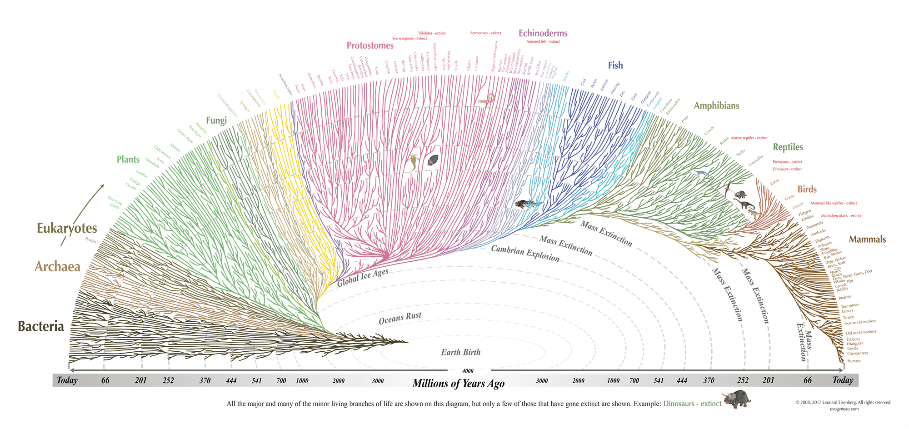
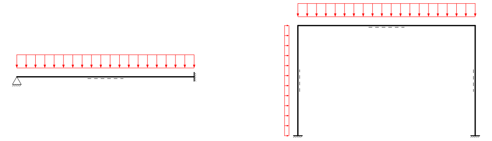
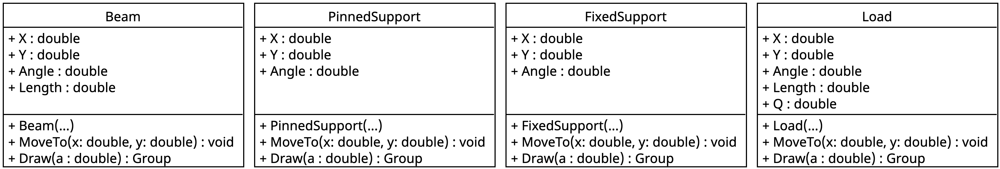
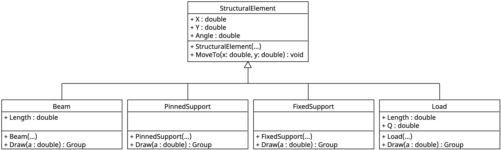
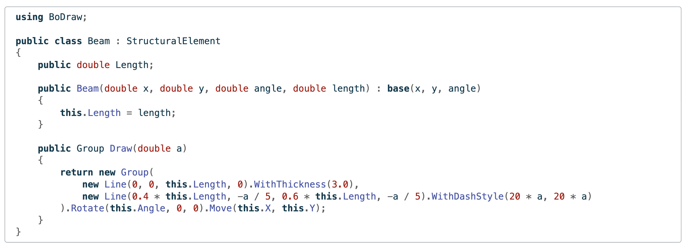
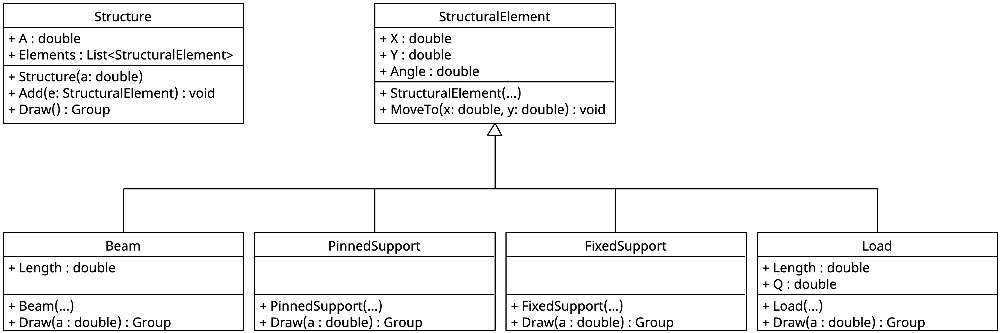
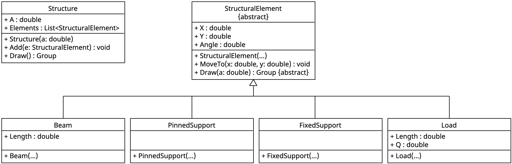

# Einführung

## Klassifikation



- Klassifikation von Organismen

## In der objektorientierten Programmierung

- Vererbung
    - Klassen organisieren
    - Gemeinsame Eigenschaften/Methoden nur einmal Programmieren

- Polymorphismus
    - Programme flexibel erweitern
    - Unterschiedliche Objekte einheitlich behandeln

→ Wichtige Grundprinzipien

## Beispiel: Klassen um statische Systeme zu zeichnen

[]{.down60}
{height=250}
[]{.down40}

:::: {.r-stack}
::: {.fragment .fade-in-then-out style="width:100%"}
### Wofür man das brauchen könnte

- In dem Beispiel zum Einfeldträger
- Für ein FE-Programm, das prüffähige Statiken erstellt
- Um ein Zeichenprogramm für statische Systeme zu erstellen
:::

::: {.fragment .fade-in-then-out style="width:100%"}
::: {.columns}
### Analyse: Klassen (links) Eigenschaften und Methoden (rechts)

::: {.column width=55%}
- `Beam`: Balken mit Bezugsfaser
- `FixedSupport`: Gelenkiges Lager
- `PinnedSupport`: Eingespanntes Lager
- `Load`: Streckenlast
:::
::: {.column width=45%}
- Position, Orientierung
- Länge, Wert, etc.
- Verschieben nach
- Zeichnen mit Zeicheneinheit
:::
:::
:::

::: {.fragment .fade-in-then-out style="width:100%"}
### Design: Klassendiagramm

::: {.full-width-img}

:::
:::
::::

## {.smaller}

::: {.tall-code}
```csharp

```
:::

## {.smaller}

::: {.tall-code}
```csharp

```
:::

## {.smaller}

::: {.tall-code}
```csharp

```
:::

## {.smaller}

::: {.tall-code}
```csharp

```
:::

## {.smaller}

::: {.tall-code}
```csharp

```
:::

## Ergebnis

[]{.down40}

::: {.full-width-img}

:::

[]{.down40}

. . .

- Ordentliche Grafik
- Insgesamt 125 Zeilen Programmcode
- Attribute `X`, `Y`, `Angle` und Methode `MoveTo` vier mal

. . .

→ Identischer Code an mehreren Stellen ([DRY](https://de.wikipedia.org/wiki/Don’t_repeat_yourself)-Prinzip verletzt)

# Vererbung

## Gemeinsame Basisklasse

::: {.full-width-img}

:::

- Gemeinsame Eigenschaften und Methoden in Klasse `StructuralElement`
- `Beam`, `PinnedSupport`, `FixedSupport` und `Load` sind ein `StructuralElement`
- Sprachregelung
    - `StructuralElement` ist die Basisklasse von `Beam`
    - `Beam` erbt von `StructuralElement`
    - UML: Verbindung mit Dreieck an der Basisklasse

## {.smaller}

::: {.tall-code}
```csharp

```
:::

[]{.down40}

Definition Basisklasse

- Wie gehabt

## {.smaller}

::: {.tall-code}
```csharp

```
:::

[]{.down40}

Definition abgeleitete Klasse

- Basisklasse angeben

    `public class Klassenname : Basisklasse {}`

- Konstruktor Basisklasse

    `public Klassenname(Parameterliste 1) : base(Parameterliste 2) {}`

## {.smaller}

::: {.columns}
::: {.column width=54%}

:::
::: {.column width=46%}

:::
:::

[]{.down60}

::: {.r-stack}
::: {.fragment .fade-in-then-out style="width:100%"}
Verwendung: Eigenschaften und Methoden aus beiden Klassen 
```csharp
BoDrawApp app = new BoDrawApp();
Beam beam = new Beam(3, 12, 90, 7);
beam.MoveTo(4, 2);
Console.WriteLine($"Beam x: {beam.X}, y: {beam.Y}, l: {beam.Length}");
app.Add(beam.Draw(0.3));
```
```output
Beam x: 4, y: 2, l: 7
```

- Variable `beam` ist vom Typ `Beam`
- `Beam` ist ein `StructuralElement`

→ Alles aus `StructuralElement` plus das, was in `Beam` dazukommt
:::
::: {.fragment .fade-in-then-out style="width:100%"}
Verwendung: Basisklasse als Datentyp
```csharp
BoDrawApp app = new BoDrawApp();
StructuralElement beam = new Beam(3, 12, 90, 7);
beam.MoveTo(4, 2);
Console.WriteLine($"Beam x: {beam.X}, y: {beam.Y}"); 
// Kein beam.Length und beam.Draw(0.3) da nicht in Klasse StructuralElement
```
```output
Beam x: 4, y: 2
```

- Datentyp für `beam` jetzt `StructuralElement`
    - jeder `Beam` ist ein `StructuralElement`
- Methoden und Attribute aus `Beam` nicht verfügbar
    - nicht jedes `StructuralElement` ist ein `Beam`

→ `StructuralElement` gemeinsamer Nenner
:::
:::

## {.smaller}

::: {.tall-code}
```csharp

```

```csharp

```
:::

## {.smaller}

::: {.tall-code}
```csharp

```
:::

## {.smaller}

::: {.tall-code}
```csharp

```
:::

→ Code unverändert gegenüber erster Fassung

## Ergebnis

[]{.down40}

::: {.full-width-img}

:::

[]{.down40}

. . .

- Grafik wie gehabt
- Insgesamt 87 anstatt 125 Zeilen Programmcode
- Attribute `X`, `Y`, `Angle` und Methode `MoveTo` nur noch einmal
- Viel Programmcode in `SysdrawDemo`

# Polymorphismus

## Idee: Klasse `Structure` für die ganze Zeichnung

[]{.down40}

::: {.full-width-img}

:::

- Klasse `Structure` verwaltet Objekte vom Typ `StructuralElement`

- `Draw`-Methode von `Structure` führt `Draw` für jedes `StructuralElement` in `Elements` aus

→ Einfacher und flexibler Programmcode in `SysdrawDemo`

## {.smaller}

::: {.columns}
::: {.column}
::: {.tall-code}
```csharp

```
:::
:::
::: {.column}
::: {.tall-code}
```csharp

```
:::
:::
:::

- Code in `Structure`
    - `A`: Symbolgrö0e für alle Elemente
    - `Elements`: Elemente der Zeichung
    - `Add`: Element hinzufügen
    - `Draw`: Zeichnen, alles in eine Gruppe


## {.smaller}

::: {.columns}
::: {.column}
::: {.tall-code}
```csharp

```
:::
:::
::: {.column}
::: {.tall-code}
```csharp

```
:::
:::
:::

::: {.columns}
::: {.column width=40%}
- Code in `Structure`
    - `A`: Symbolgröße für alle Elemente
    - `Elements`: Elemente der Zeichung
    - `Add`: Element hinzufügen
    - `Draw`: Zeichnen, alles in eine Gruppe
:::
::: {.column width=60%}
- Problem: Funktioniert nicht so einfach
    - In der Schleife ist `e` vom Typ `StructuralElement`
    - Keine Methode `Draw` in `StructuralElement`
    - Und das, obwohl `Draw` in jeder Unterklasse existiert

→ Sicherstellen, dass jede Unterklasse `Draw` bereitstellt
:::
:::

## Lösung: Abstrakte Basisklasse 1/2 {.smaller}

[]{.down20}

::: {.columns}
::: {.column}
```{.csharp code-line-numbers="|22|3|"}

```
:::
::: {.column}
```{.csharp code-line-numbers="|14|"}

```
:::
:::

[]{.down20}

- Abstrakte Methode: Sicherstellen, dass abgeleitete Klassen `Draw` bereitstellen
- Abstrakte Klasse: Klassen mit abstrakten Methoden sind immer abstrakt
- Abstrakte Methode implementieren: Mit `override` markieren

## Lösung: Abstrakte Basisklasse 2/2

[]{.down40}

::: {.full-width-img}

:::

[]{.down40}

- Abstrakte Klasse `StructuralElement` mit abstrakter Methode `Draw`

- Kenntlich gemacht durch `{abstract}`

- Klar, dass abgeleitete Klassen `Draw` bereitstellen, weglassen

→ Wichtiges Prinzip in objektorientierter Programmierung

## Polymorphismus


