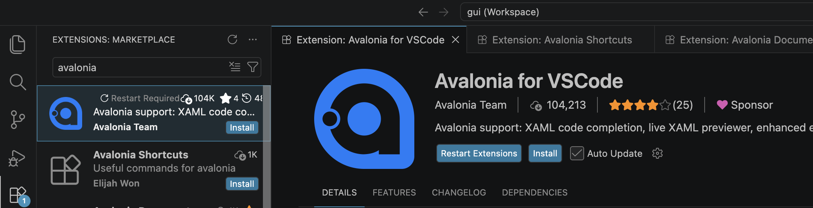

Bevor Sie mit den Aufgaben loslegen:

- Installieren Sie die Avalonia-Erweiterung in Visual Studio Code
    {width=40% fig-align="center" .lightbox}
- Die [Zip-Datei](${slug}.zip) herunterladen und in den Ordner 'projekte' entpacken.
- Starten Sie mit einem Doppelklick auf die Datei `${slug-nn}.code-workspace` die Entwicklungsumgebung Visual Studio Code.
