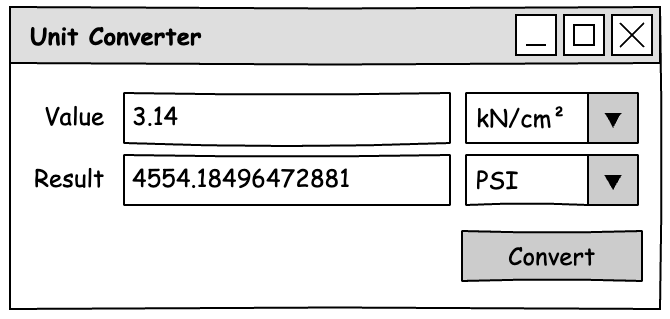

::: {#exr-einheiten-konvertieren}
## Einheiten von Spannungen konvertieren

Spannungen werden je nach Land und Fachgebiet in unterschiedlichen Einheiten angegeben: Bei uns üblich sind Pascal ($1\,\mathrm{Pa} = 1\,\mathrm{N/m^2}$) und davon abgeleitete Einheiten wie $\mathrm{N/mm^2}$ oder $\mathrm{kN/cm^2}$. In den USA wird dagegen mit PSI gerechnet (pounds per square inch, Pfund pro Quadratzoll). Wer mit amerikanischen Normen oder Datenblättern arbeitet, muss also umrechnen, dabei gilt $1\,\mathrm{PSI} = 6894.757293168\,\mathrm{Pa}.$ In dieser Aufgabe entwickeln Sie Schritt für Schritt eine grafische Anwendung, mit der sich Spannungen zwischen verschiedenen Einheiten umrechnen lassen. Am Ende soll das Programm in etwa so aussehen:

{width="50%" fig-align="center"}

Für die Bearbeitung können Sie das [Minimalbeispiel](https://matthiasbaitsch.github.io/informatik-master/lernpfad/folien/c/10-grafische-benutzungsoberflächen.html#/minimalbeispiel-22){target="_blank"} in den Folien als Referenz verwenden.

### Spannung von Pascal nach PSI konvertieren

Zunächst soll das Programm nur von Pascal nach PSI umrechnen. Die Auswahl der Einheiten kommt dann im zweiten Teil dazu.

1. Elemente hinzufügen: Öffnen Sie im Projekt `01-unit-converter` die Datei `MainWindow.axaml`. Damit mehrere Elemente Platz finden, brauchen Sie ein Layout-Element – ersetzen Sie den Text `Welcome to Avalonia!` durch ein `StackPanel`, das seine Inhalte einfach untereinander anordnet:

    ```xml
    <StackPanel>
        <Label>Value</Label>
        <TextBox>1.0</TextBox>
        <Label>Pa</Label>
    </StackPanel>
    ```

    Ergänzen Sie in `MainWindow.axaml` analog ein Label `Result`, eine leere `TextBox` für das Ergebnis, ein Label `PSI` sowie einen `Button` mit der Aufschrift `Convert`. Setzen Sie außerdem ganz oben in der Datei im `Window`-Element den Titel des Fensters auf `Unit Converter`. Starten Sie das Programm, Sie sollten alle Elemente sehen.

2. Elemente anordnen: Beschriftung, Eingabefeld und Einheit sollen neben- und untereinander stehen. Dafür gibt es das `Grid`, das seine Inhalte in Zeilen und Spalten anordnet. Ordnen Sie die ersten sechs Elemente (der Button bleibt außerhalb im `StackPanel`) in einem Raster mit drei Spalten und zwei Zeilen an:

    ```xml
    <Grid ColumnDefinitions="Auto,*,Auto" RowDefinitions="Auto,Auto">
        <Label Grid.Row="0" Grid.Column="0">Value</Label>
        <TextBox Grid.Row="0" Grid.Column="1">1.0</TextBox>
        ...
    </Grid>
    ```

    Dabei bedeutet `Auto`, dass die Spalte so breit wird wie ihr Inhalt ist, und `*`, dass die Spalte den restlichen Platz bekommt. Jedes Element gibt mit `Grid.Row` und `Grid.Column` an, in welcher Zelle es steht (Zählung ab 0). Sorgen Sie außerdem mit dem Attribut `SizeToContent="WidthAndHeight"` im `Window`-Element dafür, dass sich die Fenstergröße dem Inhalt anpasst. Starten Sie das Programm und überprüfen Sie die Ausgabe.

3. Layout verfeinern: Die Anordnung der Komponenten ist jetzt richtig, aber schön ist das noch nicht. Daher:

    - Geben Sie dem `StackPanel` die Attribute `Margin="20"` (Abstand zum Fensterrand) und `Spacing="10"` (Abstand zwischen den Inhalten) sowie `HorizontalAlignment="Center"` und `VerticalAlignment="Center"`.
    - Im `Grid` erzeugen `ColumnSpacing="10"` und `RowSpacing="10"` Abstände zwischen den Zellen.
    - Damit die Labels rechtsbündig und vertikal mittig vor den Eingabefeldern stehen, müssten Sie die Ausrichtung eigentlich bei jedem Label einzeln setzen. Einfacher geht es mit einem Style, der für alle Labels im `StackPanel` gilt:

        ```xml
        <StackPanel.Styles>
            <Style Selector="Label">
                <Setter Property="HorizontalAlignment" Value="Right" />
                <Setter Property="VerticalAlignment" Value="Center" />
            </Style>
        </StackPanel.Styles>
        ```

        Ergänzen Sie darin analog einen Style für `TextBox`, der die Breite (`Width`) auf 150 setzt.
    - Richten Sie den Button mit `HorizontalAlignment="Right"` rechtsbündig aus.

4. Konvertierung: Um die eigentliche Konvertierung durchführen zu können, ist noch Folgendes zu erledigen:

    - Damit Sie aus dem C#-Code heraus die Elemente ansprechen können, brauchen sie Namen: Geben Sie den beiden Textboxen und dem Button mit `x:Name` die Namen `ValueTB`, `ResultTB` und `ConvertB`. 
    
    - Setzen Sie bei `ResultTB` zusätzlich `IsReadOnly="True"`, damit das Feld nicht verändert werden kann.

    - Melden Sie dann in `MainWindow.axaml.cs` im Konstruktor eine Methode für den Klick auf den Button an:

        ```csharp
        this.ConvertB.Click += this.OnConvertBClicked;
        ```

        Die Methode `OnConvertBClicked` gibt es noch nicht. Lassen Sie sich vom QuickFix helfen: Klicken Sie auf den rot unterschlängelten Namen und erzeugen Sie den Methodenrumpf über die Glühbirne bzw. `Ctrl+.`. Der Typ `RoutedEventArgs` im Parameter der erzeugten Methode kommt aus dem Namespace `Avalonia.Interactivity` – falls er rot unterschlängelt ist, ergänzen Sie am Anfang der Datei die Zeile `using Avalonia.Interactivity;` (auch dabei hilft der QuickFix).

    - Programmieren Sie in der Methode `OnConvertBClicked` die Umrechnung: Lesen Sie den eingegebenen Text mit `this.ValueTB.Text!` aus, wandeln Sie ihn mit `double.Parse` in eine Zahl um und teilen Sie durch den Umrechnungsfaktor. Zeigen Sie das Ergebnis formatiert an:

        ```csharp
        double input = double.Parse(this.ValueTB.Text!);
        double result = input / 6894.757293168;
        this.ResultTB.Text = $"{result:0.0####}";
        ```

        Testen Sie das Programm: Die Eingabe `6894.757293168` muss genau `1.0` PSI ergeben.

### Auswahl der Einheiten

Bislang rechnet das Programm fest von Pa nach PSI um. Jetzt soll die Einheit auf beiden Seiten frei wählbar sein wie im Bild oben. Das lässt sich mit zwei Auswahllisten (`ComboBox`) und einem Dictionary für die Umrechnungsfaktoren lösen.

Gehen Sie in diesen Schritten vor und testen Sie in jedem Schritt das Programm (wie immer eigentlich).

1. Ersetzen Sie die beiden Labels `Pa` und `PSI` durch Auswahllisten mit entsprechenden Namen. Für die Eingabeeinheit sieht das so aus:

    ```xml
    <ComboBox x:Name="ValueUnitCoBo" Grid.Row="0" Grid.Column="2"></ComboBox>
    ...
    ```

    Die Ausgabeeinheit passen Sie mit dem Namen `ResultUnitCoBo` entsprechend an.

1. Ergänzen Sie in den Styles eine Breite von 100 für `ComboBox`.

1. Speichern Sie die Umrechnungsfaktoren in einem Dictionary, das jeder Einheit den Faktor nach Pa zuordnet. Das Dictionary ist ein Attribut der Klasse:

    ```csharp
    // Umrechnungsfaktor Wert mit Einheit -> N/m² (Pa)
    public Dictionary<string, double> Factors = [];
    ```

    Füllen Sie das Dictionary im Konstruktor mit den Einheiten `Pa` (Faktor 1), `MPa` (1e6), `N/m²` (1), `N/mm²` (1e6), `kN/cm²` (1e7) und `PSI` (6894.757293168). Hier müssen Sie gegebenenfalls nochmal in die Folien zu den Datenstrukturen schauen.
    
1. Danach füllen Sie die Einträge der Auswahllisten mit den Schlüsseln des Dictionarys:

    ```csharp
    this.ValueUnitCoBo.ItemsSource = this.Factors.Keys;
    this.ValueUnitCoBo.SelectedIndex = 0;
    ```

    Entsprechend für `ResultUnitCoBo`, dort mit `SelectedIndex = 1`.

1. Passen Sie zuletzt die Umrechnung an. Die gewählte Einheit liefert die ComboBox mit

    ```csharp
    string inputUnit = (string)this.ValueUnitCoBo.SelectedItem!;
    double inputFactor = this.Factors[inputUnit];
    ```

    Rechnen Sie zunächst mit dem Faktor der Eingabeeinheit nach Pa um (multiplizieren) und dann mit dem Faktor der Ausgabeeinheit in die Zieleinheit (dividieren). Ergänzen Sie in der Formatangabe ein paar zusätzliche `#`, damit auch kleine Werte genau angezeigt werden.

    Testen Sie das Programm mit dem Beispiel aus dem Bild: $3.14\,\mathrm{kN/cm^2}$ ergeben ungefähr $4554.18\,\mathrm{PSI}$.
:::
