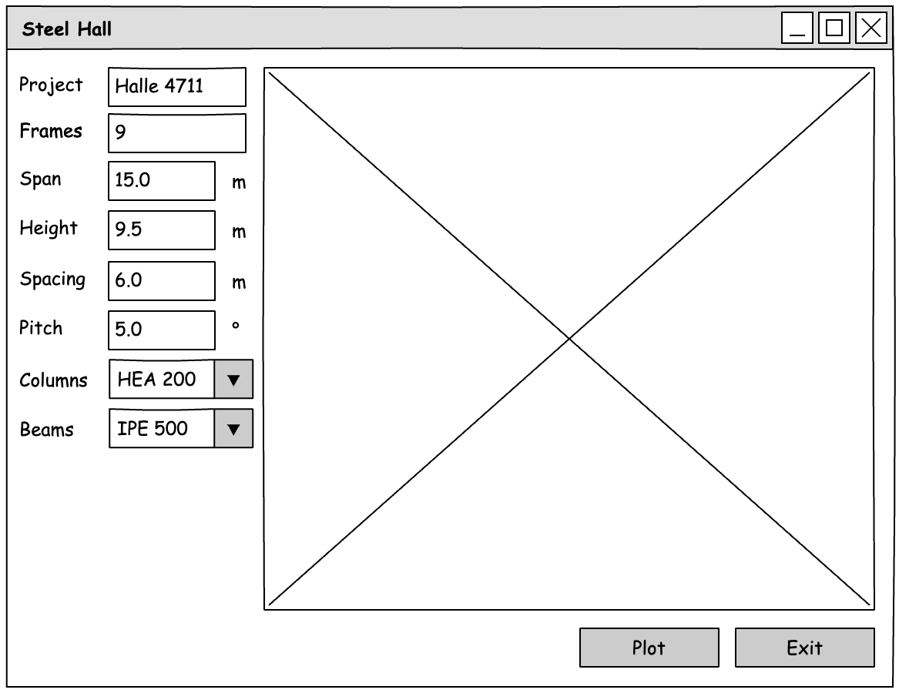

::: {#exr-stahlhalle-ui}
## Stahlhalle mit grafischer Benutzungsoberfläche

In dieser Aufgabe entwickeln Sie eine grafische Benutzungsoberfläche zu der Klasse `SteelHall` aus dem Abschnitt zu Klassen. Hier eine Anregung, wie die Oberfläche aussehen könnte. 

{width="80%" fig-align="center"}

### Die Klasse SteelHall übernehmen

1. Übernehmen Sie Ihre eigene Datei `SteelHall.cs` und das Demo-Programm aus der Aufgabe zum Thema Klassen.

Zur Not können Sie die Dateien auch herunterladen (Rechtsklick auf den Link → „Ziel speichern unter"): [SteelHall.cs](https://raw.githubusercontent.com/matthiasbaitsch/informatik-master/refs/heads/main/bausteine/10-gui/aufgaben/projekt-musterloesung/02-steel-hall/SteelHall.cs) und [SteelHallDemo.cs](https://raw.githubusercontent.com/matthiasbaitsch/informatik-master/refs/heads/main/bausteine/10-gui/aufgaben/projekt-musterloesung/02-steel-hall/SteelHallDemo.cs).

1. Ändern Sie den Typ des Parameters der `Draw`-Methode von `BoDrawApp` in `IBoDraw`. Dieses Interface wird von `BoDrawApp` und `BoDrawCanvas` implementiert – dank Polymorphismus kann die Methode damit auf beide zeichnen.

1. Starten Sie das Projekt – die Halle soll wie gewohnt im BoDraw-Fenster erscheinen.

### Grafische Oberfläche

Erstellen Sie in `MainWindow.axaml` die grafische Oberfläche. Denken Sie daran:

- Jedes Eingebeelement benötigt ein Attribut in der Klasse `MainWindow`

- Für den Zeichenbereich verwenden Sie `BoDrawCanvas`, ebenfalls mit einem Attribut

- Die Combo-Boxen können leer bleiben, das erledigen Sie im Code-Behind

### Programmlogik

1. Legen Sie in `MainWindow.axaml.cs` ein Attribut an: `public SteelHall SteelHall = new SteelHall("");`

1. Füllen Sie im Konstruktor die Auswahllisten:

    ```csharp
    this.ProfileColumnsCoBo.ItemsSource = ISection.SizesString("HE-A");
    this.ProfileColumnsCoBo.SelectedIndex = 5;
    ```

    Die Riegel bekommen entsprechend die Profile der Reihe `IPE`.

1. Melden Sie Methoden für die beiden Buttons an; der Exit-Button schließt das Fenster mit `this.Close()`.

1. Schreiben Sie eine Methode `Apply`, die die Eingaben in das `SteelHall`-Objekt überträgt. Für die Profile gibt es `ISection.Get`, das zur Bezeichnung aus der Auswahlliste das passende Profil liefert, zum Beispiel `ISection.Get("HE-A 200")`. Rufen Sie `Apply` beim Klick auf `Plot` und am Ende des Konstruktors auf.
:::
