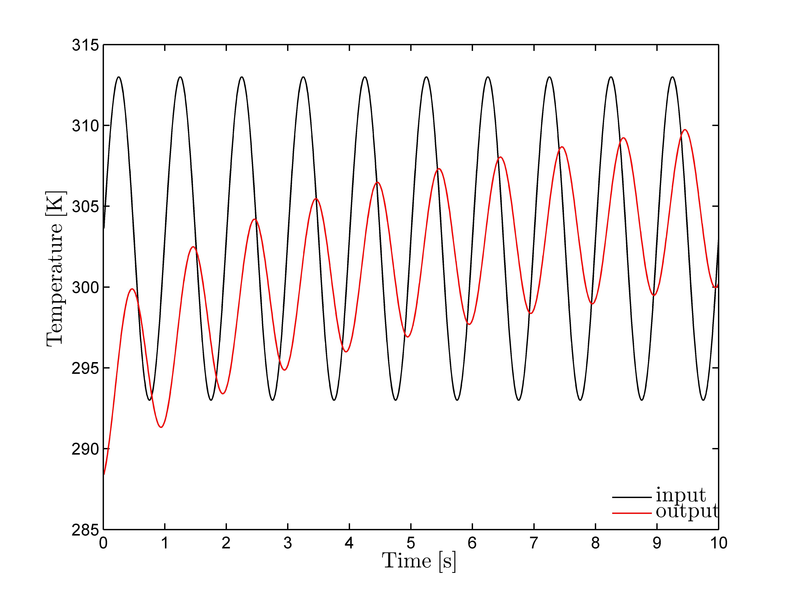

Bei der Erschließung geothermischer Reservoire sind die thermischen Eigenschaften
der Reservoirgesteine für die Nutzbarkeit und Wirtschaftlichkeit eines geothermischen
Systems von enormer Bedeutung. Am Internationalen Geothermiezentrum wird daher nach
Ansätzen geforscht, die thermischen Eigenschaften unter in-situ Bedingungen, also
unter Druck- und Temperaturbedingungen großer Tiefen bis 5 km, zu ermitteln. Wegen
der erhöhten Drücke und Temperaturen sind standardisierte Verfahren zur Bestimmung
der thermischen Eigenschaften nicht oder nur sehr begrenzt anwendbar. Aus diesem
Grund wird die Nutzung der Angström Methode favorisiert, mit der nicht nur die
thermische Leitfähigkeit unter in-situ Bedingungen ermittelt werden kann, sondern
auch Aussagen über die thermische Diffusivität ermöglicht werden.

{width=80mm}

Bei der Angström Methode wird über eine Wärmequelle ein sinusförmiges Temperatursignal
innerhalb des zu untersuchenden Gesteins angeregt (Input-Signal). Die Wärmeenergie
wird durch das Medium übertragen und im Abstand $x$ durch einen Temperaturfühler
(z.B. Thermoelement) abgegriffen (Output-Signal). Während der Übertragung der
Wärmeenergie kommt es sowohl zu einer zeitlichen Verzögerung des Sinussignals
(Phasenverschiebung) als auch zu einer Abschwächung (Dämpfung) zwischen Input-Signal
und Output-Signal. Aus Phasenverschiebung und Dämpfung lassen sich dann die thermischen
Eigenschaften des Mediums bestimmen.

Die Phasenverschiebung ergibt sich im Zeitbereich aus der zeitlichen Differenz
zwischen den Extrema des Input- und Output-Signals. Zur Bestimmung der Dämpfung
müssen das Input- und Output-Signal mittels Fourier-Transformation in den
Frequenzbereich überführt werden. Dort erhält man für die angeregte Frequenz des
Eingangssignals die Amplitudenabnahme bzw. Dämpfung (Verhältnis zwischen den
Amplituden des Output- und Input-Signals).

Während des Heizprozesses kommt es oft zu einer Nichtlinearität und damit Überlagerung
des Sinussignals, das die Auswertung hinsichtlich der Phasenverschiebung und Dämpfung
stört. Daher müssen die Signale unabhängig von den periodischen Informationen mittels
eines gleitenden Durchschnitts normiert werden, sodass die Temperaturkurve um einen
Nullwert oszilliert. Erst dann können Phasenverschiebung und Dämpfung zuverlässig
bestimmt werden.

Im Rahmen der Studienarbeit soll eine C#-Applikation mit folgendem Funktionsumfang
realisiert werden:

1. Einlesen und Darstellung der Daten aus ascii, Excel oder Matlab-Formaten
2. Normierung der Signale mit optischer Kontrolle
3. Bestimmung von Phasenverschiebung und Dämpfung zwischen Input- und Output-Signal
4. Platzhalter für physikalische Informationen zum Versuch, z.B. Dichte, Probenname,
   Datum, Druck, Temperatur, Anregungsamplitude, Anregungsfrequenz, spezifische
   Wärmekapazität (aus einer vorgegebenen Datenbank wählbar oder frei einzutragen)
5. Bestimmung der thermischen Leitfähigkeit und der thermischen Diffusivität nach
   der Angström-Methode (Literaturrecherche)
6. Export der Phasenverschiebung, Dämpfung, thermischen Eigenschaften und
   Probenparameter im ascii-Format
