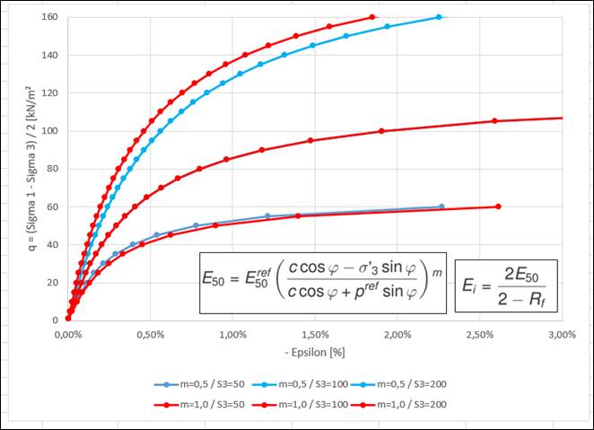

Die Bestimmung der Bodenkenngrößen „Reibungswinkel" und „Kohäsion" erfolgt im Labor
in der Regel mittels triaxialen Scherversuchen. Hierbei wird die Bodenprobe zunächst
mit einem Zelldruck hydrostatisch belastet und anschließend über einen Stempel die
Vertikallast so lange erhöht, bis ein Scherversagen in der Probe auftritt. Über die
Bestimmung des Spannungszustands in der Probe (Mohrscher Spannungskreis) und das
Grenzkriterium von Coulomb [aufnehmbare Scherspannung = Normalspannung · tan(Reibungswinkel)
+ Kohäsion] können aus den Ergebnissen von 3 Versuchen mit unterschiedlichen Zelldrücken
die o.g. Bodenkenngrößen bestimmt werden.

{width=60%}

Um das nichtlineare Last-Verformungs-Verhalten von Böden in numerischen Berechnungen
zu simulieren, wird als Stoffmodell oftmals das „Hardening Soil Model" (HS-Gesetz)
angesetzt. Eine Besonderheit dieses Stoffmodells ist der Ansatz eines
spannungsabhängigen E-Moduls.

Da bei einem triaxialen Scherversuch die Hauptspannungen und die Scherspannungen
sehr einfach aus den vorhandenen Spannungen ($\sigma_{yy}$ = Zelldruck + Vertikalkraft;
$\sigma_{xx}$ = Zelldruck) abgeleitet werden, eignet der Versuch sich besonders
gut für eine numerische Simulation.

Das zu erstellende Programm soll mit den Eingabewerten des HS-Gesetzes einen
triaxialen Scherversuch simulieren und den Spannungszustand und das
Last-Verformungs-Verhalten im Laufe des Versuchs (also bei den einzelnen Laststufen)
in Grafiken abbilden.

Bitte halten Sie vor Beginn der Bearbeitung Rücksprache mit Prof. Dörendahl um
Details der Aufgabenstellung zu klären.
