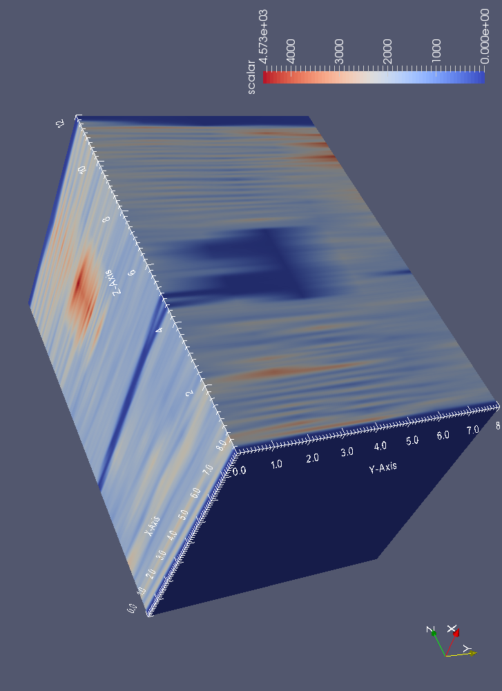

::: {layout="[3,1]"}
Durch Bohrwiderstandsmessungen an Holzprüfkörpern entsteht eine Vielzahl von
Dateien mit jeweils einer Einzelmessung. Für die Weiterverarbeitung der Daten in
einem Programm zur wissenschaftlichen Visualisierung ist es notwendig, die Daten
in zwei Dateien (Bohrwiderstand, Vorschub) zusammenzufassen. Zusätzlich muss
jedem Messwert eine 3D-Koordinate zugeordnet werden.

Im Rahmen dieser Studienarbeit soll eine Java-Applikation konzipiert und
implementiert werden, mit der solche Daten aus binären Dateien ausgelesen werden
können und automatisch in einer neu zu erstellenden Datei mit entsprechenden
Koordinaten hinterlegt wird. Darüber hinaus sollen die Daten grafisch aufbereitet
werden.

{height=60mm}
:::

Das zu entwickelnde Programm soll es Anwendern mit Hilfe einer grafischen
Benutzungsoberfläche ermöglichen

- den Ordner mit den binären Dateien auszuwählen,
- das Bohrraster (z.B. $x \times y : 3 \times 4$) und den Abstand der Bohrungen
  (z.B. $x_i = 30\,\text{mm}$, $y_i = 50\,\text{mm}$) einzugeben,
- zu wählen ob nur der Bohrwiderstand oder Bohrwiderstand und Vorschub ausgegeben
  werden sollen,
- die Messdaten in einer neuen Datei mit entsprechender Zuordnung der Daten zu
  den entsprechenden Koordinaten zu speichern,
- die Bohrtiefen auszulesen und anzeigen zu lassen,
- den Probekörper in einer grafischen Darstellung zu betrachten.
