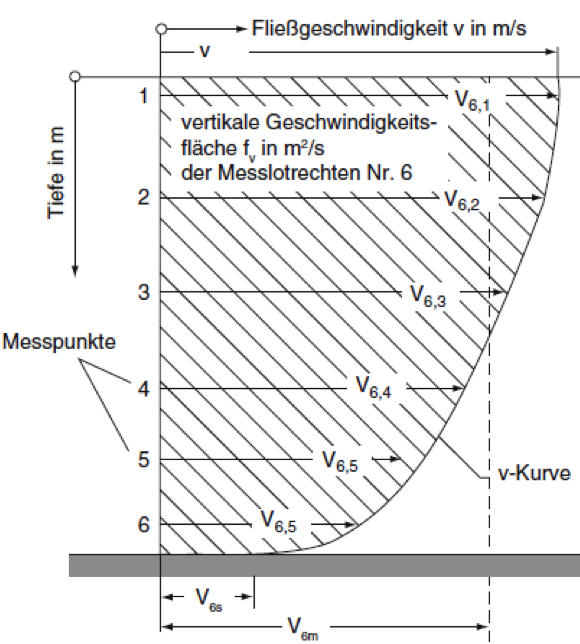

::: {layout="[3,1]"}
Durchflussmessungen in Gerinnen (Flüssen) werden vielfach mit punktuellen
Flügelmessungen durchgeführt. Aus den Punktmessungen muss eine
Geschwindigkeitsverteilung und eine mittlere Geschwindigkeit für das gesamte
Profil berechnet werden um so den gesamten Durchfluss zu bestimmen. Im Rahmen
dieser Studienarbeit soll eine Java-Applikation entwickelt werden, mit der die
entsprechenden Messdaten aus einer Datei ausgelesen und zahlenmäßig ausgewertet
sowie grafisch dargestellt werden sollen.

{height=50mm}
:::

Das zu entwickelnde Programm soll es Anwendern mit Hilfe einer grafischen
Benutzungsoberfläche ermöglichen

- das Profil des betrachteten Gerinnes einzugeben,
- die Messdaten (Ort und Geschwindigkeit) aus einer Datei einzulesen,
- den Gerinnequerschnitt sowie für jede Messlotrechte das Geschwindigkeitsprofil
  in einer dreidimensionalen Grafik darzustellen,
- die mittlere Fließgeschwindigkeit sowie den Gesamtdurchfluss zu ermitteln.
