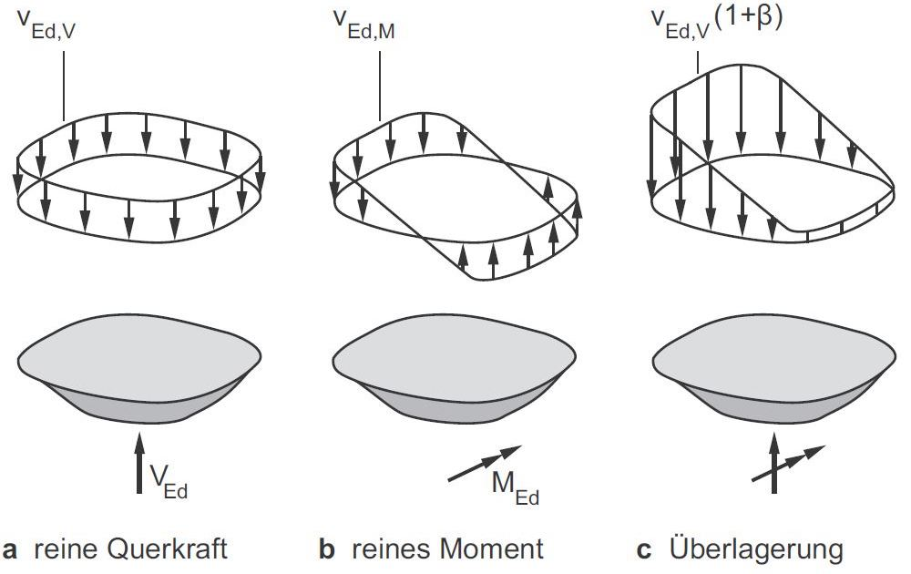

{width=100mm}

Der $\beta$-Faktor kann bei einem Durchstanznachweis durch die in der
DIN EN 1992-1-1 (mit NA) beschriebenen Ansätze bestimmt werden:

- Konstante Faktoren für ausgesteifte Systeme mit annähernd gleichen Stützweiten
- Verfahren mit der plastischen Schubspannungsverteilung
- Sektormodelle (bzw. Lasteinzugsflächen) [DAfStb Heft 600]

In einer Veröffentlichung von Hegger, J. und Beutel, R. [Hintergründe und
Anwendungshinweise zur Durchstanzbemessung nach DIN 1045-1, Teil 1 und Teil 2,
Bauingenieur, Band 77, November 2002] wurde ein weiteres Berechnungsverfahren zur
Bestimmung von $\beta$-Faktor beschrieben.

Aufgabe besteht darin, eine Applikation zu entwickeln, die überprüft, ob der
konstante $\beta$-Faktor bei einem Durchstanznachweis berücksichtigt werden darf.
Falls die Randbedingungen für die Verwendung von konstanten $\beta$-Faktoren nicht
eingehalten werden, soll das Programm nach den drei oben erwähnten Verfahren
berechnen.
