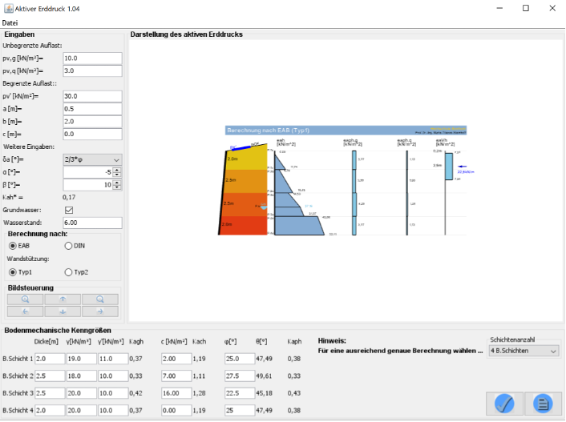
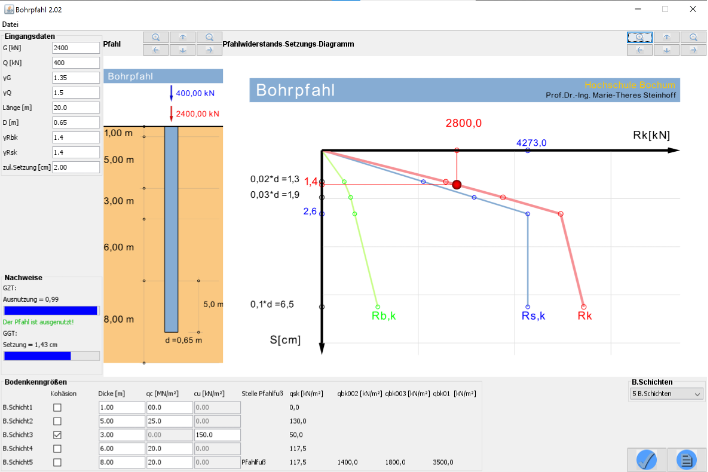

::: {layout-ncol=2}
{width=70mm}

{width=70mm}
:::

Im Rahmen dieser Studienarbeit soll ein Programm entwickelt werden, das die
Berechnung eines ausgewählten Typs von Erdbauwerken erlaubt. Eine mögliche
Anwendung besteht darin, dass Studierende im Bachelor ihre Handrechnungen mithilfe
der zu entwickelnden Programme überprüfen können. Mögliche Anwendungen sind zum
Beispiel die Berechnung

- des aktiven Erddrucks auf Stützbauwerke,
- einfach gestützter Baugrubenwände bis zur Baugrubensohle,
- axial belasteter Bohrpfähle.

Einzugeben sind hierbei die Abmessungen des Bauwerks, Einwirkungen sowie die
notwendigen Kennwerte der einzelnen Bodenschichten. Das Programm soll das
eingegebene System sowie die berechneten Ergebnisse grafisch darstellen. Die
Abbildungen oben zeigen beispielhaft eine mögliche Umsetzung.
