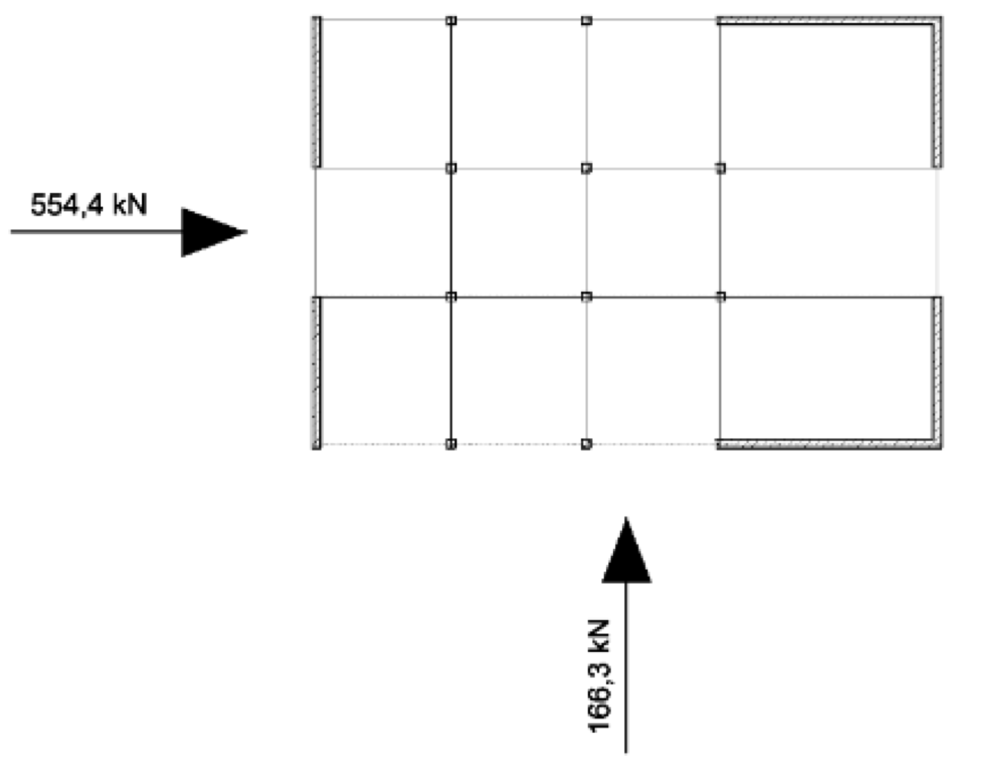

Die Grundaufgabe der Erdbebensicherung besteht darin, durch Entwurf, Bemessung
und Konstruktion die dem Bauwerk zugeführte Schwingungsenergie so zu verteilen
und in andere Energieformen umzuwandeln, dass keine großen Schäden entstehen.

{width=50%}

Die Bemessung nach dem vereinfachten Antwortspektrumverfahren darf für Tragwerke
verwendet werden, die im Aufriss regelmäßig sind und deren Grundschwingzeit in
beide Richtungen einen Grenzwert nicht überschreitet. Dieser Grenzwert ist abhängig
von Boden sowie dem vorliegenden Untergrundbeschaffenheiten.

Die linear-elastischen Berechnungen dürfen bei einem regelmäßigen Grundriss des
Tragwerks unter Verwendung von zwei ebenen Modellen durchgeführt werden.

Das zu entwickelnde Programm soll es Anwendern mit Hilfe einer grafischen
Benutzungsoberfläche ermöglichen

- das elastische Antwortspektrum grafisch darzustellen,
- die resultierenden Erdbebenersatzkräfte für die beiden Hauptrichtungen zu
  berechnen und ggf. in einer zweidimensionalen Darstellung zu visualisieren.
