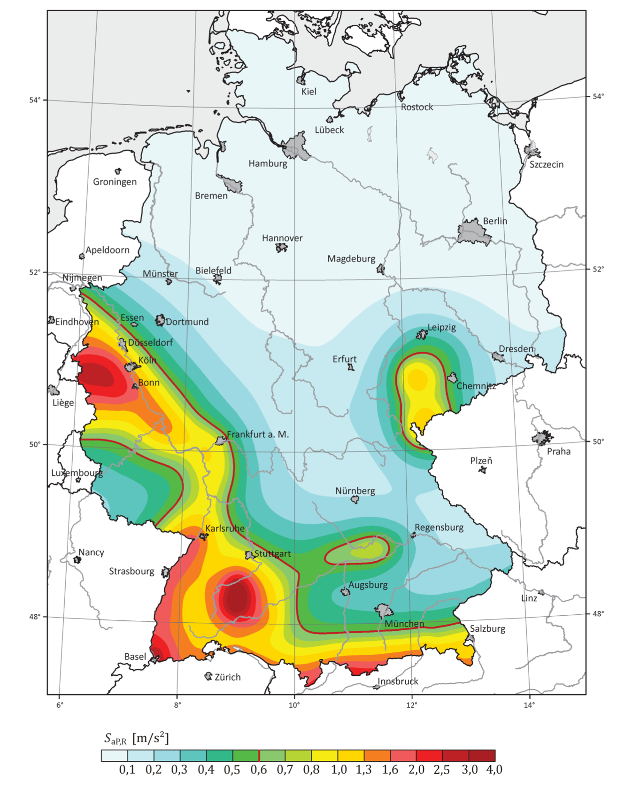
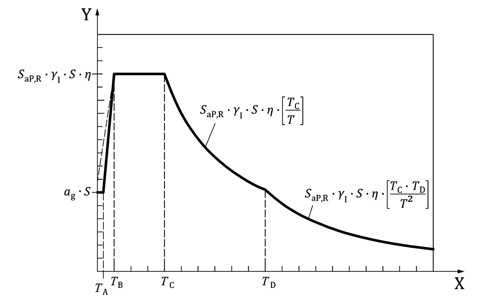

Der Eurocode 8 (Auslegung von Bauwerken gegen Erdbeben) enthält ein vereinfachtes
Verfahren zur Ermittlung von Ersatzlasten für Hochbauten unter Erdbebeneinwirkungen.
Das Verfahren benötigt den Beiwert $S_{\mathrm{aP,R}}$ für die spektrale
Antwortbeschleunigung, der abhängig von der geografischen Lage des Bauprojekts
(Abbildung links) ist. Die entsprechenden Werte liegen als georeferenzierte Werte
in Form einer CSV-Datei vor.

::: {layout-ncol=2}
{height=70mm}

{height=75mm}
:::

Im Rahmen der Studienarbeit soll eine Java-Applikation entwickelt werden, die auf
Grundlage der Eingabe

1. der geografischen Lage in der Form „51,44760° N, 7,26874° E" (zum Beispiel aus
   Google Maps),
2. der Untergrundverhältnisse sowie der
3. Bedeutungskategorie des Bauwerks

das rechts gezeigte elastische Beschleunigungs-Antwortspektrum (im Eurocode
erläutert) berechnet und darstellt. Darüber hinaus soll für die vorgegebene Periode
$T$ des Gebäudes die maßgebende elastische horizontale Spektralbeschleunigung
$S_\mathrm{e}$ ermittelt werden.
