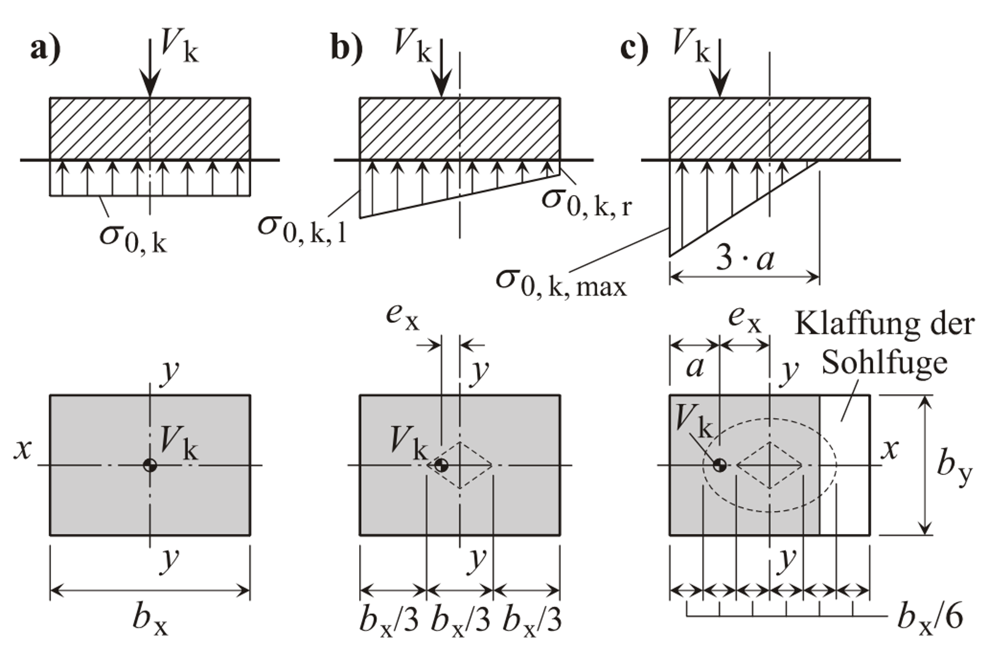

Als Sohlnormalspannung wird die in der Gründungssohle zwischen dem Gründungskörper
und dem Boden wirkende Druckspannung verstanden. Abhängig von den Belastungen $N_x$
und $M_y$ (bzw. $N_y$ und $M_x$) des Gründungskörpers entsteht eine
Sohlnormalspannungsfigur, deren Verlauf auch über die Bestimmung der Ausmitte der
Sohldruckresultierenden bestimmt werden kann. Überschreitet diese Ausmitte einen
bestimmten Wert, so kommt es zu einer „klaffenden Fuge" zwischen dem Gründungskörper
und dem Boden, die Sohlnormalspannungsfigur passt sich entsprechend an.

{width=70%}

Im Rahmen der Studienarbeit soll ein Programm für die Vorlesung „Bodenmechanik"
entwickelt werden, welches die Sohlnormalspannungen in Abhängigkeit einer 1-axialen
und 2-axialen Belastung berechnet und die Einhaltung der Grenzzustandsbedingungen
kontrolliert. Zudem sind die Lage der Sohldruckresultierenden und — zumindest für
den Fall der 1-axialen Belastung — auch der Verlauf der Sohlnormalspannungen grafisch
darzustellen.

Bitte halten Sie vor Beginn der Bearbeitung Rücksprache mit Prof. Dörendahl um
Details der Aufgabenstellung zu klären.
