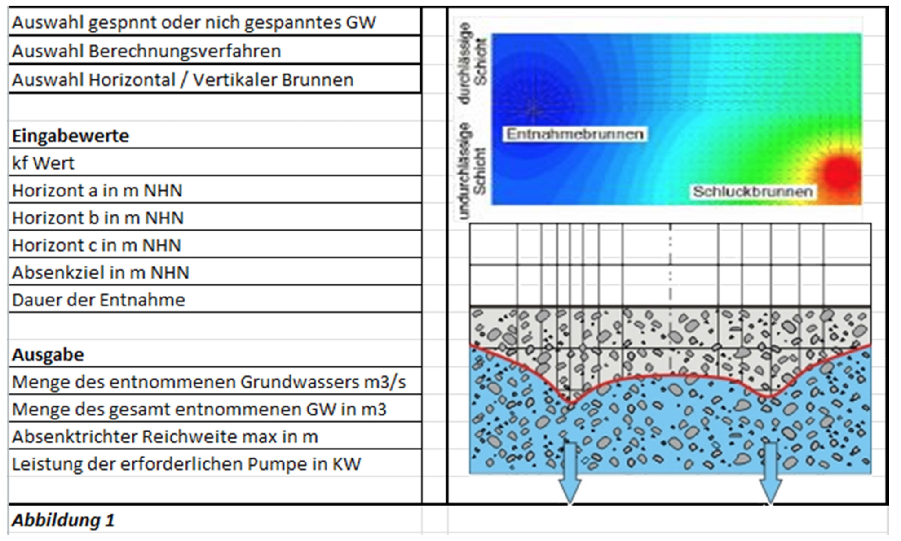

{width=120mm}

Für Tiefbaumaßnahmen ist es mitunter notwendig, evtl. vorhandenes Grundwasser auf
einen bestimmten Horizont abzusenken, damit es nicht in die spätere Baugrube gelangt.
Das Abpumpen des Grundwassers ist hierbei eine gängige Methode. Für die Studienarbeit
soll ein Programm erstellt werden, welches die erforderlichen Parameter berechnet
und den Absenktrichter grafisch darstellt.

Vorteile durch ein solches Programm:

- Arbeitserleichterung bei der Entwurfsplanung und Genehmigungsplanung
- Abschätzung, ob im umliegenden Umkreis Gebäude durch die Absenkung betroffen werden
- Abschätzung wie viele Pumpen nötig sind, um eine Baugrube „trocken zu legen"
- Menge des zu entsorgenden Grundwassers zum Zeitpunkt t kann exakt berechnet werden
- Die grafische Darstellung könnte der „Unteren Wasserbehörde" bei einem Antrag auf
  Grundwasserabsenkung zur Verfügung gestellt werden

Das Programm soll folgende Werte berechnen:

- Menge des entnommenen Grundwassers zum Zeitpunkt (t)
- Menge des entnommenen Grundwassers gesamt in (m³)
- Reichweite des Absenktrichters in (m)
- Darstellung des Absenktrichters anhand von Schrittweiten 0,10 m

Folgende Eingangswerte werden benötigt:

- Höhe des Grundwasserspiegels im natürlichen Zustand
- Erforderliche Absenktiefe (i.d.R. 0,5 m unter Baugrubensohle)
- Brunnendurchmesser
- kf-Wert des Bodens (Durchlässigkeitswert in m/s)

Zusätzlich soll das Programm in Abhängigkeit von der zu entnehmenden
Grundwassermenge die Leistung der Pumpe berechnen, die für die Absenkung notwendig
ist. Da es unterschiedliche Ausführungen für die Absenkung gibt, soll eine
Oberfläche konstruiert werden, bei welcher der Nutzer über Schaltflächen zunächst
auswählen kann, ob es sich um einen horizontal oder einen vertikalen Brunnen handelt.
Weiterhin soll die Möglichkeit bestehen, zwischen einem gespannten und ungespannten
Grundwasserleiter auszuwählen.
