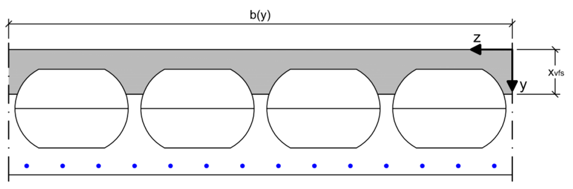
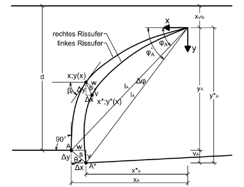
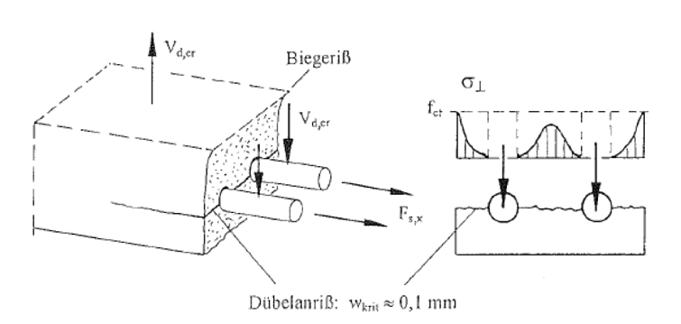

**Grundlagen**

Die Querkrafttragfähigkeit einer Stahlbetondecke setzt sich aus den drei wesentlichen
Querkrafttraganteilen

- Traganteil der ungerissenen Druckzone
- Traganteil der Rissreibung
- Traganteil der Dübelwirkung der Längsbewehrung

zusammen.

Das in dieser Studienarbeit in einem C#-Programm umzusetzende Bemessungsmodell
beruht auf der Dissertation von Stephan Görtz. Hierbei werden die drei
Querkrafttraganteile zunächst getrennt voneinander berechnet. Die Gesamttragfähigkeit
lässt sich durch Addition der drei Haupttraganteile ermitteln. Christian Albrecht
hat in seiner Dissertation das Bemessungskonzept von Görtz auf die Anwendung für
Hohlkörperdecken erweitert.

Im Einzelnen sind folgende Punkte zu bearbeiten:

**Bearbeitungsumfang**

1. Grafische Darstellung der Hohlkörperdecke

   {width=120mm}

   Die Berechnung der Tragfähigkeit erfolgt über 100 Stützstellen. Für jede
   Stützstelle wird die Breite $b(y)$ in Abhängigkeit der Lage und unter
   Berücksichtigung der Hohlkörper mit dem Abstand der Stützstellen und der
   Schubspannung $\tau(y)$ multipliziert. Die Summe der einzelnen Traganteile
   ergibt die Tragfähigkeit der ungerissenen Druckzone.

2. Ermittlung des Traganteils der Rissreibung

   {width=80mm}

   Der Traganteil der Rissreibung entspricht den über die Rissufer übertragbaren
   Normal- und Schubspannungen nach Walraven.

   Für die Berechnung wird der Rissverlauf nach Görtz angesetzt. Zur vereinfachten
   Berechnung des Rissverlaufs wird dieser nicht beginnend von der Längsbewehrung,
   sondern von der Rissspitze in der Dehnungsnulllinie ausgehend berechnet.

   Die nach Walraven von der Rissbreite $w$ und der Rissuferverschiebung $v$
   abhängigen Normal- und Schubspannungen im Riss werden unter Berücksichtigung
   von Spannungsbeziehungen berechnet. Hierzu wird der Abstand zwischen
   Lasteinleitung und Auflager in 1.000 Stützstellen unterteilt.

3. Ermittlung des Traganteils der Dübelwirkung der Längsbewehrung

   {width=120mm}

   Der Traganteil der Dübelwirkung wird nach Görtz berechnet. Durch die Hohlkörper
   wird die Tragfähigkeit der Dübelwirkung nach Markus Aldejohann reduziert.
