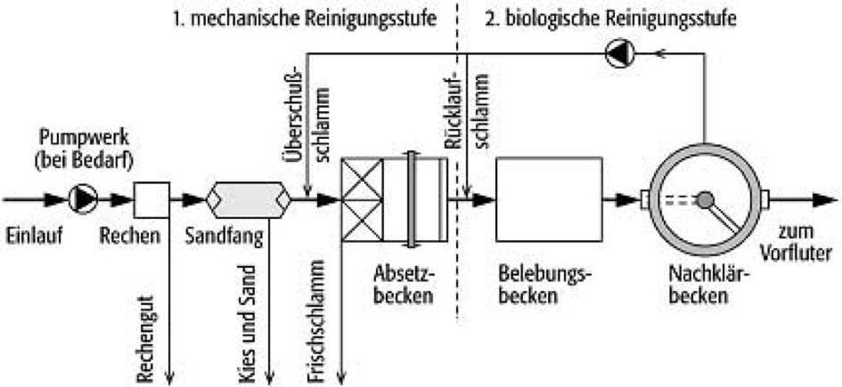

Im Zuge der Studienarbeit soll ein Programm entwickelt werden, welches eine
Vordimensionierung für Kläranlagen, bezogen auf die jeweilige Ausbaugröße und den
auftretenden Abwasseranfall, ermöglicht.

{width=70% fig-align="center"}

Anhand von Bemessungsformeln des Arbeitsblattes DWA-A 131, die den Anforderungen
der Abwasserordnung entsprechen, können Berechnungen in das Programm implementiert
werden. Mit den Eingangsparametern des Zulaufes der Kläranlage können die
Beckenabmessungen berechnet werden. Die Ausgabewerte beziehen sich auf die Bemessung
der Vorklärbecken (optional vorhanden), der Belebungsbecken und der
Nachklärbecken. Weitergehend ist zu überlegen, weitere Kapazitäten der Kläranlage
berechnen zu lassen.

Bei einer unzureichenden Dateneingabe (Datenverfügbarkeit) können gemäß der
Eliminationsleistung nach A131 Mittelwerte ergänzt werden.

Die Ergebnisse sollen mit Abbildungen der Stoffströme und den berechneten
Beckengrößen visualisiert werden.
