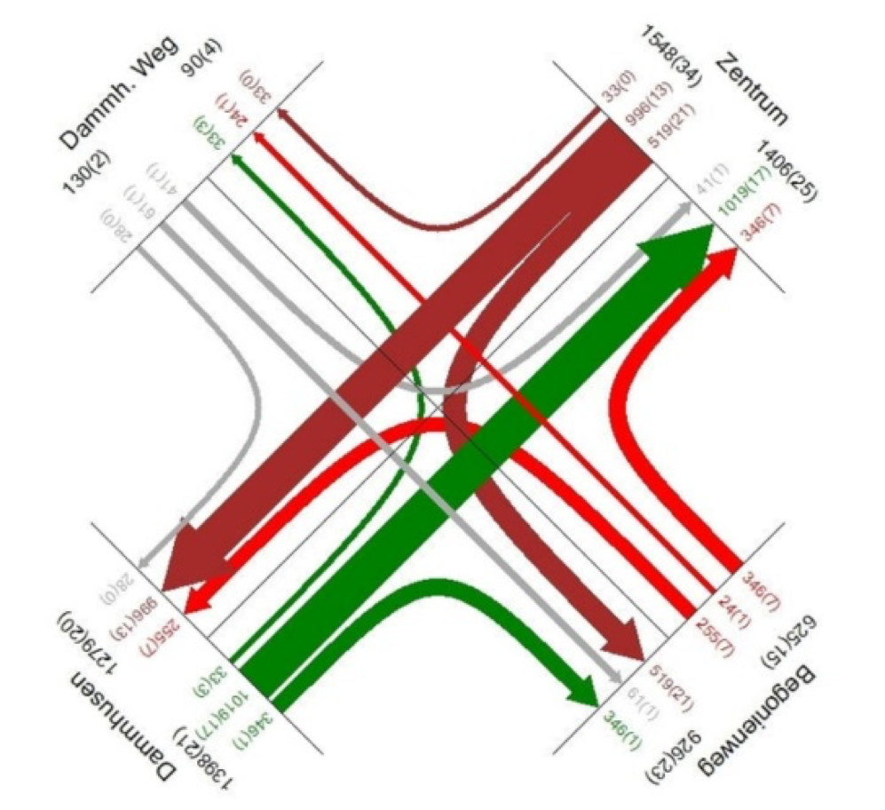

Knotenstrompläne sind eine elementare Grundlage für die Bestimmung der
Verkehrsqualität an Knotenpunkten. Sie bilden die Datenbasis für die Berechnung
und zeigen übersichtlich verkehrliche Belastungen des Radverkehrs, Kfz-Verkehrs
und des Schwerverkehrs. Neben der faktischen Darstellung der Belastungswerte zeigt
die Breite eines Knotenstroms im Knotenstromplan die Belastung in Relation zu den
anderen Strömen an. Im Zuge dieser Aufgabenstellung soll eine Applikation entwickelt
werden, die den Prozess der Darstellung eines Knotenstromplans für eine (1) Kreuzung
oder einen (2) Kreisverkehr automatisiert.

{width=110mm}

Im Einzelnen soll das Programm folgenden Funktionsumfang zur Verfügung stellen:

- Eingabe der erforderlichen Parameter zur Darstellung des Knotenstromplans
  (verkehrliche Belastungen, Straßennamen, Knotenpunktform)
- Darstellung der verkehrlichen Belastungen für die definierte Knotenpunktsituation
  unter Einfluss der Eingangsparameter (die Knotenpunktströme sollen dabei durch die
  Strichdicke die Relation zur Verkehrsstärke des Knotenpunktes verdeutlichen und je
  Zufahrt soll eine Farbe für die Darstellung frei wählbar sein)
- Export-Funktion für den Knotenstromplan als JPG- oder PNG-Datei (Pixelverhältnis
  1920×1080)
