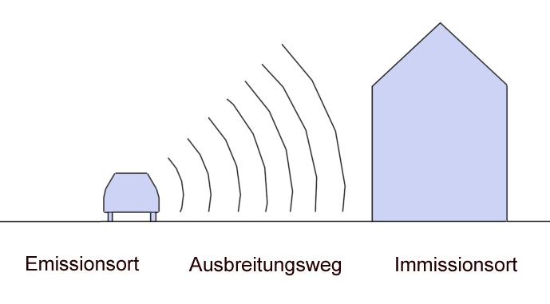

Die Richtlinien für den Lärmschutz an Straßen der Forschungsgesellschaft für
Straßen- und Verkehrswesen aus dem Jahr 2019 erläutern Möglichkeiten zur Minderung
von Lärmeinwirkungen und führen ein Verfahren zur Bestimmung des Beurteilungspegels.
Der Beurteilungspegel dient dem Vergleich mit Grenz- und Orientierungswerten, z.B.
der akustischen Gebiets- und Straßenplanung, und berechnet sich aus der Stärke der
Schallquellen des Straßenverkehrs im Einzugsbereich des Immissionsortes und der
Minderung des Schalls auf dem Ausbreitungsweg zwischen Emissions- und Immissionsort.

{width=90mm fig-align="center"}

Mit dem zu erstellenden Programm soll es möglich sein, für eine sinnvoll zu
treffende Auswahl an Straßenraumsituationen und Immissionsorten den
Beurteilungspegel zu bestimmen. Dabei können Sie zunächst von folgenden
Vereinfachungen ausgehen:

- Einzubeziehen ist nur der fließende Straßenverkehr; ruhender Verkehr
  (Parkplatzflächen, Längsparkstände usw.) muss nicht berücksichtigt werden.
- Zu berechnen ist die freie Schallausbreitung zwischen Emissions- und
  Immissionsort; Abschirmungen und Reflexionen müssen im Verfahren nicht
  berücksichtigt werden.

Falls es zeitlich machbar ist, stellt die Berücksichtigung von Schallschutzwänden
eine wünschenswerte Erweiterung des Programms dar.

Mit dem zu erstellenden Programm soll es möglich sein, für eine sinnvoll zu
treffende Auswahl an Straßensituationen den Bemessungspegel zu bestimmen:

- Eingabe der zur Bestimmung des Bemessungspegels erforderlichen Parameter
- Grafische Darstellung der eingegebenen Situation zur Kontrolle
- Berechnung des Bemessungspegels
