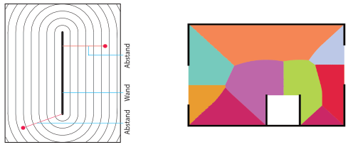

Im Mauerwerksbau werden Lasten aus den Decken über gemauerte Wände in den Baugrund abgeleitet. Um die Standsicherheit der Wände nachzuweisen ist es zunächst notwendig, die Auflast aus der Decke für jede Wand zu ermitteln. Hierzu werden die Deckenplatten üblicherweise in Lasteinzugsbereiche aufgeteilt. Dies kann in einem ersten Schritt so erfolgen, dass für jeden Punkt der Deckenplatte ermittelt wird, welche Wand am nächsten liegt. Alle Punkte, die zu einer bestimmten Wand den geringsten Abstand besitzen, bilden die geometrische Lasteinzugsfläche dieser Wand.

{width=80% fig-align="center"}

Für die mathematische Formulierung dieser Idee benötigen wir zunächst für jede Wand $i$ eine Abstandsfunktion $d_i : \Omega \to \mathbb{R}$, die jedem Punkt $(x, y)$ der Grundrissfläche $\Omega \subset \mathbb{R}^2$ einen Abstand $d_i(x, y)$ zur Wand $i$ zuordnet. Die Abbildung links zeigt exemplarisch die Isolinien der Abstandsfunktion zu einer Wand sowie den Abstand für zwei Punkte. Auf dieser Grundlage definieren wir die Funktion $w : \Omega \to \mathbb{N}$ mit

$$
  w(x, y) = \arg\min_{i} d_i(x, y),
$$

die für jeden Punkt die am nächsten gelegene Wand ermittelt (Beispiel in der Abbildung rechts). Dabei liefert der Operator $\arg\min$ dasjenige $i$, für das $d_i(x, y)$ den kleinsten Wert hat. Die Umsetzung von $w$ in C# erfolgt mithilfe einer Schleife über alle Wände.

Im Rahmen der Studienarbeit soll eine C#-Applikation mit folgendem Funktionsumfang realisiert werden:

1. Eingabe des Grundrisses mit einer beliebigen Anzahl von Wänden
1. Darstellung des Grundrisses mit den Lasteinzugsflächen
1. Tabellarische Auflistung der Belastung für jede Wand

Wünschenswert, aber nicht zwingend notwendig ist die Möglichkeit, Öffnungen in der
Deckenplatte vorzusehen.
