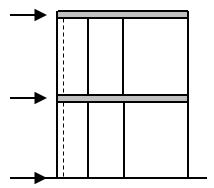
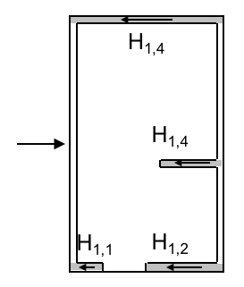

Im mehrgeschossigen Massivbau werden Bauwerke häufig durch Wandscheiben ausgesteift.
Für den Nachweis der Tragfähigkeit muss dabei die Verteilung horizontal wirkender
Windlasten auf die einzelnen Wandscheiben auf der sicheren Seite liegend abgeschätzt
werden. Ziel dieser Studienarbeit ist die Konzeption und Implementierung einer
Applikation mit der die entsprechenden Schnittgrößen (Querkraft und Biegemoment)
mithilfe von Näherungsformeln berechnet und grafisch dargestellt werden können.

::: {layout-ncol=3}
{height=35mm}

{height=25mm}

{height=35mm}
:::

Im Einzelnen soll das Programm folgenden Funktionsumfang zur Verfügung stellen:

- Eingabe der Grunddaten des Gebäudes wie Abmessungen, Geschosshöhe und Windlastzone.
- Eingabe der Wandscheiben mit Position, Dicke und Ausrichtung; hier bietet sich
  eine tabellarische Eingabe an.
- Grafische Darstellung des Gebäudes entsprechend den Benutzereingaben. Dabei sollen
  die eingegebenen Werte unmittelbar visualisiert werden, um eine einfache
  Fehlerkontrolle zu erreichen.
- Berechnung der Schnittgrößen der Wandscheiben entsprechend den jeweiligen
  Steifigkeiten. Besonders Wert wird hier auf eine übersichtliche und aussagekräftige
  Darstellungsform gelegt. Eine Aufbereitung der Ergebnisse in einer Textdatei ist
  wünschenswert aber nicht zwingend erforderlich.
