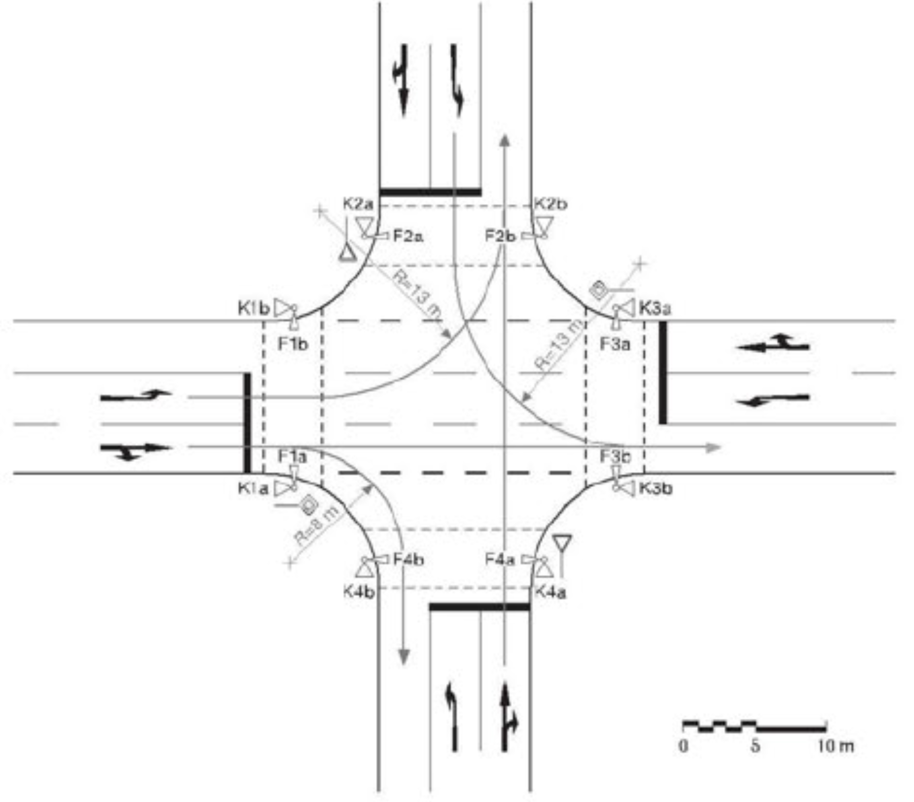
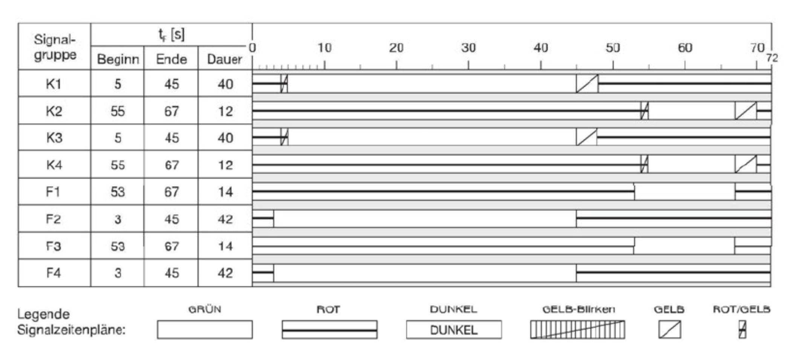

Das technische Regelwerk Richtlinien für Lichtsignalanlagen (kurz RiLSA) enthält
Vorgaben und Empfehlungen für die Planung und Betrieb von Lichtsignalanlagen in
Deutschland. Ausgehend von einem Signallageplan (Abbildung links) sowie vorliegenden
Verkehrsstärken lässt sich damit eine einfache Signalisierung in Zweiphasen- und
Festzeitsteuerung für eine innerstädtische Kreuzung auslegen.

::: {layout-ncol=2}
{height=50mm}

{height=47mm}
:::

Mit dem zu erstellenden Programm soll für eine gegebene Kreuzung ein
Festzeitprogramm bestimmt werden. Im Einzelnen sollen folgende Punkte realisiert
werden:

- Möglichkeit zur Eingabe der Verkehrsstärken
- Grafische Darstellung der eingegebenen Werte zur Kontrolle
- Berechnung der Sättigungsverkehrsstärken und einer zweckmäßigen Umlaufzeit
- Bestimmung und grafische Darstellung des Signalzeitenplans (Abbildung rechts)
