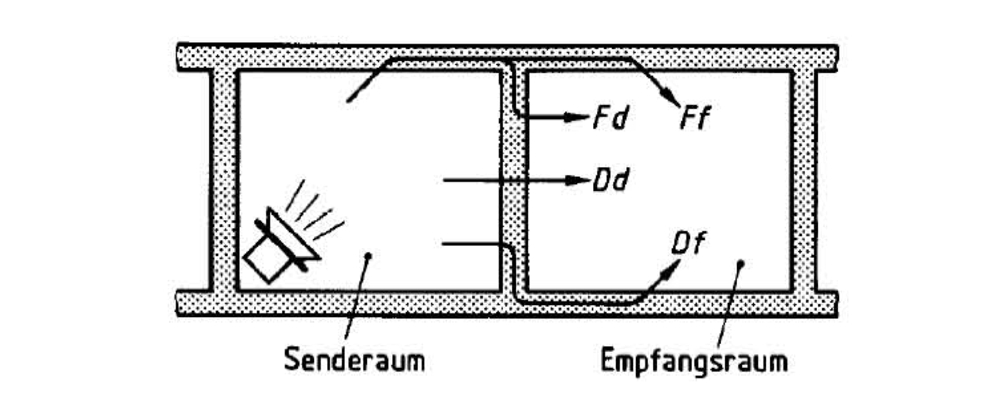

Im Rahmen der Studienarbeit soll ein Programm zur Berechnung der Luftschalldämmung
nach DIN 4109-2 erstellt werden. Der Fokus liegt dabei auf dem Holz-, Leicht- und
Trockenbau sowie auf Mischbauweisen.

{width=80%}

Im Einzelnen sollen folgende Funktionen umgesetzt werden:

- Auswahl von Trennbauteil und Flankenbauteilen aus einem Bauteilkatalog oder
  Eingabe eigener Bauteile
- Grafische Darstellung des gewählten Bauteilaufbaus im Schnitt und im Grundriss
- Integration einer erweiterbaren Datenbank auf der Grundlage des Bauteilkatalogs
  (DIN 4109-33) sowie von Messwerten von Prüfinstituten (Herstellerangaben)
- Prüfung, ob die Mindestanforderungen an den Luftschallschutz nach DIN 4109 bzw.
  weitergehende Anforderungen eingehalten werden
- Nachweisführung auf Basis der DIN 4109 und der Information [Schallschutz im
  Hochbau](https://informationsdienst-holz.de/publikationen/2-informationsdienst-holz-holzbau-handbuch/reihe-3-bauphysik/schallschutz-im-holzbau)
  des Informationsdienstes Holz

Eine vergleichbare Applikation vom Bundesverband der Kalksandsteinindustrie ist
unter <https://www.ks-schallschutzrechner.de> zu finden.
