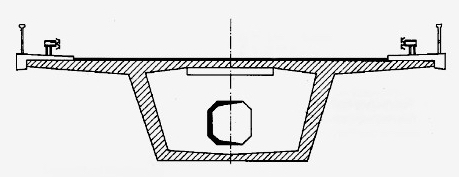
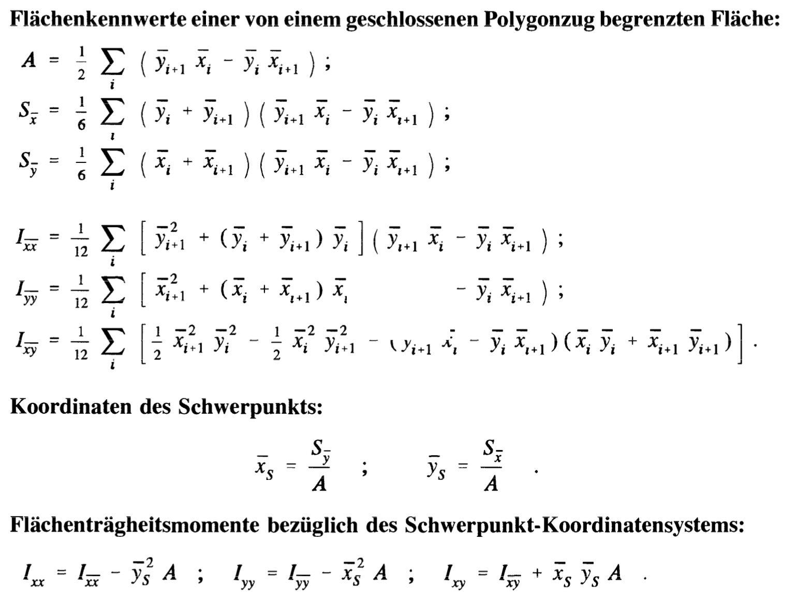

Für komplexe und/oder nicht-symmetrische Querschnitte (Abbildung links) ist die
Ermittlung von Flächenträgheitsmomenten aufwändig und fehleranfällig. Sind die
Querschnitte jedoch polygonal berandet, dann können die gesuchten Werte mithilfe
einfacher Formeln (Abbildung rechts, Quelle: Dankert und Dankert, Technische
Mechanik) berechnet werden. Hierzu müssen nur die Koordinaten der Eckpunkte des
Polygons bekannt sein.

::: {layout="[2,3]"}
::: {}
```{=latex}
\includegraphics[width=0.7\linewidth]{polygon-querschnitte-2}
```


:::


:::

Im Rahmen der Studienarbeit soll eine Java-Applikation mit folgendem Funktionsumfang
realisiert werden:

1. Eingabe der Eckpunkte des begrenzenden Polygons und der Schnittgrößen
2. Visualisierung des eingegebenen Querschnitts
3. Ermittlung der Flächenträgheitsmomente bezogen auf die Hauptachsen
4. Berechnung und Ausgabe der Spannungen unter einer beliebigen Kombination aus
   Normalkraft und Biegemomenten in allen Eckpunkten des Polygons

Wünschenswert, aber nicht zwingend notwendig ist die Möglichkeit, Ausschnitte im
Querschnitt vorzusehen (Abbildung links unten).
