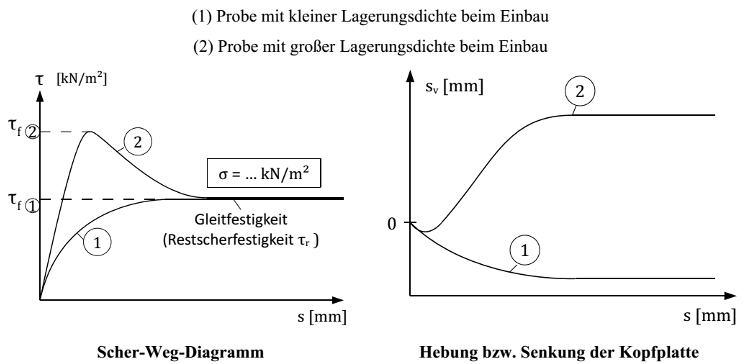

{width=120mm}

Für die Bestimmung der Scherparameter eines Bodens im Laborversuch kann der
Direkte Scherversuch nach DIN EN ISO 17982-10 (siehe auch alte Norm: DIN 18137-3)
herangezogen werden, der im Folgenden stark verkürzt beschrieben wird:

> Eine Bodenprobe wird in einen Scherkasten eingebaut und mit einer Normalkraft
> belastet. Nach der Konsolidierung des Bodens wird die obere Hälfte des Scherkastens
> seitlich verschoben, so dass im Boden eine Scherfuge entsteht. Hierbei werden der
> Verformungsweg und die hierfür erforderliche Kraft gemessen. Der Versuch wird mit
> unterschiedlichen Normalkräften wiederholt. Aus den Peakwerten der Scherkraft und
> den aufgebrachten Normalkräften können die Scherparameter „Reibungswinkel" und
> „Kohäsion" des beprobten Bodens berechnet werden.

Im Rahmen dieser Studienarbeit soll ein Lernprogramm für die Vorlesung
„Bodenmechanik" entwickelt werden, welches den direkten Scherversuch visualisiert
und sowohl den Versuchsablauf als auch die Auswertung anschaulich darstellt und
damit für die Studierenden des 3. Semesters gut nachvollziehbar macht.

Das Programm sollte insbesondere beinhalten:

- Die Wahl der Eingabeparameter einer Versuchsserie durch den User, also insbesondere
  - je Versuchsserie die Bodenart (Sand dicht oder locker gelagert, Schluff, Ton)
  - je Versuchsserie die Versuchsart (normalkonsolidiert, überkonsolidiert)
  - je Versuch die Auflastspannungen in der Konsolidationsphase
  - je Versuch die Auflastspannungen beim Abscheren
- Grafische Darstellungen
  - der Entwicklung der Scherspannung über den Scherweg während des Versuchs
  - der Entwicklung der Hebung/Senkung der Kopfplatte während des Versuchs
  - der max. Scherspannung über die aufgebrachte Normalspannung (je Versuchsserie)
    und daraus abgeleitet die Scherparameter Reibungswinkel $\varphi$, Kohäsion $c$,
    Winkel der Gesamtscherfestigkeit $\varphi_{\mathrm{ges}}$ sowie die
    bodenabhängige Proportionalitätskonstante $\varphi_c$
- Kleinere Plausibilitätskontrollen der Eingaben

Vor Beginn der Bearbeitung ist die Aufgabenstellung noch einmal mit Prof. Dörendahl
zu besprechen.
