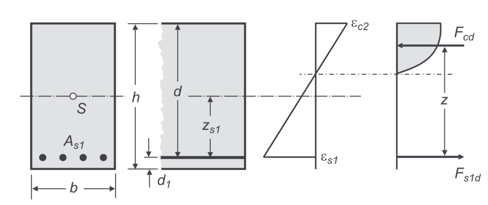

Für die Bemessung von Stahlbetonquerschnitten im Grenzzustand der Tragfähigkeit
wird davon ausgegangen, dass der Beton keine Zugspannungen aufnimmt und in der
Druckzone das Parabel-Rechteck-Diagramm den Zusammenhang zwischen Verzerrungen und
Spannungen herstellt. Für den Bewehrungsstahl wird ein ideal elastisch-plastisches
Stoffgesetz zugrunde gelegt. Demzufolge hängen bei einachsiger Biegung die
Schnittgrößen $N$ und $M$ nichtlinear von der Stahldehnung $\varepsilon_{s1}$ und
der Betondehnung $\varepsilon_{c2}$ (siehe Abbildung) ab. Zur Bemessung eines
Querschnitts für gegebene Schnittgrößen muss daher ein nichtlineares
Gleichungssystem mit zwei Unbekannten gelöst werden.

{width=130mm}

Im Rahmen dieser Studienarbeit soll ein Lehrprogramm für die Grundlagenvorlesung
in Massivbau entwickelt werden, das die Tragwirkung von Stahlbetonquerschnitten
im Zustand II visualisiert und anschaulich nachvollziehbar macht.

Auf Grundlage der eingegebenen Querschnittswerte (Abmessungen, Betongüte,
Bewehrung, Betondeckung) sollen Studierende die Möglichkeit haben

1. die Bemessungsschnittgrößen vorzugeben und die entsprechenden Verzerrungen zu
   bestimmen,
2. eine Bemessung des Querschnitts durchzuführen.

Besonderer Wert wird dabei auf die anschauliche Darstellung des Spannungszustands
im Querschnitt und den resultierenden Kräften gelegt. Darüber hinaus sollen
relevante Kenngrößen numerisch ausgegeben werden.

Das Programm soll die Berechnungen zunächst für Rechteckquerschnitte und einachsige
Biegung durchführen. Wünschenswert, aber nicht zwingend notwendig, wäre darüber
hinaus die Möglichkeit Plattenbalken und/oder schiefe Biegung zu berücksichtigen.
