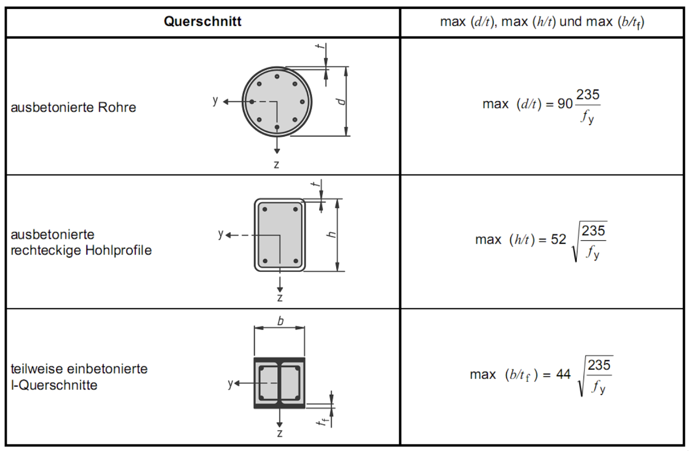

Im Rahmen der Studienarbeit soll ein Software-Tool zur Unterstützung der Bemessung
von Verbundstützen entwickelt werden. Der Fokus soll dabei zunächst auf I-Profilen
liegen.

{width=60%}

Ziel ist es, eine grafische Benutzeroberfläche zu erstellen, in der die einwirkenden
Kräfte (Normalkraft und Moment) eingegeben werden können. Basierend auf diesen
Eingaben soll ein Interaktionsdiagramm für Normalkraft und Biegemoment erstellt
werden. Die eingegebenen Kräfte sollen in diesem Diagramm visualisiert werden.
