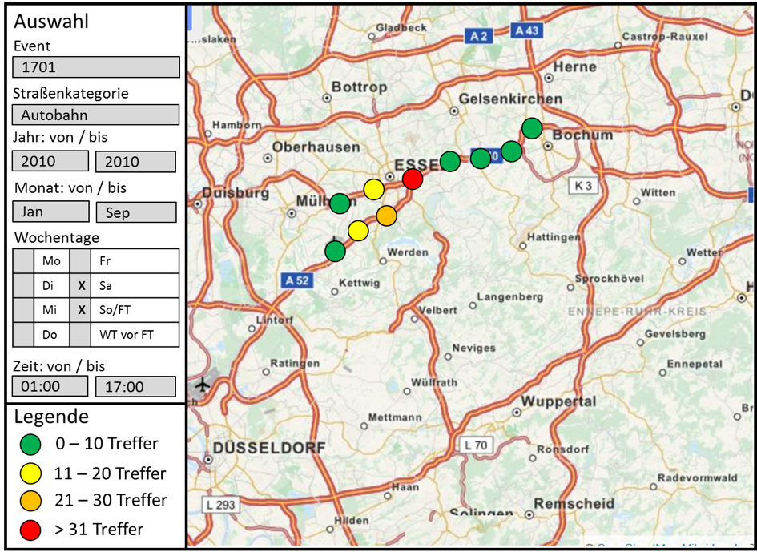

Das Ziel dieser Studienarbeit ist die Entwicklung einer Programmoberfläche zur
Darstellung und grafischen Auswertung von Verkehrsdaten. Dabei stehen Ereignisse
im Bundesfernstraßennetz (Autobahnen, Bundesstraßen) im Vordergrund.

Die Grundlage bilden Verkehrsinformationsdaten, die auch im Radio oder in
Navigationsgeräten an die Verkehrsteilnehmer weitergegeben werden; sogenannte
RDS-TMC-Daten. Diese sind in einer MS Access Datenbank gespeichert.

Jede Verkehrsinformation enthält neben der Straßenkategorie (Autobahn, Bundesstraße)
und einem Datums- und Zeitstempel einen Event Code und einen oder mehrere Location
Codes. Mehrere Codes stehen dabei semikolon-getrennt in einem Datenbankfeld. Der
Event Code beschreibt das Ereignis, z.B. Stau, Personen auf der Fahrbahn, Achtung
Falschfahrer. Alle theoretisch möglichen Event Codes sind in der Event Code List
(ECL) hinterlegt. Die Bestimmung der Lage erfolgt über die Location Codes, die Orte
im Bundesfernstraßennetz georeferenzieren, z.B. Anschlussstellen, Autobahnkreuze
und -dreiecke. Diese sind in der Location Code List (LCL) gespeichert. Jedem
Location Code sind Koordinaten zugeordnet. Auszüge der ECL und der LCL liegen im
MS Excel-Format vor.

{width=75%}

Das zu entwickelnde Programm soll es Anwendern mit Hilfe einer grafischen
Benutzungsoberfläche ermöglichen,

- für ein bestimmtes Event (freie Auswahl des Anwenders) die Häufigkeit des
  Vorkommens (Anzahl der betroffenen Locations) georeferenziert auf einer
  Kartengrundlage (online oder offline, z.B. Open-Streetmap (OSM) Karte Deutschland
  mit Bundesfernstraßennetz) darzustellen, z.B. über unterschiedliche Farben
  (Ampel-Skala) oder Punktgrößen. Für die Darstellung der OSM-Karten kann die
  C#-Bibliothek JMapViewer verwendet werden.
- die folgenden Zeitbereiche zu filtern:
  - Jahre (von/bis)
  - Monate (von/bis)
  - Wochentage (Einfach- und Mehrfachauswahl für Mo, Di, Mi, Do, Fr, Sa,
    So/Feiertag)
  - Stunden (von/bis)
- Optional: weitere sinnvolle Filtermöglichkeiten, z.B. Straßennummer (A1, A2 usw.),
  Abschnitte (zwischen Anschlussstelle X und Anschlussstelle Y).

Dabei sollen folgende Aspekte beachtet werden:

- Die Kartenausschnitte mit den Häufigkeitstreffern sollen skalierbar sein.
- Das Programm soll eine Exportfunktion für die Kartenausschnitte beinhalten
  (Grafikformate, z.B. png, jpg).
- Die Programmoberfläche soll eine Legende enthalten, die die Häufigkeitsskala
  erläutert.

**Datengrundlagen**

Als Datengrundlagen dienen Auszüge und exemplarisch aufbereitete Datentabellen:

- Verkehrswarnmeldungen (RDS-TMC-Daten) [MS Access]
- Location Code List (LCL) [MS Excel]
- Event Code List (ECL) [MS Excel]

Auf diese Daten kann mit entsprechenden C#-Bibliotheken zugegriffen werden.
