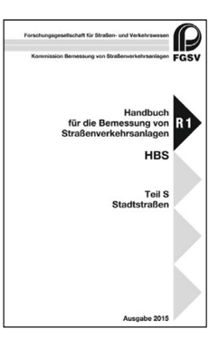
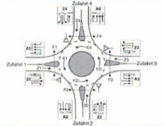
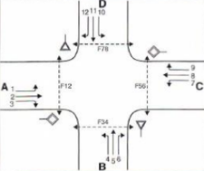

Mit dem HBS 2015 werden unter anderem Verkehrsqualitäten für Knotenpunkte im
Straßenverkehr bemessen. Das HBS ist dabei in die drei Teile A (Autobahnen),
L (Landstraßen) und S (Stadtstraßen) unterteilt. Unterschieden wird dabei im
Weiteren zwischen Knotenpunkten mit Lichtsignalanlage und Knotenpunkten ohne
Lichtsignalanlage. Im Zuge dieser Aufgabe soll ein Berechnungsprogramm für eine
Knotenpunktform ohne LSA an Stadtstraßen erstellt werden. Zur Wahl stehen:
(1) Kreisverkehr, (2) Kreuzung mit Vorfahrtregelung durch Verkehrszeichen (VZ).

::: {layout-ncol=3}
{width=28mm}

{width=57mm}

{width=48mm}
:::

Im Einzelnen soll das Programm folgenden Funktionsumfang zur Verfügung stellen:

- Eingabe der erforderlichen Parameter zur Bestimmung der Verkehrsqualität,
- Berechnung und Darstellung der Verkehrsqualität für die definierte
  Knotenpunktsituation unter Einfluss der Eingangsparameter,
- Export-Funktion für die Ergebnisse als Excel-Datei (die Excel-Blätter sollen dabei
  das Layout der HBS-Formblätter besitzen).
