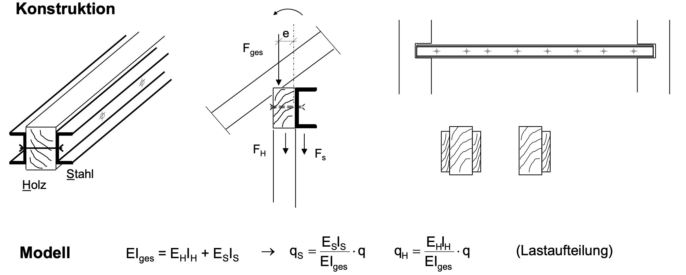

Bei Pfettendächern in Altbauten kommt es vor, dass Pfetten nachträglich verstärkt werden müssen, zum Beispiel wenn sich die Nutzlasten erhöhen (neue Dacheindeckung, PV-Anlage). Im Rahmen dieser Studienarbeit soll eine Applikation entwickelt werden, mit der sich die Verstärkung von Pfetten durch seitliche angebrachte zusätzliche Holzquerschnitte oder U-Profile aus Stahl dimensionieren lässt.

{width=80% fig-align="center"}

Das Programm soll den folgenden Funktionsumfang zur Verfügung stellen

1. Eingabe des statischen Systems, der Belastung und des Altquerschnitts
1. Eingabe der Festigkeiten und Steifigkeiten von Altholz, Zusatzholz und Stahl
1. Eingabe zulässiger Verformungen
1. Auswahl der Art der Verstärkung (einseitig/zweiseitig sowie Holz/U-Profil)
1. Bestimmung und Visualisierung der Schnittgrößen
1. Nachweisführung im Grenzzustand der Tragfähigkeit (GZT) und Grenzzustand der Gebrauchstauglichkeit (GZG)
1. Automatische Dimensionierung unter folgenden Rahmenbedingungen:
    - Zusatzholz: Höhe wählbar, Breite wird ermittelt, so dass Nachweise im GZT und GZG erfüllt sind
    - U-Profil: Ermittlung des optimalen Profils bei gleichen Ausnutzungsgraden im GZT. Zusätzlich Nachweis im GZG erfüllt
